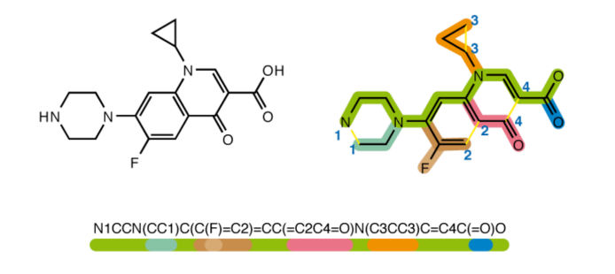
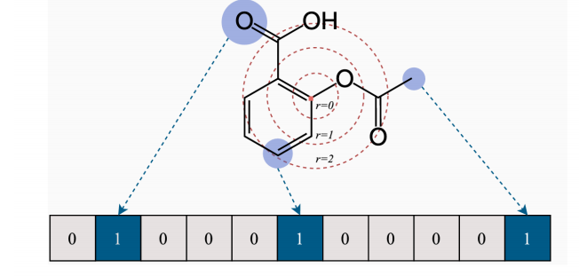
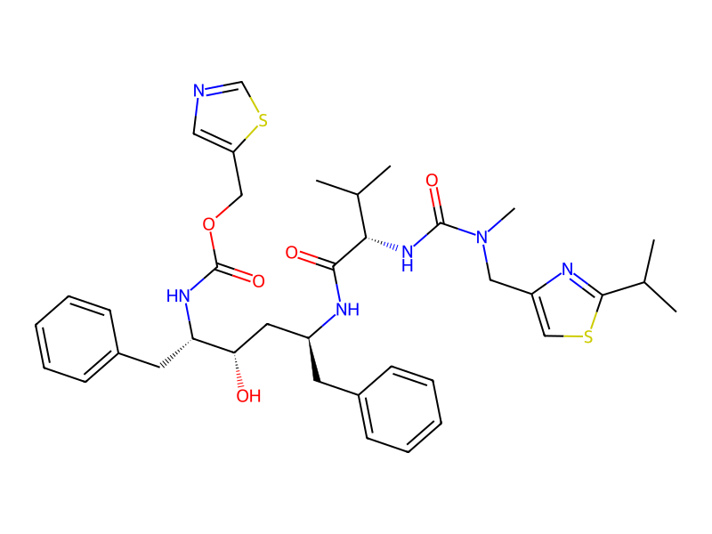
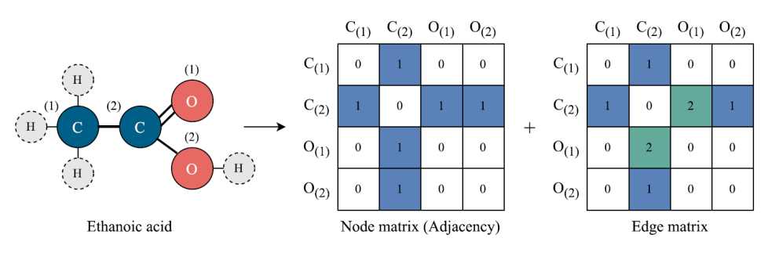
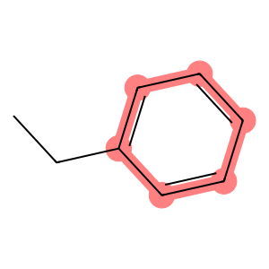
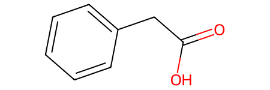
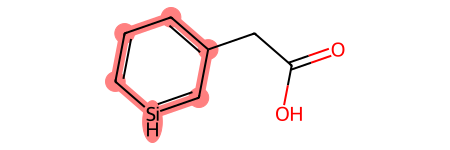
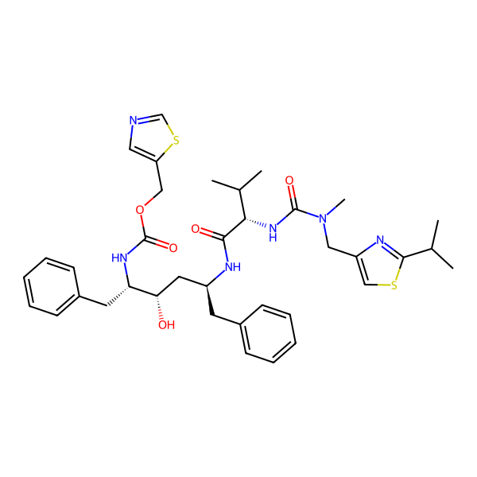
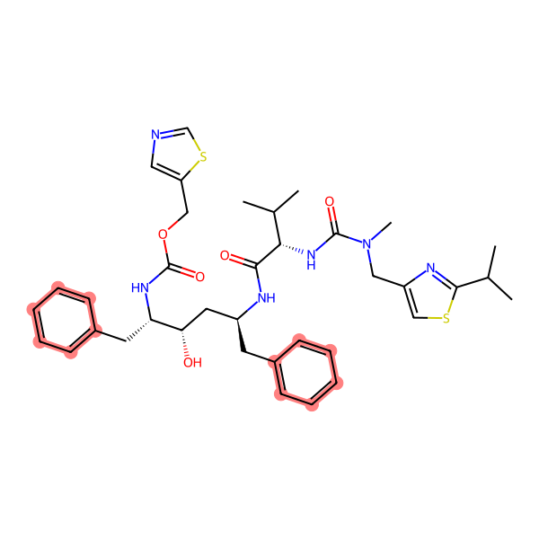

# RDkit介绍

RDkit是一个用于化学信息学和生物信息学的开源软件包，它提供了广泛的化学信息学工具和功能。RDkit主要用于化学信息学，包括分子描述符的计算、分子对接、虚拟筛选、分子模拟等。

功能相当丰富并且强大,内置的函数繁杂,建议使用的时候搭配大语言模型一起使用,查文档较为耗时.

这篇文档是莫老师的<医药人工智能>课程的课程笔记,内容参考莫老师的PPT.

## 分子的数字表示

在化学中,我们常常使用分子的化学式,化学名称来辨识分子,包括常用名和IUPAC name,例如,阿司匹林又称作乙酰水杨酸,其IUPC name为2-Acetyloxybenzoic acid.

更加规范化的,每个分子都有一个独属于自己的编号,即CAS号,该编号由 Chemical Abstracts Service这一机构给出.

<h6 align="left">The CAS Registry is an authoritative collection of disclosed chemical substance information. It 
identifies more than 204 million unique organic and inorganic substances and 69 million protein 
and DNA sequences. It is updated with around 15,000 additional new substances daily</h6>

| Drug Name | IUPAC Name | CAS Number |
|-----------|------------|------------|
| Aspirin | 2-(acetyloxy)benzoic acid | 50-78-2 |
| Ibuprofen | 2-(4-isobutylphenyl)propanoic acid | 15687-27-1 |
| Caffeine | 1,3,7-trimethylpurine-2,6-dione | 58-08-2 |
| Amoxicillin | (2S,5R,6R)-6-[(2R)-2-amino-2-(4-hydroxyphenyl)acetamido]-3,3-dimethyl-7-oxo-4-thia-1-azabicyclo[3.2.0]heptane-2-carboxylic acid | 26787-78-0 |

### smiles

更一般的,我们可以使用smiles来表示绝大多数的分子,无论其是否存在于物性数据库中.

smiles是simplified molecular-input line-entry system的缩写,是一种用于表示分子的字符串.其将复杂的平面结构甚至是三维结构变成一维的一串字符串,从而便于程序识别和读入.



### 分子指纹

molecular fingerprint也是一种常见的表示化合物结构的一种方式,广泛用于分子子结构搜索,聚类和物性预测.




下面给出一个简单的分子指纹的计算方法,这种方法是基于smiles字符串的,我们不断搜索smiles字符串中的不同长度的子串,最后将这些子串的数字映射到二进制编码,再拼接起来,最后得到一个分子指纹.

定义超参数:

- radius: 搜索的子串长度
- nBits: 二进制编码的长度

radius不能太短,否则分子指纹捕捉不到长程信息,也不能太长,否则会过于依赖全局信息而忽略了局部相似.

对长度为[1, radius]的子串进行遍历,并统计每个子串出现的次数,储存到字典当中.

```python
def generate_morgan_fingerprint(smiles, radius=2, nBits=2048):
    # Initialize a list to count substructure occurrences
    substructCnt = {}
    
    # Loop over all possible substructures of length 1 to radius
    for i in range(1, radius + 1):
        for j in range(len(smiles) - i + 1):
            substruct = smiles[j:j + i]
            
            if substruct in substructCnt:
                substructCnt[substruct] += 1
            else:
                substructCnt[substruct] = 1
```

根据获得的各个结构的统计结果,我们将数目映射到二进制编码,然后将他们拼接起来

```python
# Initialize the fingerprint
    fingerprint = []
    
    # For each substructure, convert the count to a 16-bit binary representation
    for substruct in sortedSubstruct:
        substructBinary = [int(bit) for bit in bin(substructCnt[substruct])[2:].zfill(16)]
        fingerprint.extend(substructBinary)
```

完成后,填充或者截断分子指纹的长度到nBits,返回分子指纹.

```python
    if len(fingerprint) >= nBits:
        fingerprint = fingerprint[:nBits]
    else:
        fingerprint.extend([0] * (nBits - len(fingerprint)))
    return np.array(fingerprint)
```

很明显,这是一个相当粗糙的实现,例如,其区分不了'CCO'和'CCF'这两种不同的分子,只有当分子的异构程度足够大的时候,这样生成的分子指纹才能有一定效果.

RDkit中就提供了更为高级的分子指纹计算方式.

```python
from rdkit import Chem
from rdkit.Chem import AllChem
def generate_rdkit_morgan_fingerprint(smiles, radius=2, nBits=2048):
    mol=Chem.MolFromSmiles(smiles)
    if not mol:
        raise ValueError(f"Invalid SMILES: {smiles}")
    fp = AllChem.GetMorganFingerprintAsBitVect(mol, radius, nBits=nBits)
    return np.array(fp)
```

rdkit生成分子指纹的方式更加复杂,他会考虑每个原子周围的化学环境,而不只是简单的字符串匹配.

同时,rdkit还支持将分子指纹可视化,生成分子结构图,其中基团会被高亮标出.



```python
smiles = "CC(C)c4nc(CN(C)C(=O)N[C@@H](C(C)C)C(=O)N[C@@H](Cc1ccccc1)C[C@H](O)[C@H](Cc2ccccc2)NC(=O)OCc3cncs3)cs4"  # Example SMILES string
mol = Chem.MolFromSmiles(smiles)
from rdkit.Chem import Draw

# 创建高清图像
img = Draw.MolToImage(mol, 
                     size=(500,500),  # 更大的尺寸
                     dpi=300,  # 更高的DPI
                     )

# 如果要保存高清图像
img.save('molecule_hd.png', dpi=(300,300))
```
dpi是图像的分辨率,单位是像素/英寸,300dpi表示每英寸有300个像素.

### 图表示

分子的图表示是一个相当自然的表示方法,原子视作节点,键视作边.

而一个图的表示常常用邻接矩阵,节点矩阵和边矩阵来表示(H往往是被忽略的):



图表示可以展现学习分子的底层特征,所以,基于图神经网络的方法在分子性质预测中有着广泛的应用.

## RDKit: a basic tool for handing molecules

RDkit提供了大量的函数来处理分子,包括分子指纹的计算,分子结构的绘制,分子性质的预测等.

### Visualizing Molecules

使用`rdkit.Chem`中的`Draw`模块,我们可以将分子绘制为图像,并且灵活的标注分子中的基团和键.

```python
from rdkit import Chem
from rdkit.Chem import Draw

# Create a molecule from SMILES (ethylbenzene)
smiles = "CCc1ccccc1"
mol = Chem.MolFromSmiles(smiles)

# Define atom indices to highlight.
# For ethylbenzene, we choose the benzene ring atoms.
# Typically, for ethylbenzene the benzene ring is represented by indices 2 to 7.
highlight_atoms = [2, 3, 4, 5, 6, 7]

# Find bonds connecting these highlighted atoms.
highlight_bonds = []
for bond in mol.GetBonds():
    begin_idx = bond.GetBeginAtomIdx()
    end_idx = bond.GetEndAtomIdx()
    # Check if both atoms in the bond are part of the highlight_atoms list.
    if begin_idx in highlight_atoms and end_idx in highlight_atoms:
        highlight_bonds.append(bond.GetIdx())

# Draw the molecule with the specified atoms and bonds highlighted.
img = Draw.MolToImage(mol,
                      size=(300, 300),
                      highlightAtoms=highlight_atoms,
                      highlightBonds=highlight_bonds)
print(highlight_bonds)
```


### Modifying Molecules

```python
from rdkit import Chem
from rdkit.Chem import AllChem

# Example complex molecule containing a benzene ring.
# Replace this with your molecule's SMILES.
smiles = "c1ccccc1CC(=O)O"  # for instance, a benzoic acid derivative
mol = Chem.MolFromSmiles(smiles)
Chem.SanitizeMol(mol)   # 检查分子是否合法
# Define a benzene ring pattern (SMARTS)
benzene_pattern = Chem.MolFromSmarts("c1ccccc1")

# Find benzene substructure matches in the molecule
matches = mol.GetSubstructMatches(benzene_pattern)
print(matches)
if matches:
    # Choose the first match; this returns a tuple of atom indices (one per ring atom)
    match = matches[0]
    print(match)
    # Replace one carbon with nitrogen.
    # Here, we choose the first atom in the match.
    atom_to_replace = match[1]
    mol.GetAtomWithIdx(atom_to_replace).SetAtomicNum(14)  # 7 is nitrogen

    # Resanitize the molecule to update aromaticity and valence
    Chem.SanitizeMol(mol)
    new_smiles_direct = Chem.MolToSmiles(mol)
    print("Modified molecule (atom replacement):", new_smiles_direct)
else:
    print("No benzene ring found using the SMARTS pattern.")

```




### Calculating Molecular Descriptors

rdkit可以计算相当丰富的分子描述符,包括分子指纹,拓扑指数,量子化学性质等.这些描述符可以用于QSPR/QSAR,机器学习特征工程等.需要用的时候再去查就好了:

```python
from rdkit.Chem import Crippen,Descriptors

def get_common_descriptors(mol):
    return {
        'MW': Descriptors.ExactMolWt(mol),
        'LogP': Crippen.MolLogP(mol),
        'TPSA': Descriptors.TPSA(mol),
        'HBA': Descriptors.NumHAcceptors(mol),
        'HBD': Descriptors.NumHDonors(mol),
        'Rotatable_Bonds': Descriptors.NumRotatableBonds(mol),
        'Rings': Descriptors.RingCount(mol),
        'Aromatic_Rings': Descriptors.NumAromaticRings(mol)
    }

# 使用示例
mol = Chem.MolFromSmiles("CC(=O)OC1=CC=CC=C1C(=O)O")
common_desc = get_common_descriptors(mol)
for name, value in common_desc.items():
    print(f"{name}: {value}")
```

这个网站 [https://datagrok.ai/help/datagrok/solutions/domains/chem/descriptors] 可以查看大量可被计算的分子描述符以及其对应的意义,需要的时候再去使用就好了.

### Substructure Searching

子结构搜索的关键函数是:

```python
matches = mol.GetSubstructMatches(benzene)
```

返回的matchs是一个元组,每个元素都是一个元组,代表被搜索到的子结构的原子序数序列.我们可以通过高亮这些原子来可视化搜索结果.






