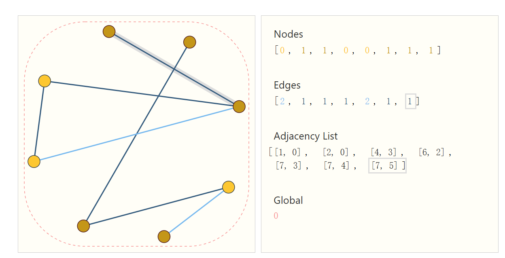
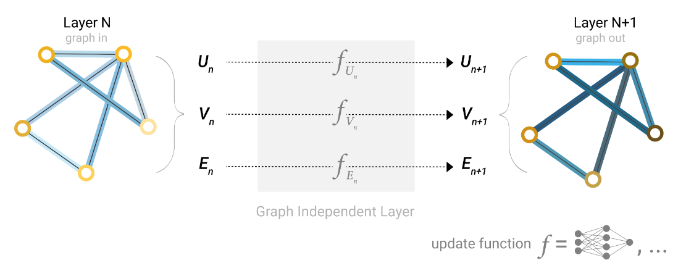
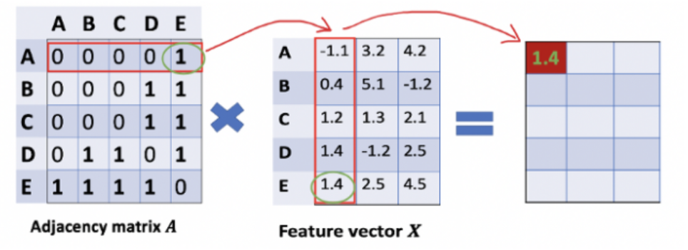

# 图神经网络

图神经网络是提取分子底层特征的一种强大方法,基于消息传递的机制可以充分捕捉每个原子周围的化学环境,从而实现对分子性质的预测和理解。

图神经网络可以参考网站 [https://distill.pub/2021/gnn-intro/] ,里面给出了详细的介绍和说明,并且制作了大量精美的交互图.

## 图表示

每个原子都是一个节点,原子之间的键作为边,构建一个图,同时图还存有全局信息,全局信息也是一个向量.每个节点和边都有对应的特征,这些特征可以表示为向量.

连通性信息往往由邻接矩阵表示,而对于比较大的矩阵,如何存储和运算是一个问题,所以我们保存连通性信息的时候,往往保留一条边的两个顶点.



## 简单的图神经网络

如果不考虑图的各个结构之间的信息传递,我们可以给出一个简单的图神经网络:



$$
\begin{aligned}
U_n^k = MLP(U_n^{k-1}) \\
V_n^k = MLP(V_n^{k-1}) \\
E_n^k = MLP(E_n^{k-1}) \\
\end{aligned}
$$

就像是普通的并联的三个神经网络一样,三者之间没有任何的交汇,也许在最后的时候,我们把所有的向量展平,然后接上一个全连接层,用于预测物质结构信息,但是这样并没有利用到图的结构信息.

于是,为了充分的让图的各个部分进行交互,我们要引入消息传递机制.

### 基于节点的消息传递机制(GCN)

让我们简化问题,假设我们不考虑边的特征和全局信息,所谓的图只保留节点特征和连通性信息,那么消息传递就是在节点之间进行.

即,每一次节点的特征的更新都要依赖于本次节点的特征和他的邻居的节点的特征.

消息传递的第一阶段被称作聚合,即将邻居信息聚合到本节点上,第二部,再利用本节点的特征和邻居的特征进行更新.

**值得注意的是,消息聚合的一个简单原则是,不能破坏图的对称性,即排列不变性,对不同节点信息聚合的先后不应该改变聚合结果**

我们将聚合方法称作池化(Pooling),常见的聚合方式有三种

1. 平均池化
2. 最大池化
3. 求和池化
4. 加权求和池化

下面以平均池化为例,节点信息更新的公式就为:

$$
h_v^{(k)} = \sigma(W_k(h_v^{(k-1)} + \sum_{u \in N(v)}  h_u^{(k-1)})+b_k)
$$

其中,$\sigma$是激活函数,通常是ReLU,$N(v)$表示节点$v$的邻居节点.

更进一步,我们可以引入权重矩阵$W_v^{(k)}$来对邻居节点的信息进行加权:

$$
h_v^{(k)} = \sigma(W_k(h_v^{(k-1)} + \sum_{u \in N(v)}  W_u^{(k)} h_u^{(k-1)})+b_k)
$$

权重矩阵可以是人为指定的,也可以是可学习参数.

还有一种情况是,消息聚合来的信息不直接加到已有节点的信息上,而是和他拼接起来:

$$
h_v^{(k)} = \sigma(W_k[h_v^{(k-1)}, \sum_{u \in N(v)}  h_u^{(k-1)}]+b_k)
$$

具体使用哪种要视具体情况而定.

更加一般的,消息更新可以不只是采用一层激活函数,我们可以使用多层感知机进行消息更新,即:

$$
h_v^{(k)} = \mathrm{MLP}^{(k)}(h_v^{(k-1)}+\sum_{u \in N(v)}  h_u^{(k-1)})
$$

通过维度变换,节点的特征在一层一层的GNN中被传播,压缩,最后,我们需要进行全局池化,将所有节点特征变成一个节点特征,然后接上一个全连接层,用于预测物质结构信息. **这样做的好处是无视了分子图的大小,如果节点数目不同,最后依旧可以用同一个网络训练**

全局求和池化:

$$
h_G^{(k)} = \sum_{v \in V} h_v^{(k)}
$$

接个MLP:

$$
\hat{y} = \mathrm{MLP}(h_G^{(k)})
$$

下面我们使用torch来实现一个简单的GNN:

单层GNN,接受消息传递后的聚合信息,输出更新后的节点信息:

```python
# 定义一个简单的GNN层
class simple_gnn_layer(nn.Module):
    def __init__(self,input_dim,output_dim):
        super(simple_gnn_layer,self).__init__() # 继承父类的初始化方法
        # 定义消息聚合和更新所需要用到的方法
        # 线性变换
        self.linear = nn.Linear(input_dim,output_dim)
        # 激活函数
        self.activation = nn.ReLU()
    
    # 定义消息聚合
    def message_passing(self,h,adj):
        '''
        h:节点特征矩阵 [num_nodes,input_dim]
        adj:邻接矩阵 [num_nodes,num_nodes]
        '''
        h_prime = torch.matmul(adj,h) # [num_nodes,num_nodes] * [num_nodes,input_dim] -> [num_nodes,input_dim]
        # 邻接矩阵不包含自环,所以上述得到的是聚合到各个节点的特征
        return h_prime
    
    def update(self,h_prime,h):
        combined  = h+ h_prime
        combined = self.linear(combined)
        combined = self.activation(combined)
        return combined
    
    def forward(self,h,adj):
        h_prime = self.message_passing(h,adj)
        h_new = self.update(h_prime,h)
        return h_new
```

这里,消息聚合的办法采用邻接矩阵和特征矩阵相乘的形式,即:

$$
\mathrm{message\_passing} = adj \times h
$$



如果增加自环,即将邻接矩阵的对角元变成1,那么就不需要把消息加到本节点上,矩阵乘法的结果直接就是MLP的输入.

然后我们把GNN层堆叠起来,就得到了一个GNN模型.最后要做物性预测,所以还需要池化之后接一个MLP.

```python
# 把层拼成GNN:
class simple_gnn(nn.Module):
    def __init__(self,model_config_gnn,model_config_mlp):
        super(simple_gnn,self).__init__()
        self.layers = nn.ModuleList([simple_gnn_layer(model_config_gnn[i][0],model_config_gnn[i][1]) for i in range(len(model_config_gnn))])
        
        # 在初始化时就创建MLP层
        mlp_layers = []
        for i in range(len(model_config_mlp)):
            if i == len(model_config_mlp)-1:
                mlp_layers.append(nn.Linear(model_config_mlp[i][0],model_config_mlp[i][1]))
            else:
                mlp_layers.append(nn.Linear(model_config_mlp[i][0],model_config_mlp[i][1]))
                mlp_layers.append(nn.ReLU())
        self.mlp_layers = nn.Sequential(*mlp_layers)

    # 全局池化
    def global_pooling(self,h):
        return torch.mean(h,dim=0)
    
    def mlp(self, h):
        # 确保h是二维张量
        if len(h.shape) == 1:
            h = h.unsqueeze(0)  # 添加批次维度
        return self.mlp_layers(h)
    
    def forward(self,h,adj):
        for layer in self.layers:
            h = layer(h,adj)
        # 全局池化
        h = self.global_pooling(h)
        # 接一个多层感知机
        h = self.mlp(h)
        return h
```

值得注意的是,torch中存在一些书写规范,`nn.ModuleList()`会自动将各层的可学习参数注册到模型中,如果使用普通的python列表则不能使得各层的参数被自动识别,在前向传播的时候,可以直接使用`h=layer(h,adj)`来实现层的前向传播,隐式调用了layer的`forward`方法,会自动触发pytorch的前向传播计算图的构建,自动触发hooks和自动梯度计算.

但是上述这样的书写有点问题,图神经网络只能处理一个一个图,不能直接处理一个batch的图,所以要进行修改.

```python   
# 定义一个支持批处理的GNN层
class simple_gnn_layer(nn.Module):
    def __init__(self,input_dim,output_dim):
        super().__init__()
        self.linear = nn.Linear(input_dim,output_dim)
        self.activation = nn.ReLU()
    
    def message_passing(self,h,adj):
        '''
        h: 节点特征矩阵 [batch_size, num_nodes, input_dim]
        adj: 邻接矩阵 [batch_size, num_nodes, num_nodes]
        '''
        h_prime = torch.bmm(adj, h)  # 使用批量矩阵乘法
        return h_prime
    
    def update(self,h_prime,h):
        combined  = h + h_prime
        combined = self.linear(combined)
        return self.activation(combined)
    
    def forward(self,h,adj):
        h_prime = self.message_passing(h,adj)
        return self.update(h_prime,h)

class simple_gnn(nn.Module):
    def __init__(self,model_config_gnn,model_config_mlp):
        super().__init__()
        self.layers = nn.ModuleList([simple_gnn_layer(input_dim, output_dim) for input_dim, output_dim in model_config_gnn])
        self.mlp_layers = nn.Sequential(*[nn.Linear(input_dim, output_dim) for input_dim, output_dim in model_config_mlp])
    
    # 修改全局池化方法
    def global_pooling(self,h):
        # h形状: [batch_size, num_nodes, features]
        return torch.mean(h, dim=1)  # 在节点维度做平均池化
    
    def mlp(self, h):
        # h形状: [batch_size, features]
        return self.mlp_layers(h)
    
    def forward(self,h,adj):
        # h形状: [batch_size, num_nodes, input_dim]
        # adj形状: [batch_size, num_nodes, num_nodes]
        for layer in self.layers:
            h = layer(h,adj)
        h = self.global_pooling(h)  # 输出形状 [batch_size, features]
        return self.mlp(h)
```

同时,输入的数据需要是batch的形式,所以我们还要写一个打包函数,将一批数据打包成形状为[batch_size, num_nodes, input_dim]的张量:

```python
def collate_fn(batch):
    """
    将一批图数据处理成批量格式
    """
    x_batch = []
    adj_batch = []
    y_batch = []
    
    for data in batch:
        x, adj, y = process_data(data)
        x_batch.append(x)
        adj_batch.append(adj)
        y_batch.append(y)
    
    # 添加填充和转换张量的步骤
    max_nodes = max([x.shape[0] for x in x_batch]) # x: [num_nodes, features]
    x_padded = [torch.nn.functional.pad(x, (0,0,0,max_nodes-x.shape[0])) for x in x_batch]
    adj_padded = [torch.nn.functional.pad(adj, (0,max_nodes-adj.shape[1],0,max_nodes-adj.shape[0])) for adj in adj_batch]
    
    return torch.stack(x_padded).to(device), torch.stack(adj_padded).to(device), torch.stack(y_batch).to(device)
```

`torch.nn.functional.pad(x, (0,0,0,max_nodes-x.shape[0]))`是torch内置的填充函数,其四个变量分别表示(left,right,top,bottom),即在x的四个方向上填充0,填充的数目为max_nodes-x.shape[0],即填充到和最大节点数相同,这样,每个批次的数据就具有相同的形状,可以进行批量处理.

然后再创建数据加载器的时候应用上述的打包函数,数据集就会变成一个个batch的形式:

```python
# 创建数据加载器
batch_size = 256
train_loader = DataLoader(train_dataset, batch_size=batch_size, shuffle=True, collate_fn=collate_fn) #在这里应用刚刚定义的打包函数
test_loader = DataLoader(test_dataset, batch_size=batch_size, shuffle=False, collate_fn=collate_fn)
```

### 加权邻接矩阵

一种可能的改进是,将键长的倒数作为邻接矩阵的值,即键长越短,两个原子之间的距离越近,消息传递的权重越大.

以QM9数据集为例,在data.pos中可以获得原子的坐标矩阵,通过计算有边相连的原子索引之间的距离,可以获得键长矩阵,然后取倒数作为邻接矩阵的值.

数据预处理:

```python
# 2. 数据预处理和划分
def process_data(data):
    # 节点特征标准化
    x = (data.x.float() - feature_mean) / feature_std
    
    # 获取原子坐标（单位：埃）
    atom_pos = data.pos  # 形状: [num_nodes, 3]
    
    # 计算真实的键长（欧氏距离）
    edge_index = data.edge_index
    src_nodes = edge_index[0]
    dst_nodes = edge_index[1]
    # 计算原子间距离（单位：埃）
    edge_length = torch.norm(atom_pos[src_nodes] - atom_pos[dst_nodes], dim=1)
    
    # 创建带权重的邻接矩阵（使用真实键长）
    num_nodes = x.size(0)
    adj = torch.zeros(num_nodes, num_nodes)
    
    # 填充邻接矩阵（考虑无向图的双向关系）
    for i in range(edge_index.size(1)):
        src = edge_index[0, i].item()
        dst = edge_index[1, i].item()
        # 使用1/(键长+epsilon)作为权重（键长越短权重越大）
        weight = 1 / (edge_length[i] + 1e-6)
        adj[src, dst] = weight
        adj[dst, src] = weight  # 无向图需要双向赋值

    # 直接使用原始标签
    y = data.y[:, 0].float()
    
    return x, adj, y
```

为了防止键长太小的情况,我们给键长加上一个很小的数,防止出现无穷大.

修改单层GNN的消息传递部分:

```python
    def message_passing(self,h,adj):
        '''改进后的消息传递，考虑边权重'''
        # 对邻接矩阵进行归一化处理
        row_sum = adj.sum(dim=2, keepdim=True) + 1e-6
        norm_adj = adj / row_sum  # 按行归一化
        
        h_prime = torch.bmm(norm_adj, h)  # 使用带权重的邻接矩阵
        return h_prime
```

### 节点和边信息聚合的图神经网络

更加先进的模型应该考虑节点和边的信息聚合,即用与节点相连的边更新节点,用边两端的节点更新边.

在实际应用场景中,通常采用先用节点信息更新边信息,再用边信息更新节点信息,这样可以使得消息传递更加迅速且深入.

边使用节点信息进行更新

$$
e^k_{ij} = \phi^k_e(h_i^{k-1},h_j^{k-1},e^{k-1}_{ij})
$$

节点信息更新:

$$
h^k_i = \phi^k_n(h^{k-1}_i,\{h^{k-1}_j,e^{k}_{ij}\})
$$

亦或者:

$$
h^k_i = \phi^k_n(h^{k-1}_i,e^{k}_{ij})
$$


使用多层GNN后就可以完成长程的节点,边信息交互.

上述的$\phi^k_n,\phi^k_e$都是MLP,如果我们采用直接相加的聚合方式,为了使得维度匹配,信息聚合的时候要加上一个转换层进行维度映射,所以完整写出来就是:

$$
\begin{aligned}
&e^k_{ij} = \phi^k_e(\sigma(W^k_1(h_i^{k-1})+b^k_1)+\sigma(W^k_2(h_j^{k-1})+b^k_2)+e^{k-1}_{ij})\\
&h^k_i = \phi^k_n(h^{k-1}_i+\sum_j\sigma(W^ke^{k}_{ij}+b^k))
\end{aligned}
$$

于是,我们的GNN层就可以写成:

```python
class simple_gnn_layer(nn.Module):
    def __init__(self, node_input_dim, node_output_dim, edge_input_dim, edge_output_dim):
        super().__init__()
        self.node_input_dim = node_input_dim
        self.node_output_dim = node_output_dim
        self.edge_input_dim = edge_input_dim
        self.edge_output_dim = edge_output_dim
        
        # 节点更新所需的转换
        self.W_edge = nn.Linear(self.edge_input_dim, self.node_input_dim)  # 边特征转换为节点维度
        self.node_update = nn.Sequential(
            nn.Linear(self.node_input_dim, self.node_output_dim),
            nn.ReLU()
        )
        
        # 边更新
        # 我们需要最后的所有边的长度,所以需要把边特征逐级压缩,最后压缩到一维.
        self.W_node1 = nn.Linear(self.node_input_dim, self.edge_input_dim)  # 源节点特征转换
        self.W_node2 = nn.Linear(self.node_input_dim, self.edge_input_dim)  # 目标节点特征转换
        self.edge_update = nn.Sequential(
            nn.Linear(self.edge_input_dim, self.edge_output_dim),
            nn.ReLU()
        )
        
        self.activation = nn.ReLU()
    
    def message_passing(self, h, edge_index, edge_attr):
        """
        h: 节点特征 [batch_size, num_nodes, input_dim]
        edge_index: 边的索引 [batch_size, num_edges, 2]
        edge_attr: 边特征 [batch_size, num_edges, edge_dim]
        """
        batch_size, _, _ = h.shape
        num_edges = edge_index.size(1)
        
        # 更新边特征
        edges_new = torch.zeros_like(edge_attr)
        for b in range(batch_size):
            for e in range(num_edges):
                # 获得每条边的源节点和目标节点
                i, j = edge_index[b, e, 0].item(), edge_index[b, e, 1].item()
                # 源节点和目标节点特征
                h_i, h_j = h[b, i], h[b, j]
                # 边特征更新: e^k_ij = φ^k_e(σ(W^k_1(h_i^{k-1})+b^k_1) + σ(W^k_2(h_j^{k-1})+b^k_2) + e^{k-1}_ij)
                transformed_h_i = self.activation(self.W_node1(h_i))
                transformed_h_j = self.activation(self.W_node2(h_j))
                edge_massages = transformed_h_i + transformed_h_j + edge_attr[b, e]
                edges_new[b, e] = self.edge_update(edge_massages)
        
        # 更新节点特征
        node_messages = torch.zeros_like(h)
        for b in range(batch_size):
            for e in range(num_edges):
                i, j = edge_index[b, e, 0].item(), edge_index[b, e, 1].item()
                # 聚合边特征到节点
                # 先更新边特征,再更新节点特征,可以使得消息传递更加迅速且深入.
                transformed_edge = self.activation(self.W_edge(edges_new[b, e]))
                # 将转换后的边特征加到目标节点
                node_messages[b, j] += transformed_edge
                # 无向图还需要反向添加
                node_messages[b, i] += transformed_edge
                
        # 节点特征更新: h^k_i = φ^k_n(h^{k-1}_i + Σ_j σ(W^k e^{k-1}_ij + b^k))
        h_new = h + node_messages
        h_new = self.node_update(h_new)
        
        return h_new, edges_new
    
    def forward(self, h, edge_index, edge_attr):
        h_new, edge_new = self.message_passing(h, edge_index, edge_attr)
        return h_new, edge_new
```

一种应用更加广泛的方式是特征拼接,强制压缩到同一维度会不可避免的损失掉很多信息,所以可以在消息传递后更新的时候把消息特征向量和原本的特征向量拼接起来:

$$
\begin{aligned}
e^k_{ij} &= \phi^k_e(h_i^{k-1} \oplus h_j^{k-1} \oplus e^{k-1}_{ij})\\
h^k_i &= \phi^k_n(h^{k-1}_i \oplus \sum_j e^{k}_{ij})
\end{aligned}
$$

我们可以使用pyg库来高效执行这个操作:

值得注意的是,pyg处理批次的时候是将整个批次合成一张大图,同时用一个batch索引来指向原来的图,这和我们之前的 [batch_size, num_nodes, input_dim] 不同.

pyg库内部高度优化了消息传递和更新过程,使得训练更加快速

```python
class GNNLayer(MessagePassing):
    def __init__(self, node_input_dim, node_output_dim, edge_input_dim, edge_output_dim):
        super().__init__(aggr="add")  # 使用加法聚合
        # 边更新
        self.edge_mlp = nn.Sequential(
            nn.Linear(node_input_dim * 2 + edge_input_dim, edge_output_dim),
            nn.ReLU()
        )
        # 节点更新
        self.node_mlp = nn.Sequential(
            nn.Linear(node_input_dim + edge_output_dim, node_output_dim),
            nn.ReLU()
        )
        
    
    def forward(self, x, edge_index, edge_attr):
        # 先更新边
        new_edge_attr = self.update_edges(x, edge_index, edge_attr)
        # 再更新节点
        # propagate是pyg的高度优化更新方法
        # 其会自动调用massage方法生成消息,然后根据aggr参数聚合消息,最后用update方法更新节点特征
        new_x = self.propagate(edge_index, x=x, edge_attr=new_edge_attr)
        return new_x, new_edge_attr
    
    def update_edges(self, x, edge_index, edge_attr):
        src, dst = edge_index
        src_features = x[src]
        dst_features = x[dst]
        edge_features = torch.cat([src_features, dst_features, edge_attr], dim=1)
        return self.edge_mlp(edge_features)
    
    def message(self, x_j, edge_attr):
        # 组合节点特征和边特征
        return torch.cat([x_j, edge_attr], dim=1)
    
    def update(self, aggr_out, x):
        # 更新节点特征
        return self.node_mlp(aggr_out)
```

### 引入全局特征

不仅仅只有边和节点的特征,我们还可以引入全局特征,即图的特征,比如分子的性质,分子的类型等.

这些全局特征参与边和节点的每一次更新,并且在边和节点更新后使用全局池化的边和节点特征来更新他自己:

$$
\begin{aligned}
&e^k_{ij} = \phi^k_e(h_i^{k-1},h_j^{k-1},e^{k-1}_{ij},g^{k-1})\\
&h^k_i = \phi^k_n(h^{k-1}_i,\{h^{k-1}_j,e^{k}_{ij}\},g^{k-1})\\
&g^k = \phi^k_g(h^k,e^k,g^{k-1})
\end{aligned}
$$

```python
def update_global(self, global_features, x, edge_attr, batch, edge_batch):
   # 将节点和边的特征全局池化
   node_pooled = global_mean_pool(x, batch)  # [batch_size, node_dim]
   edge_pooled = global_mean_pool(edge_attr, edge_batch)  # [batch_size, edge_dim]
          
   # 拼接池化特征和当前全局特征
   combined = torch.cat([node_pooled, edge_pooled, global_features], dim=1)

   # 更新全局特征
   transformed_global = self.global_mlp(combined)

   return transformed_global
```
