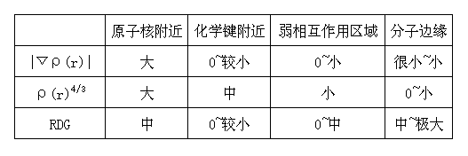
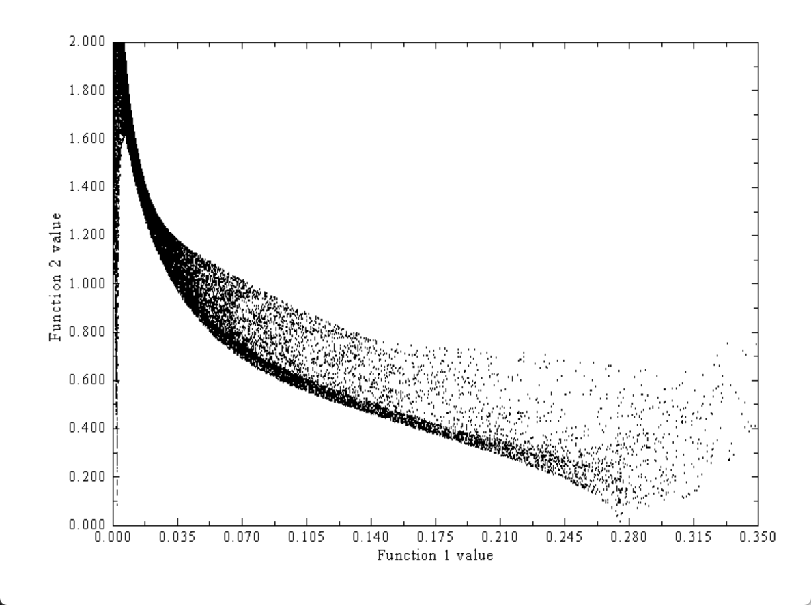
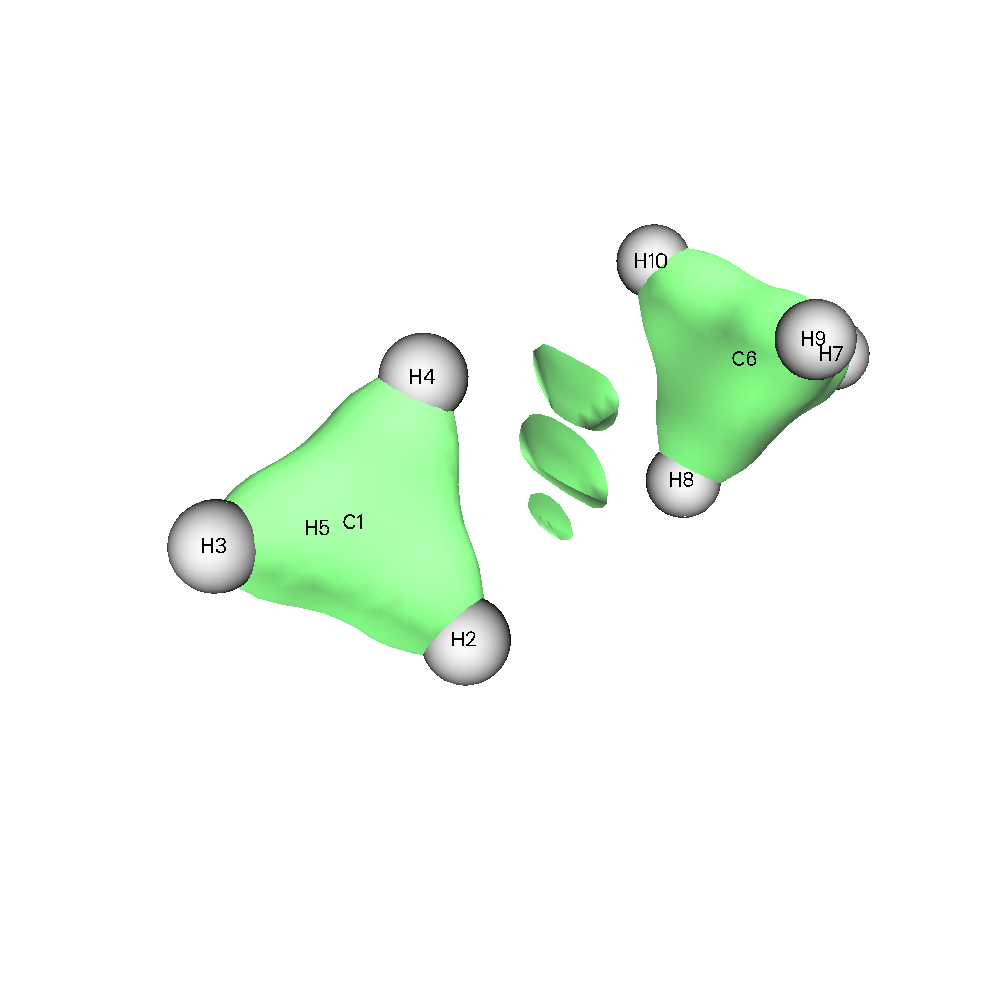
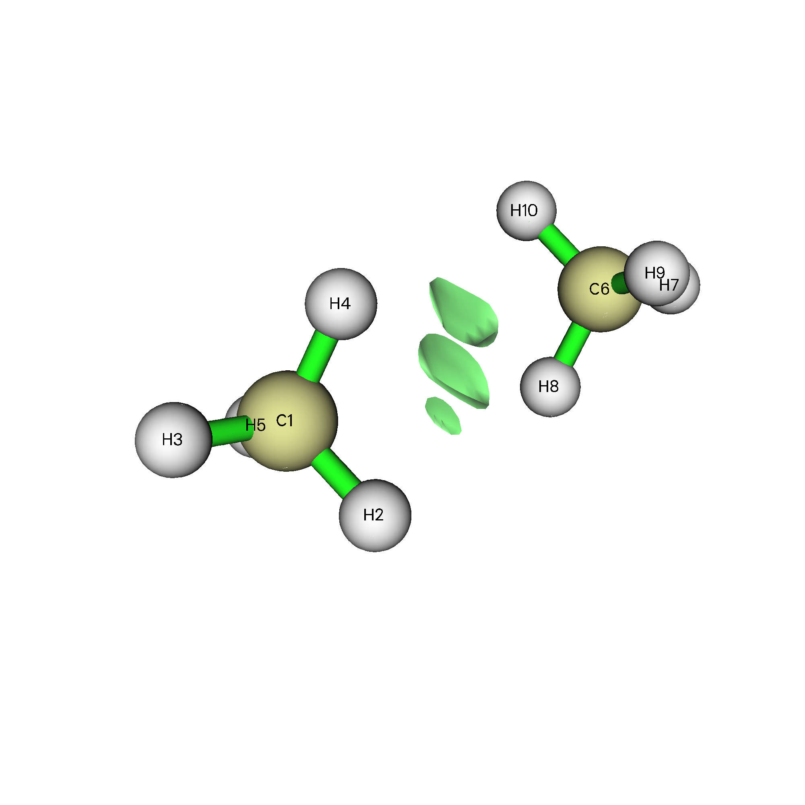
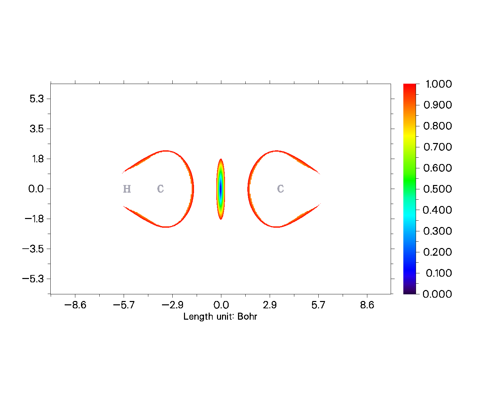

# RDG分析

本笔记参考整理自卢老师的[使用Multiwfn图形化研究弱相互作用](http://sobereva.com/68)

RDG函数是人类自定义的一个实空间函数,和电子密度相关,其主要目的是为了区分空间中哪些区域容易被弱相互作用影响,其定义式为:

$$
f(r) = \frac{1}{2(3π^2)^{1/3}}\frac{|\nablaρ(r)|}{ρ(r)}^{4/3}
$$

而一个分子体系主要由四个部分构成,不同实空间函数在不同区域的表现不同.



使用RDG函数首先可以排除原子核和分子边缘部分,但是化学键和弱相互作用区域容易分不开,这时候可以用电子密度辅助判断,最终得到弱相互作用主导的区域.

## 使用Multiwfn绘制RDG等值面

按照卢老师的教程,先优化获得一个甲烷二聚体(建议用PM6预优化一下,然后再跑b3lyp/6-31++g** opt em=GD3BJ,不收敛改一改几何优化的关键词就好了).

先把setting中的RDG_maxrho设置成0,然后按照如下步骤绘制$f(r)-\rho(r)$散点图

```
100   //功能100，其中包含Multiwfn中比较杂的功能
1    //绘制“函数1 vs. 函数2”散点图并生成相应格点文件
1,13  //输入函数1和函数2的序号，分别作为散点图的横轴和纵轴。在Multiwfn支持的函数中ρ(r)是第1号，RDG函数是第13号。
2   //用中等质量的网格，总共约512000个点，x,y,z方向的具体点数通过使x,y,z方向格点间距相等来自动确定。网格的区域自动往分子外延展6 bohr。
现在开始计算格点数据。格点数越多、体系所含Gauss函数越多，计算速度越慢，计算时间与二者都成正比。计算完毕后，输入
4   //设定散点图X轴
0,0.35 //X轴上下限的值
5   //设定散点图Y轴
0,2 //Y轴上下限的值
-1  //绘制散点
```

得到这样的图:



横坐标是电子密度,纵坐标是RDG.

最左侧的这条黑色的竖线正是电子密度较小但是RDG为0到中的区域,也就是弱相互作用主导的区域.

关掉图之后输入7绘制等值面,我们设置等值面为0.5,得到:



这样的图是没有把电子密度较大的区域即成键区域屏蔽掉的,所以需要设置一个阈值,把大于阈值的电子密度值对应的RDG值全部设置成为100(一个大值),这样做y=0.5就不会和成键区域相交了,这个阈值由我们刚刚的RDG_maxrho决定.重新调整maxrho,得到:



还可以通过绘制平面色图来表示弱相互作用区域:

```
4  //功能4，绘制平面图
13  //RDG函数
1   //填色图
按回车使用默认的格点数(200,200)
0  //设定延展距离。默认延展4.5 bohr，对于RDG函数偏大了
2   //改为只延展2 bohr
1  //绘制XY平面
0  //XY平面的Z值为0
```


## 弱相互作用的强度与类型

