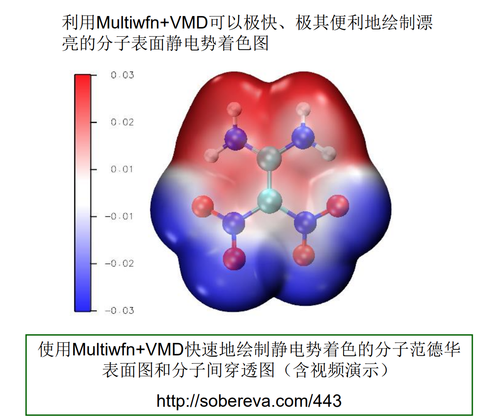
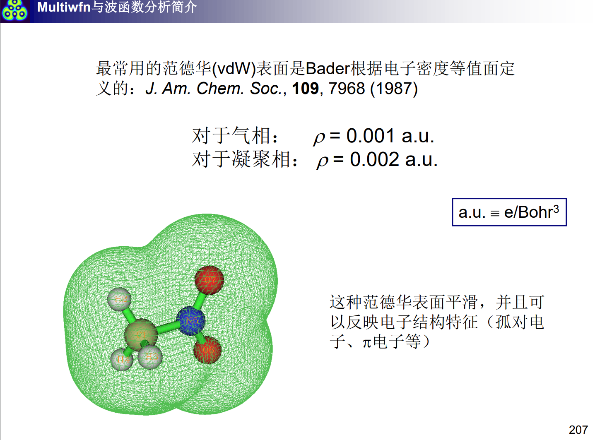
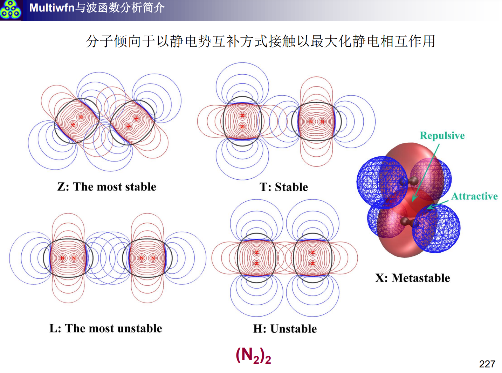
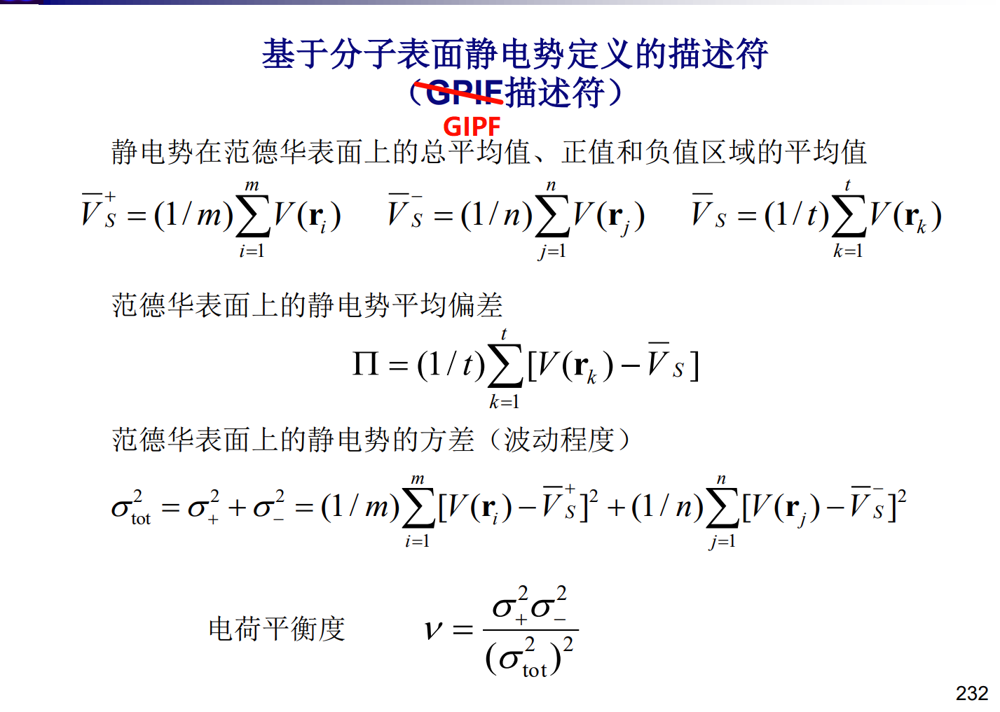

# 静电势

为了方便快捷的构建QSPR(定量结构属性关系)和QSAR(定量结构活性关系)模型,我们需要用到大量的分子描述符,rdkit软件包中提供的分子描述符很多都是拟合出来的,不具有实际的物理意义,同时精确性也不能保证,采用量子化学方法计算出来的描述符不仅种类丰富,而且有实际的物理意义,同时结果较为精确.更多Multiwfn可以计算的分子描述符详情见社长的文章[http://sobereva.com/601]

静电势即为空间中位矢为r处的静电势能,由两部分贡献而来,一部分是核势能,另一部分是电子势能:

$$
V(r)=V_{nuc}(r)+V_{ele}(r)=\sum_A \frac{Z_A}{|r-r_A|}+\int\frac{\rho(r')}{|r-r'|}dr'
$$

在原子体系中,一般空间上的静电势总是处处为正,这体现了静电相互作用还是由核主导,而对于某些分子体系,由于复杂的相互作用,会导致空间上某些地方静电势为正,某些地方静电势为负.使用Multiwfn和VMD绘制分子表面的静电势分布,详情参见[http://sobereva.com/443]



其中,分子表面的定义各有不同,最常见的是范德华表面,即以电子密度=0.01a.u.的等值面来判定.



静电势还可以用一定程度上判定二聚体的最优分子构型,两个分子倾向于以静电互补的方式接近,以使得静电相互作用能降低:



综上所示,我们知道静电势可以捕捉分子的电荷分布信息和相互作用信息,但是静电势是弥散在整个空间的,如果要将他作为分子描述符就需要在范德华表面上执行采样,将均值和方差作为描述符,这就是GIPF描述符:



通过这一系列描述符,可以有效预测分子的密度,蒸发焓,沸点,溶解自由能等性质[http://sobereva.com/337] 这些性质对静电势描述符的拟合已经有人做过了,文章中给了公式,但是误差略微有点大.

将gaussian结构优化的.chk文件转化为.fchk文件(formchk...)后载入Multiwfn,

依次输入:

```
12 # 定量分子表面分析功能
0 # 执行计算(Start now!)
```

然后就会吐出分析结果,包括范德华表面上的全局最小点和全局最大点,所有的极小值点和极大值点:

```
 Global surface minimum: -0.022371 a.u. at   1.660843  -0.820160  -2.352275 Ang
 Global surface maximum:  0.025523 a.u. at  -0.803164   2.241500   1.964054 Ang

 The number of surface minima:     7
   #       a.u.         eV      kcal/mol           X/Y/Z coordinate(Angstrom)
     1  0.00409000    0.111295    2.566517      -5.772642  -1.352661  -0.739591
     2  0.00409055    0.111309    2.566859      -5.771882  -1.362458   0.723013
     3  0.00395574    0.107641    2.482268      -4.876003  -2.350196  -0.034150
     4  0.00901657    0.245353    5.657988      -3.733564   2.364639  -0.058240
*    5 -0.02237134   -0.608755  -14.038238       1.660843  -0.820160  -2.352275
     6 -0.02236713   -0.608641  -14.035598       1.715292  -0.787472   2.357010
     7 -0.02235562   -0.608327  -14.028375       2.945542   1.899403  -0.026087

 The number of surface maxima:    10
   #       a.u.         eV      kcal/mol           X/Y/Z coordinate(Angstrom)
     1  0.01664444    0.452918   10.444550      -6.257106   0.781510  -0.058848
     2  0.01597949    0.434824   10.027293      -3.880574  -1.764231  -2.107646
     3  0.01597171    0.434612   10.022406      -3.869799  -1.859246   2.053505
     4  0.00935243    0.254493    5.868744      -2.653253  -1.972490  -0.040063
     5  0.01579985    0.429936    9.914562      -2.088565  -1.181985  -2.117400
     6  0.01580602    0.430104    9.918433      -2.035617  -1.085064   2.160660
     7  0.01889884    0.514264   11.859213      -1.743475   2.375186  -0.053539
     8  0.02551557    0.694314   16.011272      -0.845531   2.231411  -1.960781
*    9  0.02552327    0.694523   16.016105      -0.803164   2.241500   1.964054
    10  0.01918076    0.521935   12.036116       3.477717  -1.075946   0.041651
```

以及输出的结果总结,包含了所有的GIPF描述符,分子表面积,以及根据拟合公式预测的密度:

```
       ================= Summary of surface analysis =================

 Volume:  1033.21421 Bohr^3  ( 153.10655 Angstrom^3)
 Estimated density according to mass and volume (M/V):    1.9958 g/cm^3
 Minimal value:    -14.03824 kcal/mol   Maximal value:     16.01611 kcal/mol
 Overall surface area:         577.92778 Bohr^2  ( 161.83626 Angstrom^2)
 Positive surface area:        398.16690 Bohr^2  ( 111.49809 Angstrom^2)
 Negative surface area:        179.76088 Bohr^2  (  50.33817 Angstrom^2)
 Overall average value:    0.00410901 a.u. (      2.57845 kcal/mol)
 Positive average value:   0.01275983 a.u. (      8.00692 kcal/mol)
 Negative average value:  -0.01505238 a.u. (     -9.44552 kcal/mol)
 Overall variance (sigma^2_tot):  0.00007206 a.u.^2 (    28.37427 (kcal/mol)^2)
 Positive variance:        0.00002914 a.u.^2 (     11.47368 (kcal/mol)^2)
 Negative variance:        0.00004292 a.u.^2 (     16.90059 (kcal/mol)^2)
 Balance of charges (nu):   0.24085472
 Product of sigma^2_tot and nu:   0.00001736 a.u.^2 (    6.83408 (kcal/mol)^2)
 Internal charge separation (Pi):   0.01204638 a.u. (      7.55922 kcal/mol)
 Molecular polarity index (MPI):   0.36661669 eV (      8.45439 kcal/mol)
 Nonpolar surface area (|ESP| <= 10 kcal/mol):    105.89 Angstrom^2  ( 65.43 %)
 Polar surface area (|ESP| > 10 kcal/mol):         55.94 Angstrom^2  ( 34.57 %)
 Overall skewness:        -3.1448596153
 Positive skewness:        0.0137798306
 Negative skewness:        0.7263966863
```

可以看到,其中不仅仅只有上述提到的分子描述符,还给出了极性面积(Multiwfn中按照静电势10为分界线),非极性面积,以及分子极性指数(详情见[http://sobereva.com/518] )

分子极性指数的计算方法为:

$$
MPI=\frac{1}{A}\iint_S |V(r)| dS
$$

即对范德华表面上的所有静电势取绝对值后积分,然后除以表面积,对于电荷分布较为分散(极性强)的分子,MPI指数相应会大,相反,电荷分布较为均一的,每处的静电势会相应变小,从而MPI积分得到的结果也会变小,该指标可以定量的描述分子极性,为热力学性质预测提供指导性意义.

## 绘制静电势图


