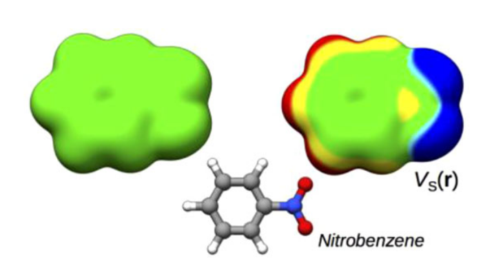
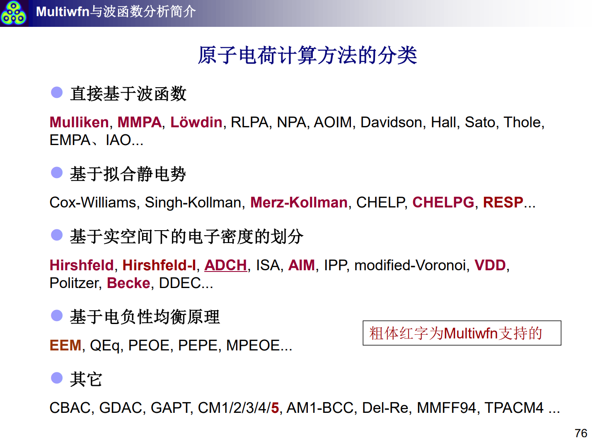
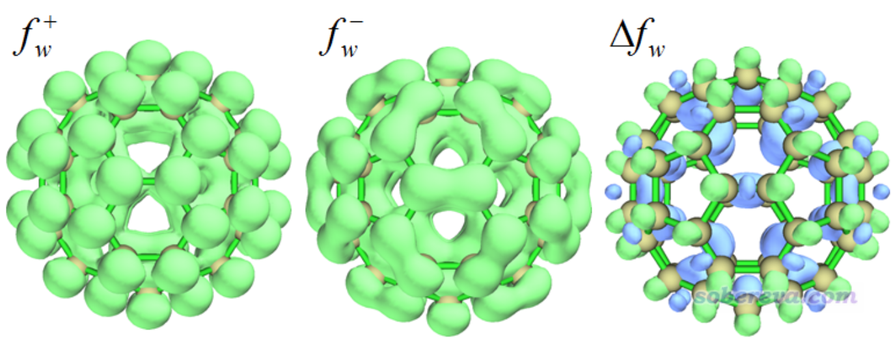

# 反应活性预测

本章节主要介绍一些反应活性预测的方法以及怎么使用Multiwfn去计算预测参数.

## Reference

主要参考内容是社长提供的一些文献以及他自己写的教程.

公社上的讨论帖: [http://bbs.keinsci.com/thread-31734-1-1.html]

轨道成分的计算方法: [http://sobereva.com/131]

轨道权重福井函数和轨道权重双描述符的博客: [http://sobereva.com/533]

使用Multiwfn计算各种概念密度泛函描述符: [http://sobereva.com/484]

静电势与局部离子化能的资料合集: [http://bbs.keinsci.com/thread-219-1-1.html]

概念密度泛函文献和综述合集: [http://bbs.keinsci.com/thread-384-1-1.html]

我看过的一些参考文献为:

| 年份 | 作者 | 标题 |
|------|------|------|
| 2015 | Cao, Jingsi; Ren, Cuilan | Comparative study on the methods for predicting the reactive site of nucleophilic reaction |
| 2014 | Rong, Fu; Tian, Lu | Comparing Methods for Predicting the Reactive Site of Electrophilic Aromatic Substitution |
| 1998 | Roy, R. K.; Krishnamurti, S. | Local Softness and Hardness Based New Descriptors for the Prediction of Reactivity |
| 2017 | Pino-Rios, Ricardo | Proposal of a simple and effective local reactivity descriptor through a topological analysis |
| 2007 | Politzer, Peter; Murray, Jane S. | Chapter 8 The average local ionization energy: A review |
| 2010 | Politzer, Peter; Murray, Jane S. | Average local ionization energy: A review |
| 1990 | Sjoberg, Per; Murray, Jane S. | Average local ionization energies: A review |
| 2019 | Brinck, Tore; Stenlid, Joakim H. | The Molecular Surface Property Approach: A Guide to Chemical Interactions in Chemistry |

## 预测方法

主要预测方法分为两大类,一类是基于静电效应的预测方法,主要是对局部硬度的描述,另一类则是体现局部电荷对外场的响应,主要是对局部软度的描述.

### 静电势

静电势是一个很有用的描述符,其计算方法为:

$$
V(r)= \sum_A\frac{Z_A}{|r-R_A|}-\int\frac{\rho(r')}{|r'-r|}dr'
$$

通常我们计算的是范德华表面上的静电势进行分析,范德华表面即$\rho=0.001a.u.$(对于气相是$\rho=0.002a.u.$)的电子密度等值面,其可以涵盖99%的电荷,可以更好的描述分子和分子之间相互接触的实际情况.

通过静电势的大小比较,我们可以合理的判断亲电和亲核位点.

### 原子电荷

原子电荷可以直观反应亲核亲电位点,其计算方法有很多种,常 见 的 如 Mulliken、CHELPG、NPA、Hirshfeld、ADCH、 AIM.

### 平均局部离子化能

关于这个概念,我强烈建议看这篇综述:(Average local ionization energy: A review).

普通的电离能为:

$$
I = E(X^+)+E(e^-)-E(X)
$$

假设不考虑电子的脱离对其余分子轨道的影响,即不考虑轨道弛豫效应,那么电离能近似等于HOMO轨道的能量:

$$
I \approx |\varepsilon_{HOMO}|
$$

同理也会有电子亲和能约等于LUMO轨道能量的近似等式.

为了考虑轨道弛豫效应带来的影响,同时又能够描述局部效应,我们考虑将轨道能量做电子云密度的加权平均:

$$
\bar{I}(\mathbf{r})=\frac{\sum_i\rho_i(\mathbf{r})|\varepsilon_i|}{\rho(\mathbf{r})}
$$

该物理量有着深层次的物理意义,可以反馈原子的核壳结构,另一个很有用的方面是,我们可以通过计算范德华表面上的平均局部离子化能来衡量分子的全局和局域电负性.

另一个很有用的方面是,平均局部离子化能反映的是局部的电子可迁移性,自然就和极化率有一定的联系,文献表明,对于原子使用原子体积除以范德华表面的平均平均局部离子化能,得到的这个量和原子极化率密切相关(R^2 = 0.984).

于是,我们可以得到一种估算分子极化率的高效算法,使用原子或者基团的贡献值进行计算:

$$
\alpha = \sum_i \alpha_i,\quad\alpha_i \sim \frac{V_i}{I_{i,S,avg}}
$$

### 前线轨道理论(FAO)

福井谦一提出的前线轨道理论认为, 体系的最高占据轨道(HOMO)和亲电反应有关, 体系的最低空轨道(LUMO)和亲核反应有关. 根据 HOMO 或  LUMO 的轨道成分多少可以判断发生亲电反应或亲核反应的位点.

要判断某个原子在HOMO或者LUMO中贡献的轨道成分的多少,就必须要做轨道成分分解.建议看这一篇[http://sobereva.com/131]

### 福井函数

福井函数是前线轨道理论的推广,其更具有物理意义.

福井函数定义为在电子数恒定情况下,分子的电子的化学势对外场的导数,也可以等价为体系总电荷密度在恒定外场作用下对电子数的导数:

$$
f(r)=\left[\frac{\partial\mu}{\partial v(r)}\right]_N=\left[\frac{\partial\rho(r)}{\partial N}\right]_{v(r)}
$$

通常认为,福井函数越大的点,反应活性越大.

我们可以考虑使用有限差分近似来估算福井函数:

亲电反应: $$f^-(r)=\rho_N(r)-\rho_{N-1}(r)\approx\rho^{HOMO}(r)$$

亲核反应: $$f^+(r)=\rho_{N+1}(r)-\rho_N(r)\approx\rho^{LUMO}(r)$$

自由基反应: $$f^0(r)=[f^+(r)+f^-(r)]/2\approx[\rho^{HOMO}(r)+\rho^{LUMO}(r)]/2$$

可以看到,在近似处理条件下,福井函数退化为前线轨道理论,哪个位点的HOMO/LUMO贡献越多,相应的反应活性越大.

为了直观展示原子的贡献,需要把福井函数收缩到原子上,即简缩福井函数(CFF),其可以基于原子电荷去计算:

亲电反应: $$f_A^-=q_{N-1}^A-q_N^A$$

亲核反应: $$f_A^+=q_N^A-q_{N+1}^A$$

自由基反应: $$f_A^0=(q_{N-1}^A-q_{N+1}^A)/2$$

这些公式表示了不同类型反应的简缩福井函数：
- $q_N^A$ 表示中性分子中原子A的电荷
- $q_{N-1}^A$ 表示阳离子中原子A的电荷
- $q_{N+1}^A$ 表示阴离子中原子A的电荷

通过计算这些简缩福井函数，我们可以直观地比较不同原子的反应活性。

### 双描述符DD

恒定电子数下体系硬度对外场的导数,即电子密度对电子数的二阶导数,福井函数对电子密度的一阶导数:

$$
f^{(2)}(r)=\left[\frac{\partial\eta}{\partial v(r)}\right]_N=\left[\frac{\partial f(r)}{\partial N}\right]_v
$$

次用一阶差分近似得到:

$$
f^{(2)}(r)\approx f^+(r)-f^-(r) = \rho^{LUMO}(r)-\rho^{HOMO}(r)
$$

负值易受亲电仅供,正值易受亲核进攻.

### $p_z$轨道布居数

对于芳香体系,离域大$\pi$键通常由多个$p_z$轨道贡献,通过考察电子在这些C原子对应轨道上的布居数可以表征相应C原子的活性.

完整的分子的量子化学计算中没有原子轨道的概念,所以要先做轨道成分分析,还原出原子轨道的概念,然后在计算出相应的原子轨道布居数.

### 软度和硬度

硬度和软度实际上是衡量反应受什么控制的一个物理量,硬度越高的位点越容易受静电作用主导,反之,软度越高的位点其电子云形变能力越强,该位点越容易收到轨道相互作用和色散相互作用主导.

#### 全局硬度和全局软度

全局硬度$\eta$和全局软度$S$的定义为:

$$
\eta=\left(\frac{\partial^2E}{\partial N^2}\right)_{v(r)}=\left(\frac{\partial\mu}{\partial N}\right)_{v(r)}
$$

$$
S=\frac{1}{2\eta}=\left(\frac{\partial^2N}{\partial E^2}\right)_{v(r)}=\left(\frac{\partial N}{\partial\mu}\right)_{v(r)}
$$

在实际计算中,通常使用有限差分近似:

$$
\eta \approx \frac{I-A}{2} \approx \frac{\varepsilon_{LUMO}-\varepsilon_{HOMO}}{2}
$$

$$
S \approx \frac{1}{(I-A)} \approx \frac{1}{(\varepsilon_{LUMO}-\varepsilon_{HOMO})}
$$

其中$I$为电离能,$A$为电子亲和能.

#### 局部硬度和局部软度

局部软度$s(r)$可以通过福井函数来定义:

$$
s(r)=Sf(r)
$$

这样就把只能在单个分子中比较的福井函数进行了修正,囊括了全局信息,进而拓展了概念,让局部软度可以在多个分子之间比较,从而确定反应活性位点.

仿照福井函数的有限差分法,我们可以得到局部软度的计算公式:

亲核反应: 
$$
s_k^+ = [\rho_k(N_0+1) - \rho_k(N_0)]S
$$

亲电反应:
$$
s_k^- = [\rho_k(N_0) - \rho_k(N_0-1)]S
$$

自由基反应:
$$
s_k^0 = \frac{1}{2}[\rho_k(N_0+1) - \rho_k(N_0-1)]S
$$

其中$\rho_k(N_0)$表示电子数为$N_0$时,原子$k$上的电子布居数(通常采用Mulliken布居分析)。这些公式分别适用于亲核进攻、亲电进攻和自由基进攻的活性位点预测。

同时,我们把相对亲电性(相对亲核性)定义为$s_k^+/s_k^-(s_k^-/s_k^+)$

局部硬度的定义式为:

$$
\tilde{\eta}(\bar{r})=\left(\frac{\partial\mu}{\partial\rho(\bar{r})}\right)_{v(r)}
$$

经过文献中一通强劲的推导,得到局部硬度的近似计算公式为:

$$
\tilde{\eta}(\bar{r})=-\frac{V_{el}(r)}{2N}
$$

### 轨道加权福井函数

福井函数和双描述符用于大多数体系都没什么问题。但有些体系比如C60、18碳环，具有高阶点群对称性，这往往令前线分子轨道存在简并性。还有些体系，前线轨道能量相差很小，即准简并。对这些情况，福井函数和双描述符可能无法给出有意义的结果。

轨道加权福井函数的定义如下：

亲核：

$$
f_w^+(\mathbf{r}) = \sum_{i=LUMO}^{\infty} w_i |\varphi_i(\mathbf{r})|^2, \quad w_i = \frac{\exp[-(\frac{\mu-\varepsilon_i}{\Delta})^2]}{\sum_{i=LUMO}^{\infty} \exp[-(\frac{\mu-\varepsilon_i}{\Delta})^2]}
$$

亲电：

$$
f_w^-(\mathbf{r}) = \sum_{i}^{HOMO} w_i |\varphi_i(\mathbf{r})|^2, \quad w_i = \frac{\exp[-(\frac{\mu-\varepsilon_i}{\Delta})^2]}{\sum_{i}^{HOMO} \exp[-(\frac{\mu-\varepsilon_i}{\Delta})^2]}
$$

自由基：

$$
f_w^0(\mathbf{r}) = [f_w^+(\mathbf{r}) + f_w^-(\mathbf{r})]/2
$$

双描述符：

$$
\Delta f_w(\mathbf{r}) = f_w^+(\mathbf{r}) - f_w^-(\mathbf{r})
$$

其中：
- $\varphi_i(\mathbf{r})$ 是分子轨道
- $\varepsilon_i$ 是轨道能量
- $\mu$ 是化学势
- $\Delta$ 是能量展宽参数
- $w_i$ 是权重因子

这种方法通过引入高斯型权重因子，考虑了更多轨道的贡献，使得结果更加合理，特别是对于具有轨道简并性的体系。

