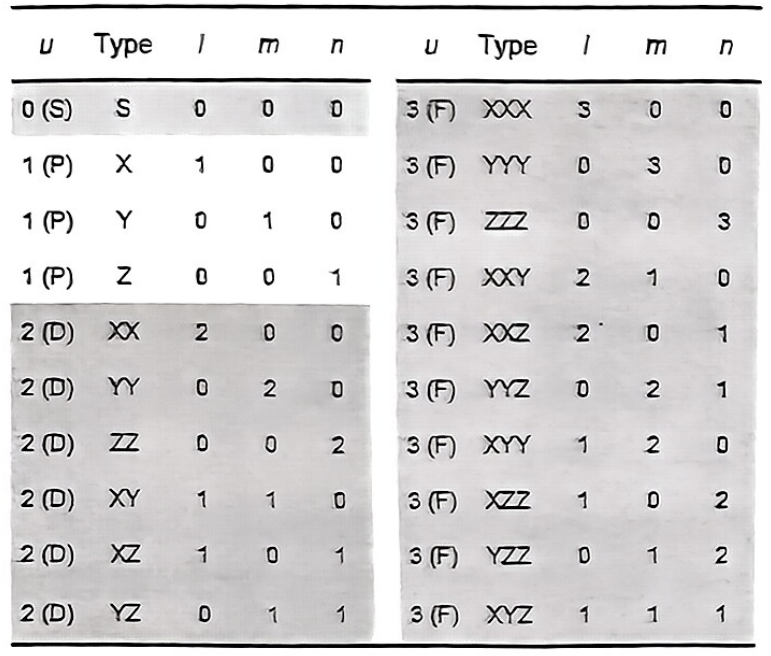
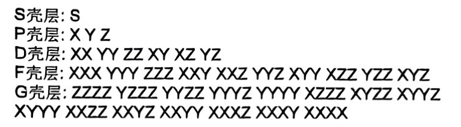
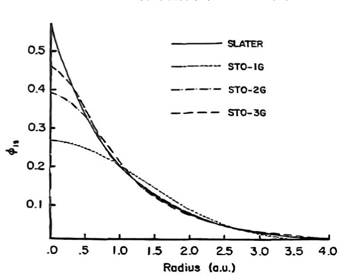
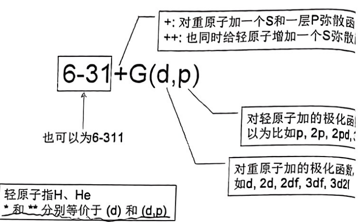

# 轨道成分分析

内容参考卢老师的博客:[http://sobereva.com/131]

## 基组

在这个网站 [https://www.basissetexchange.org/] 上可以免费查询不同软件下,不同基组对不同元素的配置.

在量子化学计算中,我们使用原子轨道基组来线性组合成为分子轨道,其中的系数组便是通过变分法进行求解的.随之而来的,如何表示原子轨道就是一个问题,氢原子的原子轨道有精确解,是slater型函数,但是一旦当电子数目增多,原子轨道将不再可以求出精确解,故对于多电子原子的原子轨道,我们也采用基函数线性组合的方法去近似表示.

Slater型函数在积分运算中没有优势,故实际使用过程中常常使用Gaussian型函数组合去近似Slater型函数.

其表达形式为(笛卡尔型):

$$
\phi(\mathbf{r}) = N x^l y^m z^n e^{-\alpha |\mathbf{r}-\mathbf{R_A}|^2}
$$

N是归一化系数,l,m,n决定GTF(高斯型函数)的type,l+m+n等于角量子数



有的时候,为了减少计算量,内层的电子轨道常常用收缩型基函数表示,即用好几个GTF收缩成为一个basis,这样就减少了可变系数的数量:

$$
\chi(r) = \sum_i d_i \phi_i(r)
$$

而对于外层电子轨道,可以采用一个收缩基函数和一个非收缩基函数共同组成原子轨道:

$$
\chi(r) = \lambda_1 \sum_i d_i \phi_i(r) + \lambda_2 \phi_j(r)
$$

其中系数可变,这里只是做一个示意,实际上这两个基函数直接作为基组参与到分子轨道的构建当中去,而不是原子轨道作为整体再去构建分子轨道.

构建不同电子亚层的时候,通常采用不同类型的基函数:



### 极小基

一个基函数就代表一个原子轨道,该基函数通常是收缩基函数,即所谓的STO-nG,n的个数就是收缩进来的基函数的个数.



随着收缩数的提升,GTF组成的收缩基函数会越来越逼近slater型基函数.

### 扩展基

与极小基相对的就是扩展基,即用多个基函数去描述一个原子轨道(其意义是组成原子轨道的各个部分系数是可变的,在自洽场过程中优化,而收缩是系数固定,整体作为基函数去参与分子轨道构建).


一个常见的双分裂价基组是pople提出的6-31G系列基组,其内层的所有原子轨道均由一个收缩型的基函数表示(该收缩型基函数由6个GTF构成),而价电子层的原子轨道由一个收缩型基函数和一个非收缩型基函数共同组成(该收缩型基函数由3个GTF构成,非收缩型基函数由1个GTF构成).

我们给出Na的6-31G基组配置

```
Na     0
S    6   1.00
      0.9993200000D+04       0.1937659277D-02
      0.1499890000D+04       0.1480699448D-01
      0.3419510000D+03       0.7270547288D-01
      0.9467960000D+02       0.2526289058D+00
      0.2973450000D+02       0.4932418160D+00
      0.1000630000D+02       0.3131688832D+00
SP   6   1.00
      0.1509630000D+03      -0.3542083504D-02       0.5001659710D-02
      0.3558780000D+02      -0.4395884348D-01       0.3551089794D-01
      0.1116830000D+02      -0.1097521086D+00       0.1428249917D+00
      0.3902010000D+01       0.1873981854D+00       0.3386199803D+00
      0.1381770000D+01       0.6466996397D+00       0.4515789738D+00
      0.4663820000D+00       0.3060583027D+00       0.2732709841D+00
SP   2   1.00
      0.5018240000D+00      -0.2196604975D+00       0.9066487958D-02
      0.6094580000D-01       0.1089122467D+01       0.9972017754D+00
SP   1   1.00
      0.2443490000D-01       0.1000000000D+01       0.1000000000D+01   
```
首先来看第一个壳层,第一个电子层内只有一个电子亚层,其基函数由6个GTF构成,第一列代表指数,第二列代表收缩系数,6个GTF共同表示一个S轨道.

第二个壳层中只有S和P轨道被占据,其也是内层轨道,所以也需要用6个GTF收缩成为的基函数表示,第一列代表指数,这是由两个原子轨道共用的,第二列是S轨道基函数的收缩系数,第三列是P轨道基函数的收缩系数.

同时注意,由于p轨道的角量子数是1,所以还要生成$p_x,p_y,p_z$三个轨道:

$$
\begin{aligned}
\phi(\mathbf{r}) = N x e^{-\alpha |\mathbf{r}-\mathbf{R_A}|^2} \\
\phi(\mathbf{r}) = N y e^{-\alpha |\mathbf{r}-\mathbf{R_A}|^2} \\
\phi(\mathbf{r}) = N z e^{-\alpha |\mathbf{r}-\mathbf{R_A}|^2} \\
\end{aligned}
$$

第三个壳层是价电子层,用2个GTF收缩成为的基函数和一个GTF表示的非收缩基函数共同组成.

### 极化函数

通常需要往基组里面去加入一些高动量基函数(d,f),这些基函数被称作极化函数,往往用来描述原子轨道在分子轨道中的变形能力,post-HF方法需要充分的极化函数才能描述电子相关.通常极化函数是无收缩的基函数.

### 弥散函数

弥散函数通常是展宽很大的GTF函数,并且是无收缩的,其主要用来描述长程相互作用,但是其物理意义弱,本质上只是一种长程修正,所以会增加计算速度,影响结果的收敛性.



## 轨道成分分析

### 极小基

首先从极小基的分析开始,使用sto-3g对He-H+的分子轨道波函数进行计算,得到如下结果

```
     Molecular Orbital Coefficients:
                           1         2
                           O         V
     Eigenvalues --    -1.52378  -0.26764
   1 1   He 1S          0.90013  -0.64981
   2 2   H  1S          0.19438   1.09302
```

其中，O 表示占据轨道 (Occupied)，V 表示空轨道 (Virtual)。

占据的分子轨道波函数 (ψ1) 可以表示为：

\[
\psi_1 = 0.9 \chi_1 + 0.1944 \chi_2
\]

其中，\( \chi \) 代表基函数。

根据轨道的归一化条件：

\[
\begin{aligned}
1 = \langle \psi_1 | \psi_1 \rangle &= 0.9^2 \langle \chi_1 | \chi_1 \rangle + 2 \times 0.9 \times 0.1944 \langle \chi_1 | \chi_2 \rangle + 0.1944^2 \langle \chi_2 | \chi_2 \rangle \\
&= 0.9^2 S_{11} + 2 \times 0.9 \times 0.1944 S_{12} + 0.1944^2 S_{22}
\end{aligned}
\]

上式中：

*   \(0.9^2\) 和 \(0.1944^2\) 分别是 \(\chi_1\) 和 \(\chi_2\) 的“定域项”，表示它们各自对 \(\psi_1\) 的贡献。
*   \(2 \times 0.9 \times 0.1944 S_{12}\) 是交叉项，代表了 \(\chi_1\) 和 \(\chi_2\) 对 \(\psi_1\) 的联合贡献。

一个简单的计算轨道成分的方法是,直接将定域项系数作为轨道成分,但是这样不满足归一化,即两个系数加起来不等于1,这是因为基函数之间往往是不正交的,需要考虑交叉项的贡献.

Mulliken、Stout-Politzer和SCPA方法都可以使得加和为1

#### Mulliken方法

Mulliken方法即将交叉项的一般划分给两个轨道,那这样轨道1的贡献就是(0.9^2+0.9* 0.1944*S12)*100%=88.6%,这种平均分割交叉项的方法保证的贡献的归一化,但是其物理意义不强(为什么就是对半分呢).

使用这种方法算出来的轨道贡献还可以计算Mulliken布居数,进而计算Mulliken电荷,假设这是一个双占据轨道,布居数就是2*0.886 = 1.772,减去核电荷2就是原子的Mulliken电荷0.228.

#### Stout-Politzer方法

Stout-Politzer方法就是按照定域项去划分交叉项,即:

$$
contri_{cross}= \frac{2*0.9* 0.1944*S12}{0.9^2+0.1944^2}*0.9* 100\%
$$

这样貌似更合理一些,实际上在某些场景会弱化表现,甚至可能出现负的贡献.

#### SCPA方法

SCPA方法就是不考虑交叉项了,我们只把定域项归一化了,这样做的好处是,完全避免了负贡献的出现:

$$
contri = \frac{0.9^2}{0.9^2+0.1944^2}* 100\%
$$

### 扩展基

扩展基使用多个基函数去描述单个原子轨道,所以,如果想要计算原子轨道的贡献,就必须要非常清楚基函数和原子轨道的对应关系.

对于HF/6-31G*下计算水分子，Gaussian输出的占据轨道系数为：

```
                         1         2         3         4         5
                        (A1)--O   (A1)--O   (B2)--O   (A1)--O   (B1)--O
     Eigenvalues --   -20.55790  -1.34610  -0.71418  -0.57083  -0.49821
   1 1   O  1S          0.99462  -0.20953   0.00000  -0.07310   0.00000
   2        2S          0.02117   0.47576   0.00000   0.16367   0.00000
   3        2PX         0.00000   0.00000   0.00000   0.00000   0.63927
   4        2PY         0.00000   0.00000   0.50891   0.00000   0.00000
   5        2PZ        -0.00134  -0.09475   0.00000   0.55774   0.00000
   6        3S          0.00415   0.43535   0.00000   0.32546   0.00000
   7        3PX         0.00000   0.00000   0.00000   0.00000   0.51183
   8        3PY         0.00000   0.00000   0.30390   0.00000   0.00000
   9        3PZ         0.00046  -0.04982   0.00000   0.40482   0.00000
  10        4XX        -0.00394  -0.00103   0.00000   0.01187   0.00000
  11        4YY        -0.00421   0.02692   0.00000   0.00079   0.00000
  12        4ZZ        -0.00409   0.02132   0.00000  -0.04630   0.00000
  13        4XY         0.00000   0.00000   0.00000   0.00000   0.00000
  14        4XZ         0.00000   0.00000   0.00000   0.00000  -0.03417
  15        4YZ         0.00000   0.00000  -0.05088   0.00000   0.00000
  16 2   H  1S          0.00032   0.13302   0.23243  -0.14007   0.00000
  17        2S         -0.00021   0.00173   0.10729  -0.08280   0.00000
  18 3   H  1S          0.00032   0.13302  -0.23243  -0.14007   0.00000
  19        2S         -0.00021   0.00173  -0.10729  -0.08280   0.00000
```

O的价层轨道用两个基函数表示,所以O的2px轨道即为2PX,3PX两个基函数贡献之和,对于H,只有价层电子,所以s轨道就由1S和2S两个基函数贡献之和.(基函数的贡献根据轨道系数来计算)

这种方法需要我们对基函数和轨道的对应关系非常清楚,但是当基组异常复杂的时候,人类是很难理清关系的,有的时候也需要过硬的化学知识来辅助理解.并且,加了弥散和极化函数之后,这种意义就变得更加模糊了,不好完成对应的分析.

### NAO方法

NAO即Natural atomic orbital,自然原子轨道,是NBO模块中的一种分析方法,这种划分方法相当于把扩展基变成极小基,并且是正交归一的,所以可以直接用NAO轨道系数的平方去计算贡献.

NAO在Gaussian中需要关键词`pop=nboread` ,并且在坐标后空两行,加上:`$NBO NAOMO $END`

这是一个简单水分子的输入文件

```
%mem=4GB
%nprocshared=8
%chk=water.chk

# p opt=(tight,calcfc,recalc=10) hf/6-31G* pop=nboread 

water calculation

0 1
 H                  1.69450100    0.52331300   -0.04412100
 H                  1.07966400    1.02791900   -1.28232000
 O                  1.04395200    0.81202800    1.24586000

$NBO NAOMO $END
```

在NBO模块会看到这样的布居分析:

```
NATURAL POPULATIONS:  Natural atomic orbital occupancies

   NAO  Atom  No  lang   Type(AO)    Occupancy      Energy
 ----------------------------------------------------------
     1    H    1  S      Val( 1S)     0.92241      -0.17340
     2    H    1  S      Ryd( 2S)     0.00055       1.03472

     3    H    2  S      Val( 1S)     0.88801      -0.20197
     4    H    2  S      Ryd( 2S)     0.00007       0.98416

     5    O    3  S      Cor( 1S)     1.99999     -20.50310
     6    O    3  S      Val( 2S)     1.96877      -1.36662
     7    O    3  S      Ryd( 3S)     0.00119       1.10199
     8    O    3  S      Ryd( 4S)     0.00000       3.56819
     9    O    3  px     Val( 2p)     1.88427      -0.50631
    10    O    3  px     Ryd( 3p)     0.00063       1.16556
    11    O    3  py     Val( 2p)     0.33300      -0.03249
    12    O    3  py     Ryd( 3p)     0.00029       1.25903
    13    O    3  pz     Val( 2p)     1.99982      -0.54259
    14    O    3  pz     Ryd( 3p)     0.00007       1.12914
    15    O    3  dxy    Ryd( 3d)     0.00032       2.07860
    16    O    3  dxz    Ryd( 3d)     0.00002       2.08379
    17    O    3  dyz    Ryd( 3d)     0.00009       2.05473
    18    O    3  dx2y2  Ryd( 3d)     0.00032       2.08722
    19    O    3  dz2    Ryd( 3d)     0.00018       2.09467
```
Cor对应于内核NAO，Val对应于价层NAO，标着这两类标签的NAO就是极小集部分，可以简单认为它们就是一般意义的原子轨道。而Ryd型NAO是用来描述那些没有被Cor和Val型NAO所描述的信息，它们对占据的分子轨道贡献极小而一般可以忽略，但是对于高能态的虚轨道则可能有很大贡献。通常我们分析的都是占据轨道和能量最低的几个虚轨道，所以一般不必考虑Ryd型NAO。

在后面可以看到各个分子轨道按照NAO轨道展开的展开系数,使用系数的平方即可计算贡献:

```
MOs in the NAO basis:                                                         

          NAO        1       2       3       4       5       6       7       8
      ---------- ------- ------- ------- ------- ------- ------- ------- -------
   1.  H 1 (S)    0.0244  0.3047  0.3644 -0.1882  0.0000 -0.4211 -0.3711  0.4027
   2.  H 1 (S)    0.0028 -0.0165  0.0095 -0.0079  0.0000 -0.4840 -0.5548 -0.3844
   3.  H 2 (S)    0.0244  0.3047 -0.3644 -0.1882  0.0000 -0.4211  0.3711 -0.4027
   4.  H 2 (S)    0.0028 -0.0165 -0.0095 -0.0079  0.0000 -0.4840  0.5548  0.3844
   5.  O 3 (S)    0.9958 -0.0896  0.0000 -0.0177  0.0000  0.0046  0.0000  0.0000
   6.  O 3 (S)    0.0847  0.8833  0.0000  0.2928  0.0000  0.2288  0.0000  0.0000
   7.  O 3 (S)    0.0003  0.0081  0.0000 -0.0246  0.0000 -0.2298  0.0000  0.0000
   8.  O 3 (S)    0.0000  0.0000  0.0000  0.0000  0.0000  0.0554  0.0000  0.0000
   9.  O 3 (px)   0.0000  0.0000  0.8554  0.0000  0.0000  0.0000  0.3287 -0.3601
  10.  O 3 (px)   0.0000  0.0000  0.0334  0.0000  0.0000  0.0000 -0.0250  0.4770
  11.  O 3 (py)   0.0023 -0.1584  0.0000  0.9170  0.0000 -0.2597  0.0000  0.0000
  12.  O 3 (py)  -0.0011 -0.0006  0.0000 -0.0124  0.0000  0.0254  0.0000  0.0000
  13.  O 3 (pz)   0.0000  0.0000  0.0000  0.0000  0.9993  0.0000  0.0000  0.0000
  14.  O 3 (pz)   0.0000  0.0000  0.0000  0.0000 -0.0173  0.0000  0.0000  0.0000
  15.  O 3 (d1)   0.0000  0.0000 -0.0388  0.0000  0.0000  0.0000 -0.0177 -0.1517
  16.  O 3 (d2)   0.0000  0.0000  0.0000  0.0000  0.0000  0.0000  0.0000  0.0000
  17.  O 3 (d3)   0.0000  0.0000  0.0000  0.0000 -0.0342  0.0000  0.0000  0.0000
  18.  O 3 (d4)  -0.0001  0.0039  0.0000  0.0267  0.0000 -0.0198  0.0000  0.0000
  19.  O 3 (d5)   0.0001 -0.0181  0.0000  0.0241  0.0000  0.0131  0.0000  0.0000

          NAO        9      10      11      12      13      14      15      16
      ---------- ------- ------- ------- ------- ------- ------- ------- -------
   1.  H 1 (S)    0.2270  0.0000  0.3610  0.2485  0.0805  0.0138  0.0000  0.0000
   2.  H 1 (S)   -0.1947  0.0000 -0.4388 -0.1977  0.1381 -0.0269  0.0000  0.0000
   3.  H 2 (S)    0.2270  0.0000  0.3610 -0.2485  0.0805  0.0138  0.0000  0.0000
   4.  H 2 (S)   -0.1947  0.0000 -0.4388  0.1977  0.1381 -0.0269  0.0000  0.0000
   5.  O 3 (S)    0.0010  0.0000  0.0042  0.0000 -0.0015 -0.0001  0.0000  0.0000
   6.  O 3 (S)   -0.1413  0.0000 -0.2288  0.0000 -0.0322 -0.0074  0.0000  0.0000
   7.  O 3 (S)   -0.3784  0.0000  0.0830  0.0000 -0.8483  0.0516  0.0000  0.0000
   8.  O 3 (S)   -0.0124  0.0000  0.0153  0.0000  0.0926 -0.0099  0.0000  0.0000
   9.  O 3 (px)   0.0000  0.0000  0.0000 -0.1741  0.0000  0.0000  0.0000  0.0000
  10.  O 3 (px)   0.0000  0.0000  0.0000 -0.8761  0.0000  0.0000  0.0000  0.0000
  11.  O 3 (py)   0.1133  0.0000  0.2231  0.0000  0.0268  0.0457  0.0000  0.0000
  12.  O 3 (py)  -0.8010  0.0000  0.4620  0.0000  0.3681 -0.0383  0.0000  0.0000
  13.  O 3 (pz)   0.0000 -0.0178  0.0000  0.0000  0.0000  0.0000  0.0000  0.0339
  14.  O 3 (pz)   0.0000 -0.9997  0.0000  0.0000  0.0000  0.0000  0.0000 -0.0146
  15.  O 3 (d1)   0.0000  0.0000  0.0000 -0.0205  0.0000  0.0000  0.0000  0.0000
  16.  O 3 (d2)   0.0000  0.0000  0.0000  0.0000  0.0000  0.0000  1.0000  0.0000
  17.  O 3 (d3)   0.0000 -0.0140  0.0000  0.0000  0.0000  0.0000  0.0000  0.9993
  18.  O 3 (d4)   0.0507  0.0000  0.1018  0.0000 -0.1742 -0.9060  0.0000  0.0000
  19.  O 3 (d5)  -0.0283  0.0000 -0.1458  0.0000  0.2304 -0.4135  0.0000  0.0000

          NAO       17      18      19
      ---------- ------- ------- -------
   1.  H 1 (S)   -0.0708  0.0747 -0.0170
   2.  H 1 (S)    0.1228 -0.0727 -0.0119
   3.  H 2 (S)   -0.0708 -0.0747 -0.0170
   4.  H 2 (S)    0.1228  0.0727 -0.0119
   5.  O 3 (S)    0.0005  0.0000  0.0002
   6.  O 3 (S)    0.0310  0.0000  0.0097
   7.  O 3 (S)   -0.2535  0.0000 -0.0994
   8.  O 3 (S)    0.0509  0.0000 -0.9926
   9.  O 3 (px)   0.0000 -0.0194  0.0000
  10.  O 3 (px)   0.0000  0.0560  0.0000
  11.  O 3 (py)  -0.0307  0.0000 -0.0120
  12.  O 3 (py)   0.0633  0.0000  0.0565
  13.  O 3 (pz)   0.0000  0.0000  0.0000
  14.  O 3 (pz)   0.0000  0.0000  0.0000
  15.  O 3 (d1)   0.0000  0.9873  0.0000
  16.  O 3 (d2)   0.0000  0.0000  0.0000
  17.  O 3 (d3)   0.0000  0.0000  0.0000
  18.  O 3 (d4)   0.3669  0.0000  0.0114
  19.  O 3 (d5)  -0.8674  0.0000 -0.0200
```

### 计算原子或者片段的轨道成分

原子对某一个分子轨道的贡献,只需要把该原子的所有NAO原子轨道对分子轨道的贡献加起来就可以了.

还有一类基于实空间划分的方法可用于计算原子所占成份。这类方法都是将整个分子空间划分为一个个原子区域，然后积分某个轨道在相应原子空间内的模的平方来作为此原子在此轨道中的成份。主要就两种:QTAIM和Hirshfeld方法.


## 使用Multiwfn计算轨道成分

按8进入轨道成分分析模块,三种交叉项划分方法均已实现:

```
 1 Orbital composition analysis with Mulliken partition
 2 Orbital composition analysis with Stout-Politzer partition
 3 Orbital composition analysis with Ros-Schuit (SCPA) partition
```

以Mulliken划分为例,输入a显示所有轨道信息,输入轨道编号可以显示这个轨道成分的分解信息:

```
 Orbital:     5  Energy(a.u.):     -0.498209  Occ:  2.000000  Type: Alpha&Beta
 Printing threshold of absolute value:  >   0.50000 %

  Basis Type    Atom    Shell      Local       Cross term        Total
     9   Z        3(O )    7     40.86607 %     16.40974 %     57.27581 %
    13   Z        3(O )    9     26.19770 %     16.40974 %     42.60744 %
 Sum up those listed above:      67.06376 %     32.81949 %     99.88325 %
 Sum up all basis functions:     67.18051 %     32.81949 %    100.00000 %

 Composition of each shell
 Shell     7 Type: P    in atom    3(O ) :    57.27581 %
 Shell     9 Type: P    in atom    3(O ) :    42.60744 %

 Composition of different types of shells (%):
 s:   0.000  p:  99.883  d:   0.117  f:   0.000  g:   0.000  h:   0.000

 Composition of each atom:
 Atom     1(H ) :     0.00000 %
 Atom     2(H ) :     0.00000 %
 Atom     3(O ) :   100.00000 %

 Orbital delocalization index:  100.00
```

第一个部分输出了当前轨道的信息,第二个部分输出的是各个基函数对该轨道的贡献(只有贡献大于0.5%的基函数才会被输出),第三个部分是各个壳层对轨道的贡献,第四个部分是各个壳层类型对轨道的贡献,第五个部分是各个原子对轨道的贡献,第六个部分是轨道离域化指数,用于衡量轨道在各个原子间的离域化程度.

如果想要查看基函数和原子的对应关系,要回退到主页面,进入`6 Check & modify wavefunction`模块,这里可以查看所有的GTF和所有的基函数,方便我们观察其与轨道的对应关系.

此外,还有许许多多的计算轨道贡献和原子贡献的方法,要用的时候再具体去看就好了.

值得注意的是,做NAO分析的时候需要Gaussian的输出文件(.out或者.log),而不是载入波函数信息的文件,在8模块中会只剩下NAO分析这一个选项,以水为例,选择一个轨道后会输出所有贡献:

```
    NAO#   Center   Label      Type    Composition
       5    3(O )    s        Cor( 1s)    99.102 %
       6    3(O )    s        Val( 2s)     0.872 %

 Condensed NAO terms to shells:
   Atom:     3(O )  Shell:     5( 1s Cor)    99.102 %
   Atom:     3(O )  Shell:     6( 2s Val)     0.872 %

 Composition of different types of shells (%):
 s:  99.997  p:   0.000  d:   0.000  f:   0.000  g:   0.000  h:   0.000

 Condensed NAO terms to atoms:
   Center   Composition
     3(O )    99.974 %

 Core composition:       99.102 %
 Valence composition:     0.894 %
 Rydberg composition:     0.001 %

 Orbital delocalization index:   99.95
```