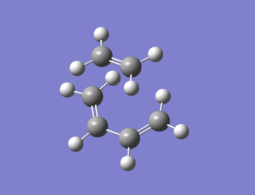
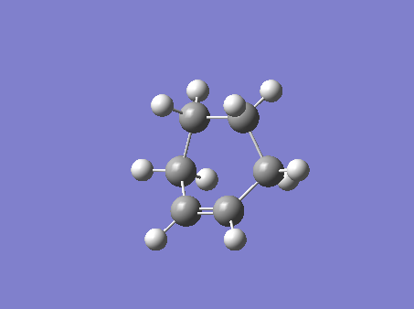
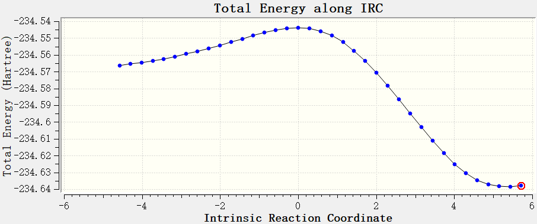
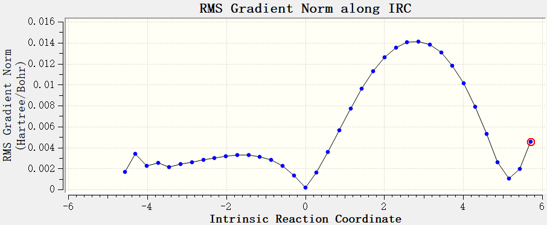
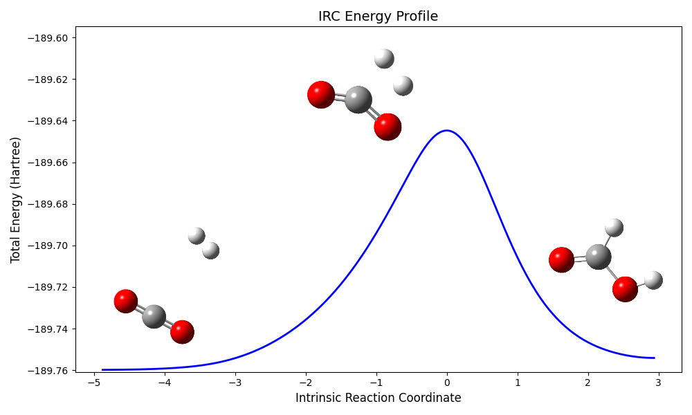

# IRC计算

IRC是质权坐标下连接反应物和产物能量最低的路径,可以有效描述化学反应过程中的结构变化,可以深入了解反应机理,可以从过渡态产生IRC得到反应物和产物,也可以从反应物产物生成IRC判断过渡态是否是真的过渡态.

## 关键词

```
Forward,Reverse: 高斯默认从过渡态开始正向和逆向产生IRC曲线上的点,这两个关键词的意思是只产生正向的或者只产生逆向的.
Maxpoints: 每个方向生成的点的个数的上限
Stepsize: IRC步长,默认为10(0.01Bohr)
recalc=N: 和前面一样,每生成N个IRC点就重新精确计算一次黑塞矩阵,需要和calclc一起使用.
```

有的时候我们需要根据过渡态获取反应物和生成物的结构,而当IRC点很接近极小值点的时候程序就会自动终止,所以可以将maxpoint设置的大一点,然后取一个离极小点最近的点做结构优化,就得到了反应物或者产物,最后再做一步单点能计算,二者之间的能量差值就是活化能

IRC也是一个耗时且敏感的操作,很容易出现某一步结构优化不收敛的情况,所以在关键词的设置上需要小心,例如我会设置:

```
IRC=(calcfc,maxpoints=500,maxcycle=200,stepsize=5,recalc=10)
```

使用小步长,频繁重新精确计算Hessian,往往可以使得每一步收敛.

关于IRC的更多设置和相关问题,参见卢经:[在Gaussian中计算IRC的方法和常见问题](http://sobereva.com/400)

## 使用GW观看IRC

以著名有机反应Diels-Alders反应的IRC计算结果为例:

反应物:



产物:



确实是符合有机化学中的机理分析理论的,再看GW中生成的IRC曲线:

能量-搜索点序列曲线



点击相应的点就能观看对应的构型,GW中还提供了平均受力曲线:



这里有一个非常值得注意的点就是,原子的平均受力最小的构型不一定是能量最低的构型.求完IRC之后,能量-序列曲线就是化学书中经常见到的描述过渡态的曲线,在没有学习IRC之间,我一直认为这是一个示意图一样的抽象曲线,直到此刻,其被具象化了.

## 更美观的IRC



例如像这个二氧化碳加氢生成甲酸的,我们可以先在Gaussview中选择save data,然后保存下来的数据可以用python或者origin画,比高斯自带的绘图肯定要美观不少.

然后,找到反应物,生成物,过渡态三个结构,分别保存为图片,然后使用AI抠图把背景去掉,再和我们使用绘图软件绘制出来的过渡态曲线叠加在一起,就得到了上面这种比较美观的IRC曲线.

抠图和叠加可以使用P图软件,或者我找到了一个免费网站也还能用,美中不足的就是非会员保存要看广告....[https://photokit.com/?lang=zh]
