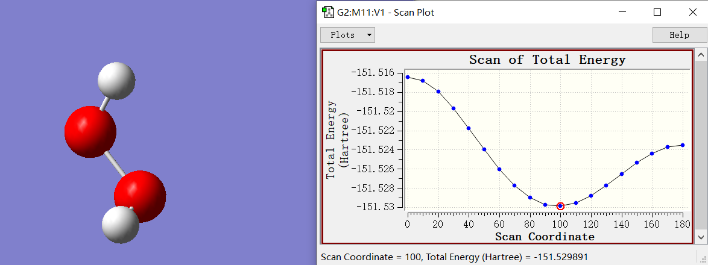
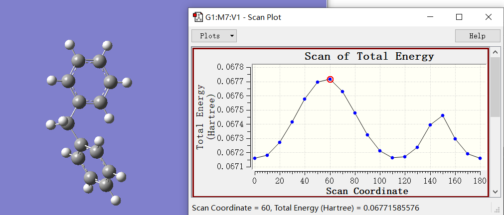

# 势能面扫描

势能面扫描就是检验能量或者其他性质随着几何结构(键长,键角,二面角等等)性质变化而发生变化,一般要设定扫描那些变量,扫描步长和扫描点数.

扫描分为两种-刚性扫描和柔性扫描,刚性扫描的意思就是仅仅使得被扫描变量发生变化,而柔性扫描的话就是在被扫描变量改变的同时,对其余的原子进行结构优化,即每一步都是限制性优化,这种扫描显然会更有意义,但是耗时会显著提升.

## 刚性扫描

关键词只要写一个scan就可以了,写原子坐标的时候,不被扫描的变量直接写数字(或者写变量然后下面指定变量名),被扫描的变量用一个变量代替,然后在坐标后面空一行,写上起始值,扫描步数,扫描步长.

双氧水:

```
%chk=C:\1.chk
# b3lyp/6-31g** scan nosymm

Title Card Required

0 1
 O
 H                  1              B1
 O                  1              B2    2              A1
 H                  3              B3    1              A2    2              D1

   B1             0.96000000
   B2             1.32000000
   B3             0.96000000
   A1           109.50000006
   A2           109.50000006
   D1           0.0   18  10.0

```

然后将.out文件拖入到GW中,在result中选择sacn,就能看到不同变量下的能量变化和对应的构型了:



## 柔性扫描

柔性扫描本质上是对每一步做结构优化,所以不需要写关键词,只是柔性扫描一般是在内坐标下进行的,所以要指定`opt=modredundant`,然后坐标写内坐标,但是照常写数字,其中的值就是扫描的初始值.

然后在输入坐标末尾空一行,写上诸如:

```
17 15 1 2 S 18 10.0
```

这种语句,前四个数字式原子序号,代表二面角,S代表柔性扫描,18是步数,10度代表步长.

二苯甲烷的扫描结果:

