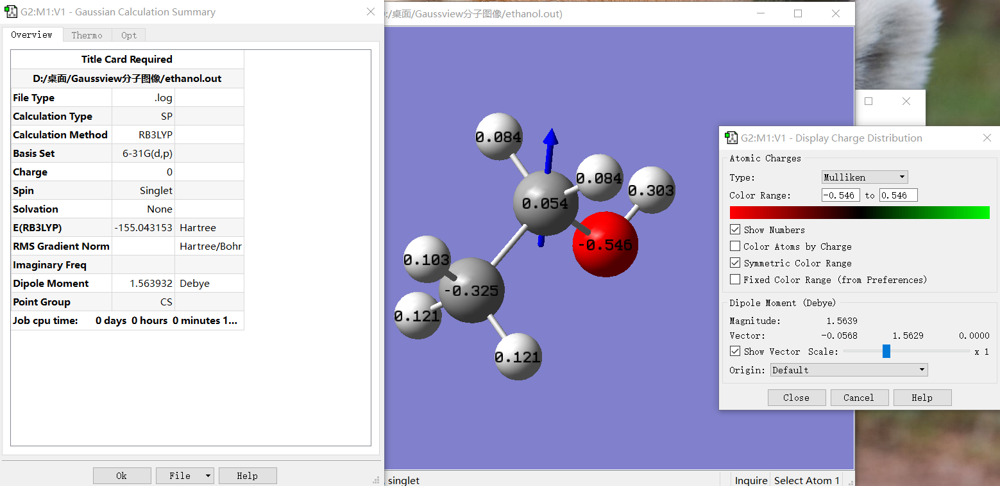
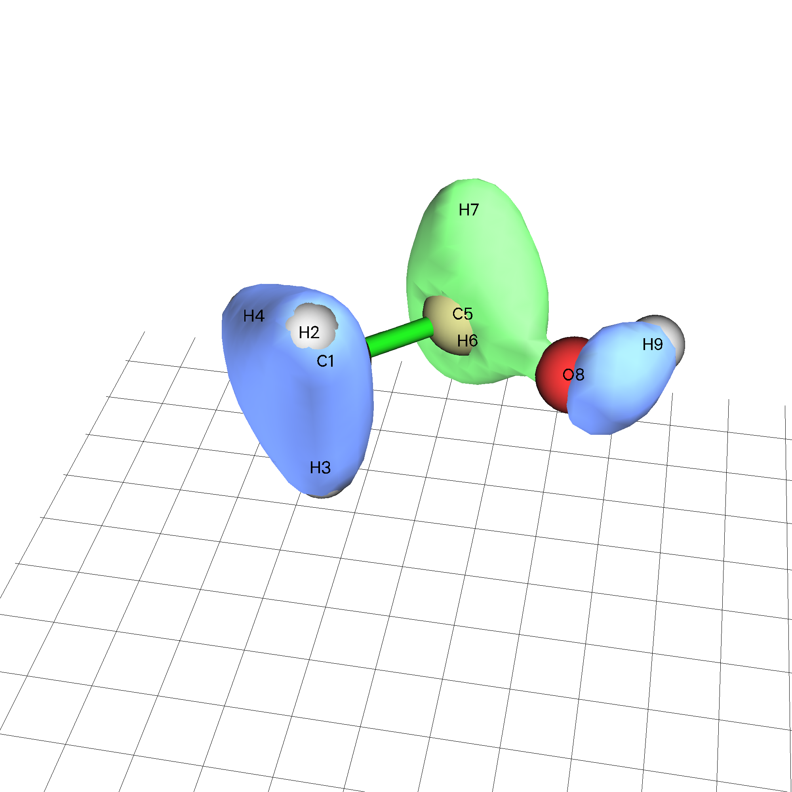
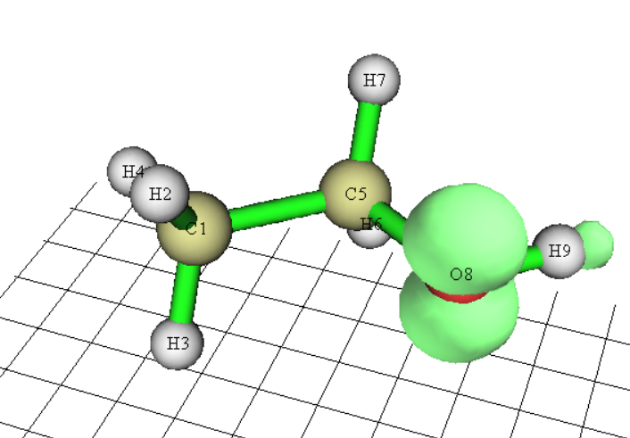
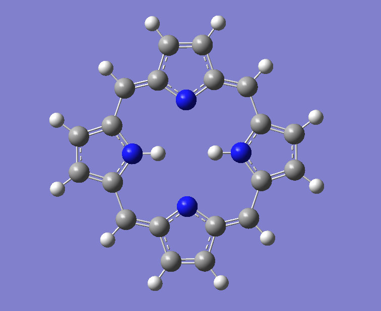

# 单点能计算

## 输出文件概览

单点能计算是最简单的量子化学计算,下面以乙醇的计算结果为例说明高斯的各部分输出.

首先要建立一个乙醇,这里选择用Gaussview:

输入文件为:

```
%chk=/root/Gausscomp/单点能计算/ethanol.chk
# b3lyp/6-31g(d,p) 

Title Card Required

0 1
 C                 -1.49782421   -1.62806767    0.00000503
 H                 -1.14220925   -2.63724446    0.00045979
 H                 -1.14016306   -1.12426525   -0.87358620
 H                 -2.56782347   -1.62695257   -0.00056966
 C                 -0.98440956   -0.90231133    1.25749584
 H                 -1.34002452    0.10686546    1.25704107
 H                 -1.34207071   -1.40611375    2.13108706
 O                  0.44558945   -0.90380159    1.25826388
 H                  0.76564014   -0.45138205    2.04215425
```

使用命令`g16 <ethanol.gjf> ethanol.out` 就能正确启动计算,然后得到.out输出文件,里面包含如下内容:

原子之间的距离矩阵:

```
Distance matrix (angstroms):
                    1          2          3          4          5
     1  C    0.000000
     2  H    1.070000   0.000000
     3  H    1.070000   1.747303   0.000000
     4  H    1.070000   1.747303   1.747303   0.000000
     5  C    1.540000   2.148263   2.148263   2.148263   0.000000
     6  H    2.148263   3.024610   2.468846   2.468846   1.070000
     7  H    2.148263   2.468846   3.024610   2.468846   1.070000
     8  O    2.425826   2.666083   2.666083   3.344887   1.430000
     9  H    3.267757   3.547732   3.547732   4.082483   1.970203
                    6          7          8          9
     6  H    0.000000
     7  H    1.747303   0.000000
     8  O    2.051796   2.051796   0.000000
     9  H    2.315570   2.315570   0.960000   0.000000
```

可以看到因为比较长,被截断分成两部分输出了.

计算所用的基函数个数,GTF个数(75),电子数(13+13):

```
    75 basis functions,   126 primitive gaussians,    75 cartesian basis functions
    13 alpha electrons       13 beta electrons
```

收敛标准:

```
Requested convergence on RMS density matrix=1.00D-08 within 128 cycles.
 Requested convergence on MAX density matrix=1.00D-06.
 Requested convergence on             energy=1.00D-06.
```

收敛总能量:

```
 SCF Done:  E(RB3LYP) =  -155.043152984     A.U. after   12 cycles
            NFock= 12  Conv=0.12D-08     -V/T= 2.0082
```

分子轨道能量:

```
 Alpha  occ. eigenvalues --  -19.13219 -10.22209 -10.16623  -1.00430  -0.74494
 Alpha  occ. eigenvalues --   -0.61273  -0.50688  -0.46417  -0.39285  -0.38256
 Alpha  occ. eigenvalues --   -0.36776  -0.31795  -0.26008
 Alpha virt. eigenvalues --    0.08122   0.12349   0.16909   0.17019   0.18192
 Alpha virt. eigenvalues --    0.20281   0.21427   0.23063   0.52427   0.54653
 Alpha virt. eigenvalues --    0.55624   0.56986   0.65805   0.66251   0.78744
 Alpha virt. eigenvalues --    0.85416   0.86987   0.89235   0.90405   0.93584
 Alpha virt. eigenvalues --    0.98676   1.00576   1.01799   1.12689   1.33072
 Alpha virt. eigenvalues --    1.35465   1.37797   1.60234   1.60547   1.65300
 Alpha virt. eigenvalues --    1.67489   1.85756   1.95174   1.97222   2.05045
 Alpha virt. eigenvalues --    2.05513   2.09494   2.11436   2.13202   2.29363
 Alpha virt. eigenvalues --    2.30780   2.37154   2.42135   2.46976   2.59867
 Alpha virt. eigenvalues --    2.67879   2.70285   2.75680   2.76802   2.84128
 Alpha virt. eigenvalues --    2.93245   2.95013   3.00444   3.25520   3.34434
 Alpha virt. eigenvalues --    3.42088   3.45032   3.51888   3.57661   3.88466
 Alpha virt. eigenvalues --    4.33578   4.58792
```

通常有电子占据的轨道能量都是负的,上面输出的行排列没有任何意义,只是按照能量大小排列,不够了就换行,而不是一个轨道对应好几个能量.其次,在输出中没有看到beta轨道,这是因为体系是单重态,所有电子自旋成对,所以只显示alpha轨道,并且显示的是空间轨道,一个轨道内有两个电子.

Mulliken电荷布居分析

通过分子轨道投影的方式将电荷分配到各个原子上,从而得到各个原子的带电量,但是加了弥散函数后,Mulliken电荷布居分析就没有物理意义了,需要用别的电荷布居分析手段:

```
Mulliken charges:
               1
     1  C   -0.324750
     2  H    0.120742
     3  H    0.120742
     4  H    0.102928
     5  C    0.054304
     6  H    0.084441
     7  H    0.084441
     8  O   -0.545644
     9  H    0.302797
 Sum of Mulliken charges =   0.00000
 Mulliken charges with hydrogens summed into heavy atoms:
               1
     1  C    0.019662
     5  C    0.223185
     8  O   -0.242848
```

后面几行的意思是把氢原子电荷归并到和他们连接的重原子上的时候,重原子电荷的具体值.

在输出文件的末尾为偶极矩,四极矩,无迹四极矩,八极矩,十六极矩,而orca要计算多极矩是要指定块语句的.

```
 Dipole moment (field-independent basis, Debye):
    X=             -0.0568    Y=              1.5629    Z=              0.0000  Tot=              1.5640
 Quadrupole moment (field-independent basis, Debye-Ang):
   XX=            -17.2449   YY=            -19.5902   ZZ=            -19.7244
   XY=              2.3968   XZ=              0.0000   YZ=              0.0000
 Traceless Quadrupole moment (field-independent basis, Debye-Ang):
   XX=              1.6082   YY=             -0.7370   ZZ=             -0.8712
   XY=              2.3968   XZ=              0.0000   YZ=              0.0000
 Octapole moment (field-independent basis, Debye-Ang**2):
  XXX=             14.1122  YYY=             -0.1737  ZZZ=              0.0000  XYY=              2.0806
  XXY=              4.4786  XXZ=              0.0000  XZZ=              1.3892  YZZ=             -0.1937
  YYZ=              0.0000  XYZ=              0.0000
 Hexadecapole moment (field-independent basis, Debye-Ang**3):
 XXXX=           -131.8641 YYYY=            -57.8547 ZZZZ=            -31.4011 XXXY=             -4.1869
 XXXZ=              0.0000 YYYX=             -8.8087 YYYZ=              0.0000 ZZZX=              0.0000
 ZZZY=              0.0000 XXYY=            -34.6208 XXZZ=            -32.1517 YYZZ=            -13.6643
 XXYZ=              0.0000 YYXZ=              0.0000 ZZXY=             -2.2989
```

文件最后会输出计算的CPU时间,生成的各个文件的大小,计算的日期,以及是否计算成功:

```
 Job cpu time:       0 days  0 hours  0 minutes 13.8 seconds.
 Elapsed time:       0 days  0 hours  0 minutes  3.6 seconds.
 File lengths (MBytes):  RWF=      6 Int=      0 D2E=      0 Chk=      1 Scr=      1
 Normal termination of Gaussian 16 at Wed Nov 13 19:47:51 2024.
```

## 使用Gaussview观看计算结果

使用Gaussview打开.out文件,然后再result选项里面可以观看计算结果汇总和密立根电荷布居分析结果以及偶极矩方向:



## 观看分子轨道

在观看分子轨道前,要把.chk二进制文件生成.fchk文本文件,使用命令:

```
formchk ethanol.chk ethanol.fchk
```

由于不可知的因素,我生成的.fchk文件在Gaussview中无法观看分子轨道,所以下面使用multiwfn观看分子轨道,我下载的是windows版本.

下载完成之后直接点击exe文件运行,然后在终端输入.fchk文件的路径,输入0观看分子轨道,就会弹出一个图形界面就能观看了:



这个显示的是分子轨道的等值面,颜色代表α还是β电子,可以调节界面右边那个bar来控制分子轨道等值面的范围.

## 观看自旋密度

对于非限制性开壳层计算,其α和β电子并不一定是简并的,对应高斯中的输出也会额外输出beta轨道,运用Mulliken自旋布居分析,可以把α电子和β电子对应投影到原子上面去,可以得到该原子所带电荷成分的自旋成分:

$$
\begin{aligned}
\text{原子电荷}:&\quad q_A=Z_A-p_A^{total}=Z_A-(p^{\alpha}_A+p^{\beta}_A) \\
\text{原子电荷布居}:&\quad p_{A}^{spin}=p_A^\alpha-p_A^\beta
\end{aligned}
$$

下面计算乙醇的最低三重激发态并且使用Multiwfn观看其自旋密度和自旋布居.

输出的分子轨道分为alpha和beta两部分:

```
 Alpha  occ. eigenvalues --  -19.28362 -10.25933 -10.19065  -1.13396  -0.78798
 Alpha  occ. eigenvalues --   -0.65852  -0.58873  -0.54159  -0.47680  -0.43533
 Alpha  occ. eigenvalues --   -0.41476  -0.37999  -0.37727  -0.00972
 Alpha virt. eigenvalues --    0.09286   0.14053   0.14125   0.14518   0.16312
 Alpha virt. eigenvalues --    0.17491   0.20193   0.49942   0.50234   0.51242
 Alpha virt. eigenvalues --    0.53430   0.60819   0.63203   0.73305   0.80510
 Alpha virt. eigenvalues --    0.82959   0.86436   0.86873   0.88746   0.91072
 Alpha virt. eigenvalues --    0.93930   0.97648   1.07028   1.27335   1.29749
 Alpha virt. eigenvalues --    1.32708   1.50589   1.55728   1.59021   1.63874
 Alpha virt. eigenvalues --    1.82135   1.87336   1.88546   2.00427   2.03327
 Alpha virt. eigenvalues --    2.06041   2.07473   2.10746   2.25162   2.25395
 Alpha virt. eigenvalues --    2.32845   2.37855   2.42551   2.55142   2.62876
 Alpha virt. eigenvalues --    2.66650   2.71344   2.71457   2.79579   2.88554
 Alpha virt. eigenvalues --    2.91881   2.96555   3.22558   3.29891   3.38266
 Alpha virt. eigenvalues --    3.40067   3.48629   3.53849   3.78309   4.29739
 Alpha virt. eigenvalues --    4.55290
  Beta  occ. eigenvalues --  -19.25307 -10.25682 -10.19093  -1.06293  -0.77388
  Beta  occ. eigenvalues --   -0.64643  -0.55864  -0.49313  -0.44961  -0.40993
  Beta  occ. eigenvalues --   -0.39128  -0.36778
  Beta virt. eigenvalues --   -0.21811   0.08647   0.10913   0.14798   0.15295
  Beta virt. eigenvalues --    0.16586   0.18029   0.18763   0.20715   0.50517
  Beta virt. eigenvalues --    0.51668   0.51935   0.53977   0.62912   0.63962
  Beta virt. eigenvalues --    0.76466   0.82460   0.85056   0.86974   0.87949
  Beta virt. eigenvalues --    0.90539   0.96233   0.96727   0.98536   1.09011
  Beta virt. eigenvalues --    1.28969   1.30992   1.33917   1.55276   1.56666
  Beta virt. eigenvalues --    1.61377   1.64561   1.82730   1.91058   1.91238
  Beta virt. eigenvalues --    2.01663   2.03528   2.07025   2.08312   2.11100
  Beta virt. eigenvalues --    2.26455   2.27913   2.35026   2.39664   2.43827
  Beta virt. eigenvalues --    2.56992   2.67485   2.68109   2.72530   2.73005
  Beta virt. eigenvalues --    2.80750   2.90068   2.92454   2.97945   3.23084
  Beta virt. eigenvalues --    3.31441   3.39090   3.43507   3.49426   3.54660
  Beta virt. eigenvalues --    3.81796   4.30215   4.55667
```

然后将.fchk文件载入multiwfn依次输入:

```
5 //计算格点数据
5 //自旋密度
2 //中等质量格点
-1 //显示等值面
```

然后调节等值面的值就能分别看到alpha和beta电子了:



可以从图中明显的了解两种自旋在原子之间的分布,一般来说他们通常分布在相近的区域范围内.

## post-HF计算

只需要关键词前面换成postHF方法就行了,别的操作一模一样,下面着重来看输出.使用postHF方法的时候推荐使用相关一致性基组(cc-PVDZ,cc-PVTZ,...),会更加匹配

### MP2,3,4...

Gaussian支持MP2,3,4..等高阶(最高到MP8)后HF方法,其输出主要是在能量一行会多一个MP相关能,加上HF原来的总能量就是修正后的总能量:

MP2

```
E2 =    -0.6006299348D+00 EUMP2 =    -0.15474205562514D+03
```

MP4

```
 E3=       -0.25293903D-01        EUMP3=      -0.15476734953D+03
 E4(DQ)=   -0.13821401D-03        UMP4(DQ)=   -0.15476748774D+03
 E4(SDQ)=  -0.42036440D-02        UMP4(SDQ)=  -0.15477155317D+03
 E4(SDTQ)= -0.26798674D-01        UMP4(SDTQ)= -0.15479414820D+03
```

可以看到进一步的修正已经十分微小了,高阶的MP方法也是相当耗时的.

### CCSD(T)

```
 DD1Dir will call FoFMem   1 times, MxPair=       110
 NAB=    55 NAA=     0 NBB=     0.
 DE(Corr)= -0.62940497     E(CORR)=     -154.77083066     Delta=-8.58D-08 ! 这一行的E(CORR)是CCSD的总能量,下面是计算T部分的能量
 NORM(A)=   0.10912752D+01
 Wavefunction amplitudes converged. E(Corr)=     -154.77083066    
 Largest amplitude= 1.84D-02
 Time for triples=      731.35 seconds.
 T4(CCSD)= -0.22703501D-01
 T5(CCSD)=  0.63371652D-03
 CCSD(T)= -0.15479290044D+03 ! CCSD(T)的最终能量
 Discarding MO integrals.
```

在输出文件的末尾甚至能找到MP2,3,4的能量,因为CCSD(T)是很高级的方法,顺手把他们也算出来了:

```
1\1\GINC-LAPTOP-DPOO7MIJ\SP\RCCSD(T)-FC\CC-pVTZ\C2H6O1\ROOT\14-Nov-202
 4\0\\# CCSD(T)/cc-pvTz\\Title Card Required\\0,1\C,0,-1.49782421,-1.62
 806767,0.00000503\H,0,-1.14220925,-2.63724446,0.00045979\H,0,-1.140163
 06,-1.12426525,-0.8735862\H,0,-2.56782347,-1.62695257,-0.00056966\C,0,
 -0.98440956,-0.90231133,1.25749584\H,0,-1.34002452,0.10686546,1.257041
 07\H,0,-1.34207071,-1.40611375,2.13108706\O,0,0.44558945,-0.90380159,1
 .25826388\H,0,0.76564014,-0.45138205,2.04215425\\Version=EM64L-G16RevB
 .01\State=1-A'\HF=-154.1414257\MP2=-154.7420556\MP3=-154.7673495\MP4D=
 -154.7794785\MP4DQ=-154.7674877\MP4SDQ=-154.7715532\CCSD=-154.7708307\
 CCSD(T)=-154.7929004\RMSD=5.002e-09\PG=CS [SG(C2H2O1),X(H4)]\\@
```

注意,postHF方法产生的波函数仍然是HF级别的,只是能量做了修正,如果想要产生的波函数也是postHF级别的,需要在关键词行加上`density`,==该关键词进队具有解析梯度的方法有效(CISD,CCSD,MP2,MP3,MP4(SDQ)),而对于没有解析梯度的方法(CCSD(T),MP4(SDTQ))无效==

## 半经验方法

对一个大分子,使用从头计算的方法是相当耗时的,例如卟啉:



所以使用一些半经验方法进行计算可以极大的减小耗时,例如,这里采用PM6方法对卟啉执行计算:

(由于我画不来卟啉,就用rdkit软件包生成了一个,但是粘贴成为输入文件的时候末尾没有空行,导致一直报错....==以后写完输入文件末尾一定要加空行==)

这个算的飞快无比.

```
 SCF Done:  E(RPM6) =  0.425270272749     A.U. after   35 cycles
            NFock= 34  Conv=0.79D-08     -V/T= 1.0022
```

这个算出来的是生成焓,所以比我们之前看到的从头算方法的能量要小很多,从头算得到的能量都没有意义,由于误差的存在总是算不准的,但是从头算得到的能量差是有意义的,因为很多误差在相减的时候会被消弭掉,差值往往比绝对值收敛的更快.


### 单点能计算的相关问题

#### 补充关键词

一个是pop,一个是geom,pop和输出有关,geom则是控制读取:

```
pop=full !输出全部分子轨道系数
pop=reg  !输出最高五个占据和最低五个非占据轨道的详细信息
pop=NBO  !单点计算后做NBO分析
geom=check  !输入结构从chk文件中读取,这个时候后面的坐标就不要写了
geom=allchk  !标题,自旋多重度,坐标都从chk中读,全部都不要写
guess=read  !从chk文件中读取波函数作为初始猜测,这样的初猜会更加合理一点,收敛会更快
```

最后一点是一个很重要的技巧,例如,我可以先用一个很简陋的基组算出的波函数作为大基组的猜测波函数:

```
!需要使用关键词oldchk
%oldchk=... !之前小基组的检查点文件
%chk=...   !新的检查点文件的保存路径
```
#### SCF不收敛

实际计算过程中很有可能遇到SCF不收敛的问题,一下是一些解决办法:

- 对明尼苏达系列泛函可以尝试在关键词中使用int=ultrafine以提升积分格点的质量
- 加弥散函数会使得SCF收敛困难,此时使用`int=acc2e=12`
- 对于过渡金属配合物尝试使用能级移动的办法 `SCF=vshift=x`
- 降低收敛限`SCF=conver=6`,默认是8
- 换个更小的基组看看能不能收敛,如果收敛了,用这个收敛的波函数作为初始猜测,然后再换到更大的基组当中去.
- 换初始猜测`guess-INDO,guess=AM1,...`
- 使用二次收敛办法QC,`SCF=QC,SCF=XQC`,XQC是前64轮用普通方法迭代,后面则用二次收敛办法.
- 增加迭代次数`SCF=maxcyc=步数上限值`

一般来说,对于主族有机体系,使用SCF=XQC能解决绝大多数SCF不收敛的情况,其余的情况要具体问题具体分析,更多解决问题的办法参考卢经[解决SCF不收敛问题的方法](http://sobereva.com/61)

在Gaussian09中还可以组合使用这样几个Iop来解决SCF不收敛的问题:`iop(5/13=1,1/11=1,2/16=1)`,5/13=1是遇到某一步不收敛,跳过不报错,1/11就是noeigentest,就是那个`noeigen`,2/16=1是对称性相关.5/13=1这个Iop不能解决不收敛的本质问题,只是对某一步不收敛视而不见,这样可能有一定的效果,迭代优化的中途几步可能不收敛,但是最后的结构可能SCF是收敛的,所以,一旦用了5/13=1,就一定要检查最后四个要求都有没有达到收敛限,但是这个Iop好像在g16中就不管用了.


