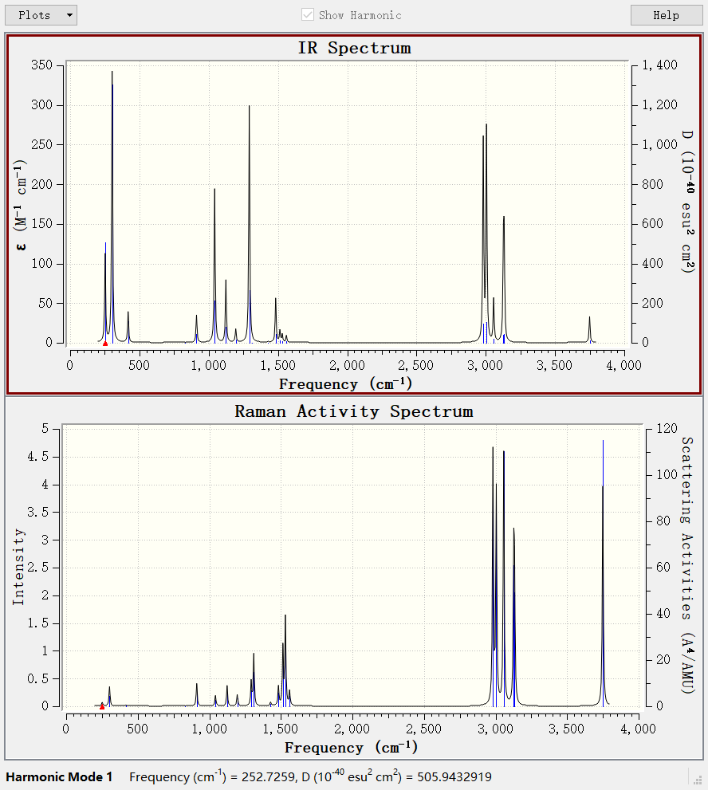

# 振动分析,红外,拉曼光谱

## 振动分析

前面给的力常数矩阵的本征值和振动频率之间的关系是基于谐振近似来做的,即振动的几所用的都是谐振子模型,在Gauss中使用关键词`freq`就能执行振动分析,这是一个相当耗时的操作(主要是在于精确计算Hessian矩阵上),振动分析完毕后会输出振动频率,极化率,红外强度,热力学数据.

通过输出的振动频率是否有虚频,虚频个数有几个可以判断结构优化是否优化到了极小点,过渡态搜索找到的是否是真正的过渡态,这一步几乎是必做的.

注意,振动分析对精度有一定的敏感性,最好在 **DFT级别** 下进行, **计算振动频率必须在优化后得到的平衡结构下进行,并且和优化的计算设置必须完全一致**,一般就是opt后面自动接一个freq.

由于是谐振子近似,通常来说振动频率会被高估,这个时候就要乘上一个频率校正因子去消除系统误差,振动因子对振动频率的校正有很强的效果,所以如果振动分析只是为了算振动频率的话,没必要用高级别的计算方法.

具体的振动因子查询,

看sob的博文:[http://sobereva.com/221],

公社的汇总帖子:[http://bbs.keinsci.com/forum.php?mod=viewthread&tid=3805]

文献.如:

J. Phys. Chem., 100, 16502-16513 (1996)

J. Phys. Chem. A, 111, 11683-11700 (2007)

J. Phys. Chem. A, 108, 9213-9217 (2004)

J. Comp. Chem., 33, 2380 (2012)

Theor. Chem. Acc., 105, 413 (2001)

## 输出

来看看具体的输出吧,以乙醇的振动分析计算为例:

```
                     1                      2                      3
                     A"                     A"                     A'
 Frequencies --    252.9071               297.6397               417.0080
 Red. masses --      1.1520                 1.0687                 2.6273
 Frc consts  --      0.0434                 0.0558                 0.2692
 IR Inten    --     34.0579                93.4053                11.1058
  Atom  AN      X      Y      Z        X      Y      Z        X      Y      Z
     1   6     0.00   0.00  -0.02     0.00   0.00   0.03    -0.20   0.02   0.00
     2   1     0.32  -0.29  -0.24     0.19  -0.11  -0.06    -0.50   0.02   0.01
     3   1    -0.32   0.29  -0.24    -0.19   0.11  -0.06    -0.50   0.02  -0.01
     4   1     0.00   0.00   0.52     0.00   0.00   0.29     0.02   0.42   0.00
     5   6     0.00   0.00  -0.05     0.00   0.00  -0.06     0.01  -0.19   0.00
     6   1     0.04  -0.07  -0.10    -0.01  -0.03  -0.09    -0.05  -0.18   0.01
     7   1    -0.04   0.07  -0.10     0.01   0.03  -0.09    -0.05  -0.18  -0.01
     8   8     0.00   0.00   0.09     0.00   0.00  -0.03     0.21   0.09   0.00
     9   1     0.00   0.00  -0.43     0.00   0.00   0.89     0.00   0.36   0.00
```

第一行显示的是振动频率,第三行是力常数,最后一行是红外强度.

把这个文件拖入GW中代开vibrations就可以观看振动动画,显示振动矢量等等,还能观看红外光谱.

## 红外,拉曼光谱

gauss对每个振动频率都计算出一个红外强度,同时,为了使得绘制出的谱图更加接近实际谱图(具有一定的展宽),将离散的一个尖峰的谱图通过一些函数进行分为展宽,常见的展宽函数有洛伦兹函数和高斯函数:

洛伦兹函数

$$
L(x)=\frac{FWHM}{2\pi}\frac{1}{x^2+0.25\times FWHM^2}
$$

FWHM是认为设定的参数.

拉曼光谱不同于红外吸收光谱,这是一种散射光谱,通常将具有一定频率的入射光打入样品中,通过测量散射光的各个频率成分来获得拉曼散射光谱,由于原理上的不同,拉曼光谱在描述分子结构上可能可以给红外光谱带来一定的补充,在频率计算中选择`freq=raman`,就能同时计算红外光谱和拉满光谱.

乙醇的红外光谱和拉曼光谱:




