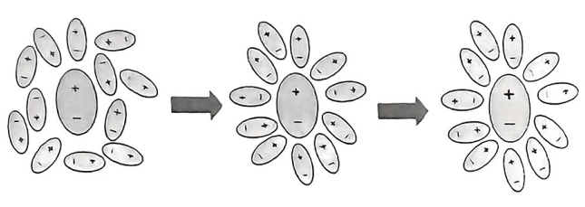

# 溶剂模型

更加具体的内容看这篇 [http://bbs.keinsci.com/thread-3345-1-1.html]

在实际的模拟中,很多过程不得不考虑到溶剂效应,即分子的势能面,结构分布,电荷分布等一系列性质在溶剂中和在气相中表现十分不同,主要表现在极化效应上,由于溶剂对溶质的静电相互作用,溶质会被极化,具体表现在电荷分布和结构发生显著改变,同时,溶剂也会被溶质分子极化,呈现出一种有序排列的状态,使得体系的一部分熵降低.

## 溶解自由能

溶质从气相迁移到溶剂,其自由能会发生改变,这一部分改变的自由能被成为溶解自由能,视溶质和溶剂之间的相互作用关系可正可负,主要包括这几部分:由于静电作用导致的能量变化,排开溶质分子形成孔洞所做的功,由于色散相互作用导致的能量变化,还有其他一些杂七杂八的能量变化.具体可以写成:

$$
\begin{aligned}
\Delta G=G_{sol}-G_{gas}=\Delta G_{ele}+(\Delta G_{cav}+\Delta G_{vdw}+\Delta G_{\text{others}}) \\
\end{aligned}
$$

括号外的部分被称作极性贡献,括号内的部分被称作非极性贡献.

## 隐式溶剂模型

溶剂模型分为两大类,一个是显式的溶剂模型,另一个则是隐式的溶剂模型,所谓显式,就是真真切切把溶剂分子画了出来,对整个体系执行Fock矩阵的迭代,隐式溶剂模型就是把溶剂当作具有恒定介电常数的环境来考虑,然而,这样做的缺点就是忽略了局部效应,例如溶质和溶剂之间的氢键,溶质和溶剂之间的电子转移等等.

隐式溶剂模型包括Onsager、PCM、CPCM、IPCM、SCIPCM、COSMO、SMD、SMx系列（如SM12）等等,Onsager、PCM、CPCM、IPCM、SCIPCM、COSMO等模型只明确定义了溶剂的极性部分怎么算，但是非极性部分的计算方式并没有在溶剂模型中明确给出，算的方式视具体程序而定。而SMD、SMx系列则明确定义了怎么计算非极性部分，并且在不同计算级别下专门拟合了参数，只要恰当使用，在计算能量方面的整体精度肯定是优于PCM、CPCM、COSMO之类的。目前最好的隐式溶剂模型应该是SMD,其被Gaussian所内置支持.

## 在Gaussian中使用溶剂模型

关键词一般写成:`scrf(SMD,solvent=ethanol)`,指定溶剂模型和溶剂,内置的溶剂以及相关参数参见[https://comp.chem.umn.edu/solvation/mnsddb.pdf] ,

计算溶解自由能只要在溶剂模型下算一次单点,然后再在气相下算一次单点,两者能量相减就可以了,这里值得注意的是,溶剂模型的参数往往是在特定基组和泛函下拟定的,例如SMD模型,一定要用`M05-2X/6-31G*`级别进行计算,换了高级别反而更加不准.

绝大多数情况下,溶剂效益下的结构和气相优化的结构差异是不大的,所以可以用气相优化得到的结构直接加上溶剂模型关键词计算单点,除非其结构严重依赖于溶剂效应,一般不用在溶剂的情况下再优化一次.

还有一点值得注意的是,一般来说,化学上的溶解自由能是把气相标准态和液相标准态之间的自由能的差值作为溶解自由能(1/22.4mol/L -> 1mol/L),所以上面用程序算出来的还需要加上1.89kcal/mol.

溶解自由能一个很大的作用就是可以用来衡量极性,我们统一以水作为基准溶剂,水的极性是很大的,如果溶质分子也具有一定的极性,那么溶解自由能往往是负的,相反,如果是甲烷这种,非极性部分占据主导地位的,溶解自由能会出现正值,这是一个极性衡量的一个重要标准.

