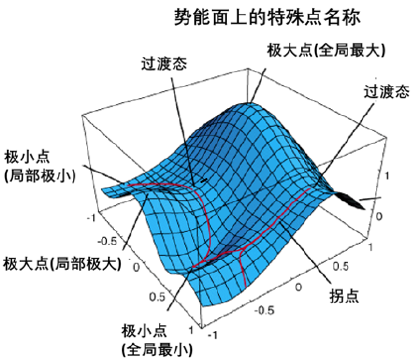
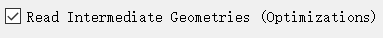
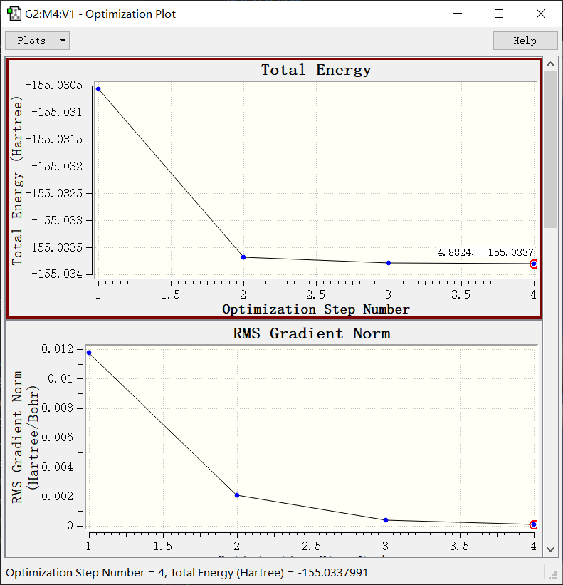

# 结构优化

## 势能面相关概念

在玻恩奥本海默近似下,体系的总能量是核坐标的函数,也就是说,能量是高维坐标空间中的一个超曲面,结构优化的任务就是在势能面上找到能量的极小值点.

下面是势能面相关的几个概念:

- 驻点:分子势能梯度为0的点
- 鞍点,在某个方向上是势能面上的极大值点,在另一个方向上是势能面上的极小值点
- IRC:内禀反应坐标,连接两个极小点的能量的路径积分最小的点(作用量最小),所翻越的势垒是最低的.
- 过渡态,IRC上能量最高的点,是一个一阶鞍点,只有在IRC上是极大点,在其他任意方向都是极小值点.
- Hessian(黑塞)矩阵:能量队原子坐标的二阶导数矩阵,随便找两个原子坐标求导:

$$
H_{ij}=\frac{\partial^2E}{\partial r_i\partial r_j}
$$



## 分子振动

对于一个分子,其总自由度为3N,去掉3个转动自由度和平动自由度,剩下3N-6个振动自由度

黑塞矩阵有3N个维度,将它对角化之后就会得到3N个本征值,其中6个非常小的本征值对应平动和转动,剩下的本征值$\lambda_i$称之为相应振动方向上的振动常数,可以换算出相应方向上的振动频率:

$$
\nu_i=\frac{\sqrt{\lambda_i}}{2\pi}
$$

如果本征值是负的,那么得到的频率就被称作虚频,这代表这个方向上的曲率半径是负的,也就是说这个点一定是不稳定的点,对于鞍点来说,他在某些方向上是不稳定的,这对应这些方向上的本征值都是负值,频率都是虚频,有一个虚频就是几阶鞍点,过渡态是一阶鞍点.

## 优化算法

由于扫描整个势能面是不现实的,所需的计算资源过多,所以通常只能利用该点和该点附近的信息进行迭代算法,这些优化算法的思路基本上都是基于牛顿法的:

$$
R^{k+1}=R^k-H^{-1}R^k\nabla E(R^k)
$$

准确的构建黑塞矩阵也是比较昂贵的,所以高斯中的迭代算法通常采用拟牛顿法和它的变体:RFO,GDIIS(在势能面较为平坦的体系效果较好),GEDIIS(默认的优化算法,结合RFO和GDIIS),可以通过关键词`opt=GDIIS`指定要使用的优化算法.

判断收敛的准则通常是原子的受力和原子坐标在迭代过程的移动程度.

最大受力:

$$
\max(|F_i^k|)
$$

均方根受力:

$$
\sqrt{\frac{1}{N}\sum_i (F_i^k)^2}
$$

最大位移:

$$
\max(|R^{k+1}_i-R^k_i|)
$$

均方根位移:

$$
\sqrt{\frac{1}{N}\sum_i (R_i^{k+1}-R_i^k)}
$$

通常结构优化是要求这四个收敛准则都满足,在输出文件的后半部分可以找到四个收敛条件是否都满足.

## 优化设置

首先,初始猜测不能过于离谱,推荐在GW中预优化或者使用rdkit软件包的分子力场执行预优化,乱写初始结构会使得SCF难以收敛或者很长时间才能收敛.

收敛限设置:`opt=loose,tight,verytight`

步数上限:`opt=maxcyc=N`

变步长设置:`opt(maxstep=x,notrust)`,会自动调整步长,步长为x*0.01,x默认为30.

在opt后面加上关键词freq会自动做振动分析.

==几何优化对方法和基组的敏感性非常低,所以没有必要在高级别的条件下优化结构==,像`b3lyp/6-311G**`这种规格完全就够了.同时,振动分析也不需要使用大基组,其误差也是非常小的.

使用关键词`opt=calcfc`会使得优化的初始Hessian矩阵被精确计算,而`opt=calcall`,则每一步的Hessian矩阵都会被精确计算得到,这是一个相当耗时的操作,使用`recalc=n`会在每做n步优化后精确计算一次Hessian矩阵,耗时相对较少.

以乙醇的优化为例,在优化结束后的末尾,可以找到优化完成的收敛准则以及其是否收敛:

```
         Item               Value     Threshold  Converged?
 Maximum Force            0.000165     0.000450     YES
 RMS     Force            0.000060     0.000300     YES
 Maximum Displacement     0.001099     0.001800     YES
 RMS     Displacement     0.000372     0.001200     YES
 Predicted change in Energy=-2.473832D-07
 Optimization completed.
    -- Stationary point found.
```

## 观看优化过程

在GW中打开.out文件,然后在打开的时候在左下角选择:



GW中就会读入多个分子构型,可以切换观看,同时可以看四个收敛准则随着迭代次数的变化,例如我计算的这个乙醇迭代4步就收敛了:



当优化时间比较长的时候(一些较大的体系),可以暂停(中止)计算,Gauss会从.chk文件中读取进度同时恢复计算,然后将.out文件载入GW中观看优化的结构是否正确,**如果不正确,可以及时终止优化计算**

## 限制性优化

可以冻结某些原子或者某些键长,键角,二面角后再执行优化,但是可能几何优化的收敛会更加的困难,冻结原子的时候,在原子符号后面写个0代表允许优化,写个1代表固定:

```
H 0 1.01  0.00 0.120
O -1 1.01 1.00 0.000
```

要固定键长键角二面角,在分子坐标后面要空一行,然后这么写:

```
3 6 F !固定3号原子和6号原子的键长
1 2 12 14 F !固定二面角
6 1 7 F  !固定键角
4 F  !固定单个原子
```

## 结构优化不收敛

结构优化不收敛有以下几种情况,要么是到达最大步数以后没有达到收敛要求,要么是在优化的后期出现了振荡的现象,要么就是某一步突然报错了程序终止.

首先,如果要优化一个非常难优化的体系,强烈建议先使用PM6半经验方法执行结构预优化,然后使用`geom=chk guess=read`读入预优化的结果,再使用DFT级别执行结构优化.

如果是达到最大步数没收敛,可以考虑调整步长,然后把之前算的结果读入继续优化,往往没几步就收敛了,如果优化的后期出现振荡现象,往往需要减小步长,实测`maxstep=5`效果比较稳定,往往都能收敛.精确计算Hessian矩阵也很重要,面对难收敛的体系往往要写`calcfc,recalc=10`这样的关键词.

还可以调整积分网格精度,更换优化算法等等,多尝试几个总能收敛的,优化的时候一定要是不是拖出.out文件到Gaussview中观看,有出现异常情况及时终止计算,重新设置关键词.

更多有关结构优化不收敛的办法参见卢经[量子化学计算中帮助几何优化收敛的常用方法](http://sobereva.com/164)

还有一个很重要的一点就是,进行多分子结构优化的时候,如果两个分子的部分原子之间的键角或者二面角接近180°的时候,量子化学计算程序往往会报错,如果手动可以调整的话,把上一步优化的文件的最后的坐标保存下来,然后微调分子,再重新扔进去优化,可以解决问题.但是,如果要批量计算的时候,手动调肯定不现实,报错的原因是高斯默认使用冗余内坐标进行优化,我们只要强制他使用笛卡尔坐标进行优化就行了(但是会非常耗时),使用关键词`opt=(cartesian,)`

