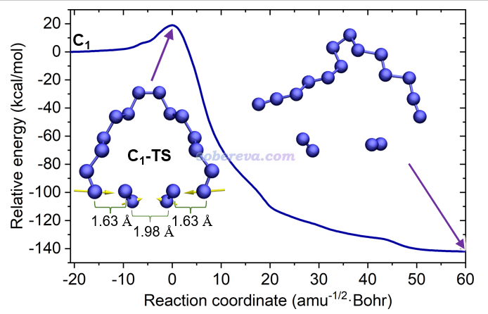

# 过渡态搜索

通常来讲,一个化学过程往往伴随着核坐标的改变,同时在这个过程中会发生能量升高的现象,这种反应往往就有过渡态,搜索过渡态有助于我们更好的理解反应的机理.

Gaussian中搜索过渡态有三种关键词:

```
opt=TS    !只需要给定过渡态的一个初始猜测结构
opt=QST2  !需要提供反应物和产物的结构
opt=QST3  !需要提供反应物,产物和初猜的过渡态结构
```

如果可以凭借化学直觉直接给出过渡态的猜测结构是最好的,过渡态的寻找难度远大于几何优化,需要多次尝试和调整.有的时候化学直觉判断的过渡态也离真实的结构有一段距离,这个时候可以采用柔性扫描的方式,自主判断最有可能形成或者断裂的键,然后对这个键执行柔性扫描,然后将柔性扫描过程中的能量最高点作为过渡态的初始猜测.例如卢老师的文章[http://sobereva.com/725] 在寻找十八氮环解离过程的过渡态的时候,就将其中一个较长的键进行柔性扫描,将扫描路径上的极大点作为初猜,最后顺利找到过渡态,然后跑IRC:



和几何优化相同的是 **过渡态结构对计算级别的敏感度较低** ,也是可以是使用低计算级别搜索过渡态,然后用高阶方法计算能量.

## TS

TS是最常用的过渡态搜索的方法,也往往是最有效的,因为势能面的变量很多,所以找过渡态往往是一个非常困难的事情,这个时候就需要依赖于人脑的化学直觉去给出一个相对合理的初始猜测,然后使用TS方法进行搜索,相较于QST2,QST3,TS方法会更加灵活,前两者只是在反应物和产物之间进行机械的插值,给出的初始猜测不一定有具有化学直觉的人给出来的有意义.

再者,寻找复杂复合反应的过渡态的时候,我们是不知道中间的反应物和产物是什么的,而QST2和QST3只能适用于基元反应过渡态的寻找,如果中途存在多个过渡态的话,插值没有任何意义.所以,这需要我们的化学直觉去初步判断每一步过渡态的初始猜测然后做IRC得到反应物和产物.

找过渡态是一件相当困难且耗时的事情(远比结构优化耗时),有时候,结果虽然收敛了,但是一看振动分析的结果竟然有两个虚频,也就是说收敛到的不是正确的过渡态,这个时候通常要调整初猜重新做,经过反复尝试,反复IRC计算,多次试错才能得到正确的过渡态,甚至有的时候,想要寻找的过渡态可能压根就不存在,要及时作出合理的判断.

做TS计算的时候要有合适的关键词,首先,关闭掉本征值检查,使用`opt=noeigen`,优化任务设置为ts:`opt=ts`,并且一定要计算初始的力常数矩阵`calcfc`,同时,为了之后的收敛顺利,需要减小步长,增大迭代次数,每隔几步就要重新计算Hessian矩阵:

完整的关键词设置通常为:

```
opt=(ts,noeigen,calcfc,maxstep=20,maxcycles=500,recalc=20) freq
```

通常做完过渡态搜索就直接接上一个振动分析,这样直接就能根据虚频振动方向和个数来判断是不是过渡态以及是不是想要的过渡态.

有的时候有多个虚频,但是已经是小虚频了,这时候就需要想办法消除掉,包括提升opt的收敛精度,增加积分网格的精度等`opt=(tight) int=superfine`,superfine已经是最精细的网格设置了.

**再次提醒,找过渡态是一件比较困难的事情,很难一次就成功,需要不断调试初始猜测,迭代次数,收敛相关设置等,有的时候,可以尝试使用半经验方法PM6执行预搜索再使用DFT方法,不要气馁**

## QST2,QST3

有的时候实在是找不到合适的初猜了,化学直觉确实掉线了,那没有办法我们尝试一下QST2,3.

QST2方法需要指定反应物和生成物的结构,他会自动插值帮忙寻找过渡态:

```
# opt=(qst2,calcfc,recalc=10,...)

title1

0 1
[反应物坐标]

title2

0 1
[生成物坐标]

```

差不多是这样一个架构,反应物和生成物不一定要是精确的结构,但是至少应该是合理的结构,因为qst2的搜索办法就是插值,所以反应物和生成物我认为应该进行结构预优化,这样可以帮助程序更快的找到过渡态.

QST3就是要你再提供一个初始猜测

```
# opt=(qst2,calcfc,recalc=10,...)

title1

0 1
[反应物坐标]

title2

0 1
[生成物坐标]

title3

0 1
[过渡态初猜]
```

一些细节部分参见卢经[简谈Gaussian里找过渡态的关键词opt=TS和QST2、3](http://bbs.keinsci.com/thread-12093-1-1.html)

## 判断过渡态的合理性

首先看一看几何结构,用化学直觉判断一下这个过渡态结构合不合理.

其次,可以进行振动分析,如果有且只有一个虚频,那其为一阶鞍点,大概率是过渡态,可以再看看虚频的振动模式是否是连接反应物和产物的.

做IRC路径计算,看看是否确实是连接反应物和产物.

一般来说,气相反应做IRC后基本上可以判断是不是过渡态了,但是,有些计算由于时间成本昂贵,是做不了IRC的,这个时候只能从虚频的振动方向和反应的活化能垒去判断,例如,使用簇模型可以模拟催化剂作用下的反应机理,在气相和簇模型下分别计算活化能,如果活化能升高基本上就可以断定过渡态找错了,反之就有很大的把握认为过渡态是正确的.


