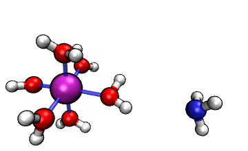
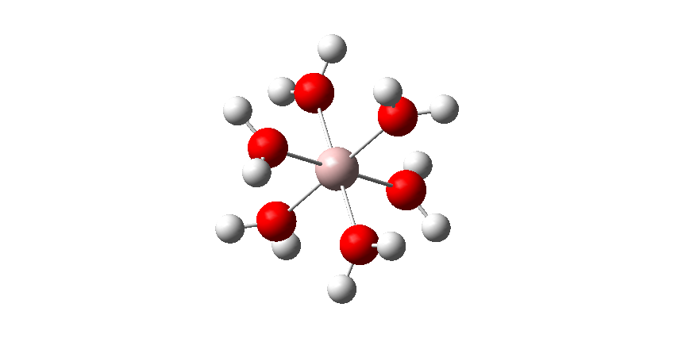
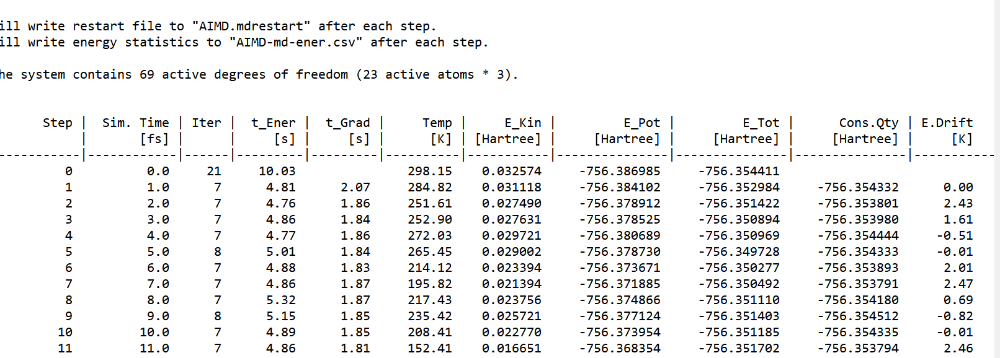
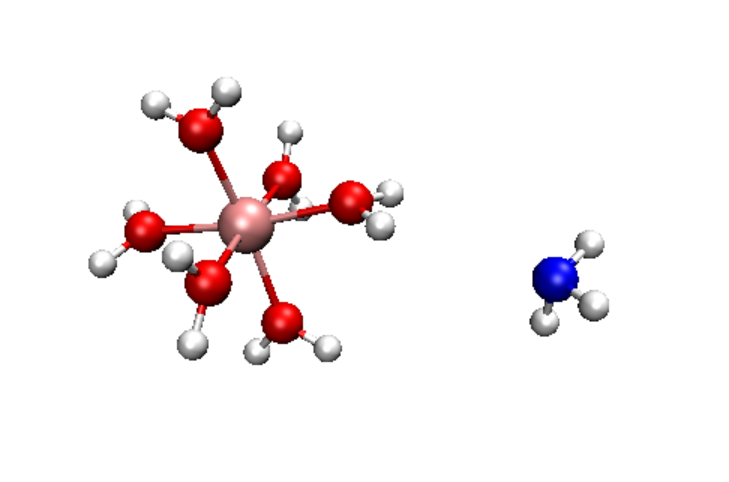
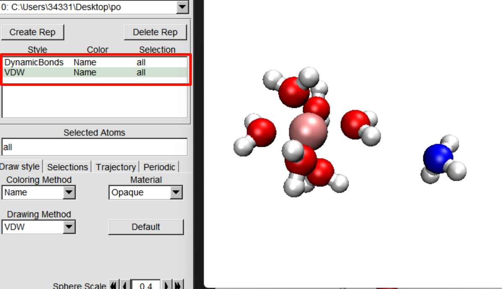
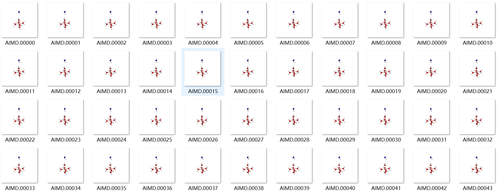
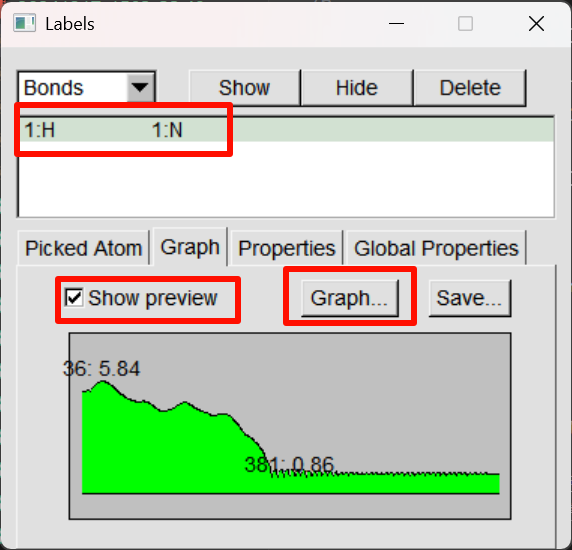
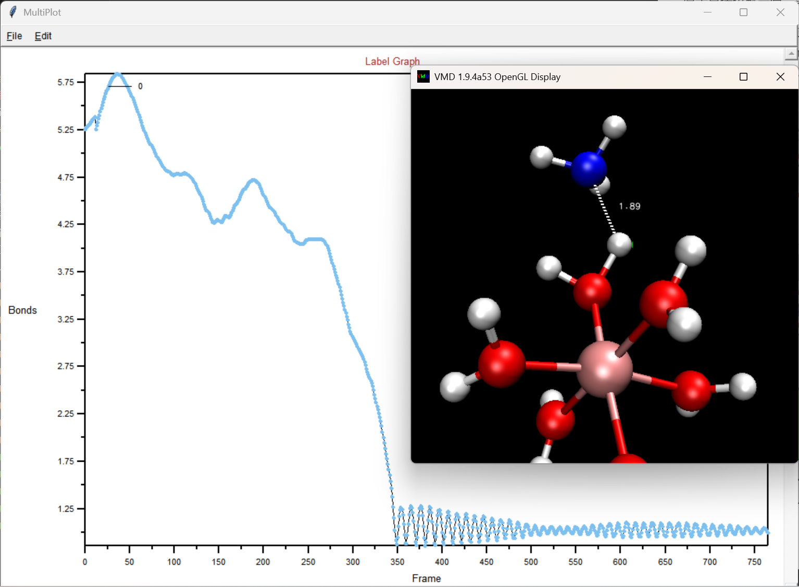

# 从头算分子动力学(AIMD)

AIMD的学习笔记,具体参照卢天老师的博文[http://bbs.keinsci.com/thread-20800-1-1.html]

## 什么是分子动力学

分子动力学(Molecular Dynamics, MD)是一种通过计算机模拟研究分子系统随时间演化的计算方法。它基于牛顿运动方程,通过一定的数值方法计算原子在力场作用下的运动轨迹。

通过结构优化我们可以得到0K时候的稳定的分子构型,但是随着温度的升高,分子会在平衡位置附近平动,转动和振动,这部分热运动会提供分子越过反应能垒的能量,从而实现新的构型转化,分子动力学就可以研究这样一个运动过程

## 从头算动力学的优势

基于量子化学方法的动力学一般称为从头算动力学（Ab initio molecular dynamics, AIMD），相比于基于一般的经典力场的动力学，其关键优势在于精度高、普适性强、能够描述化学反应，代价是耗时相差N个数量级。

## [Al(H2O)6]3+与NH3之间的H转移反应

文章中给出的动画例子为:




NH3这个亲核分子向着带正电的六水和铝离子不断接近,完成H转移后由于静电互斥远离

下面尝试复现这个过程.

首先先画一个[Al(H2O)6]3+的结构,由于不能利用Al的点群对称性,我只能手画了,使用b3lyp/6-31g*的规格进行结构优化.

优化结果如图所示:



然后在旁边较远的地方画一个NH3分子,导出输入文件并输入到Multiwfn中.

依次输入 

oi # 生成orca的输入文件

0  # 选择任务类型

6  # 分子动力学

1  # 计算级别选择B97-3c

然后将生成的输入文件根据需求微调,例如,并行的核数可以改成10(根据卢老师的说法,ORCA做AIMD的并行效果并不是很好,核数变多反倒会拖慢速度),热浴温度可以稍微调高一点,时间步长改成1.0_fs,就可以放到机子上去跑了.

```
%maxcore  10000
%pal nprocs   10 end
timestep 1.0_fs
initvel 298.15_K
```

跑了差不多1h左右,氨气分子已经完全夺取质子并且二在远离了,这个时候可以手动终止掉计算任务,找到pos.xyz,里面记录了每个时间步的坐标,然后使用VMD打开,就可以看到动画了.

计算的输出文件差不多长这样:



输出的信息有步数,,当前的时间,迭代的次数,计算SCF所需要的时间,计算原子受力所需要的时间,温度,动能,势能以及总能量.

可以看到温度变化非常大,因为温度本来就是大量分子的行为,这个计算的原子太少了,所以温度不可信是很正常的.

## VMD可视化

将生成的pos.xyz文件载入到VMD中,就可以播放动画了

VMD的初始化要进行一定的修改,不然直接呈现出来的图像会很丑.具体参见sob老师的这篇文章:[http://sobereva.com/545]

把其中的内容加到vmd.rc当中去,一些设置会被更改,一些自定义命令会被添加.

使用命令bt会自动更新每一帧的连接关系(否则那个氢原子会一直连接在O上),使用命令bw变白,bb变黑,然后再在Graphics-representations里面把Drawing-method改成CPK,就可以得到较为精美的图像.



还有一种自动更新连接方式的办法就是Create Rap,然后一个method选择dynamic bonds,另一个选择VDW,调整一下原子的大小,得到一个较为美观的图像:



动画只能在VMD内观看,如果想要导出动画,可以选择extension里面的movie maker,设定好保存的文件夹后可以导出大量图片,将这些图片制作成为动画需要第三方软件.



或者录屏,使用pixpin可以直接录制gif,或者录制视频后转化为gif,下面这个就是我算的结果:


## 可视化N-H键长度

将N-H键的长度以图的形式展现出来,以便于向读者呈现氢转移的过程.

首先bb把背景换成黑色,按2切换到选择原子的状态,依次点击N和被转移的H这两个原子,原子直接按就会有一条虚线.

然后再Graphics里面选择labels,选项切换成为bond,点击刚刚选择的键,勾选show prview,然后再点graph,就会有一个大图呈现:





从中可以清晰的看到H转移的过程,转移完毕后,键长在不断的振荡.

