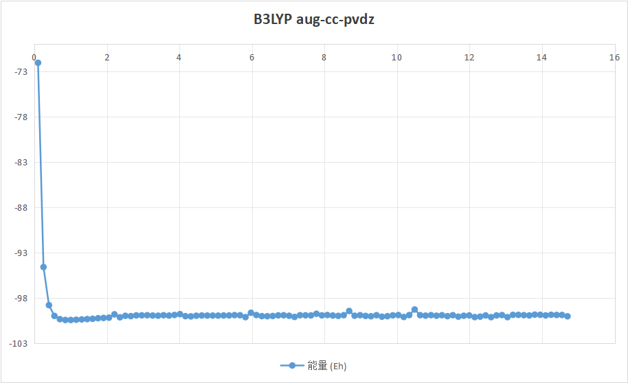
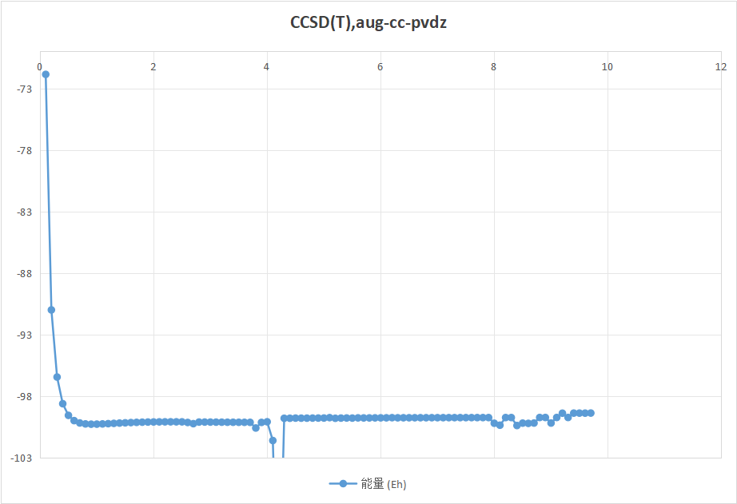
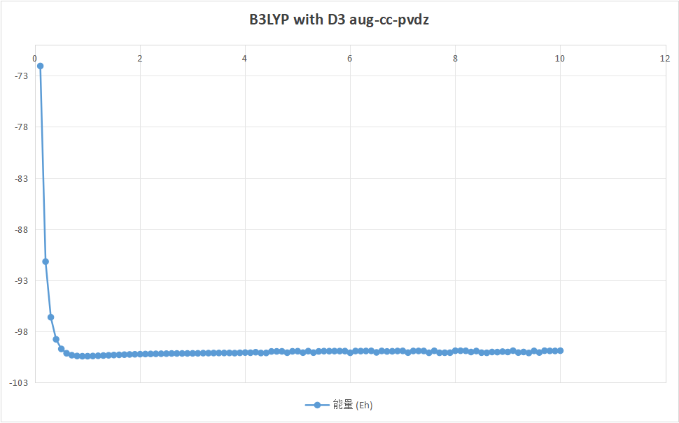

# 单点能计算

这个文档尝试执行一些简单的单点能计算积累经验.

## 使用python调用orca

通常直接在终端中执行命令`orca inp > out`,但是处理大量计算的时候需要执行批量化操作,可以考虑和python结合,使用脚本来自动执行运算.

比如我要执行一系列的单点能计算对势能面进行扫描,可以先将输入文件写好然后读入:

```
! B3LYP aug-cc-pvdz TightSCF UseSym D3

*xyz 0 1
H       0.000000     0.000000     0.000000
F       0.000000     0.000000     {bond_length}
*
```

保存在`hf_scan.inp`中,然后使用绝对路径读入:`orca_input_file=open(/root/hf_scan.inp).read()`,之后需要将`{bond_length}`替换为具体的键长.

接下来分别要定义三个函数,用来生成orca输入文件,执行orca计算,读取计算结果.

生成orca输入文件(只需要把`{bond_length}`替换为具体的键长):

```python
# 函数：生成 ORCA 输入文件
def create_orca_input(bond_length, filename):
    with open(filename, 'w') as f:
        f.write(orca_input_template.format(bond_length=bond_length))
```

`filename`在之后调用的时候指定,这不想相当于创建了一个空文件,并且把我们读入的字符串写入,将键长替换成为具体值,这也是为什么我们要写一个`{}`,使用format方法可以轻松替换这些占位符.

运行orca计算,这部分的目的是为了获得一个输出文件,我们之后再从输出文件中读取相应的能量,频率,偶极矩等计算结果:

```python
# 函数：运行 ORCA 计算
def run_orca(input_file):
    output_file = input_file.replace('.inp', '.out')
    orca_command = f"orca {input_file} > {output_file}"
    try:
        subprocess.run(orca_command, shell=True, check=True, stderr=subprocess.PIPE, text=True)
    except subprocess.CalledProcessError as e:
        print(f"ORCA 计算出错: {e}")
        print(f"错误输出: {e.stderr}")
        return None
    
    if not os.path.exists(output_file):
        print(f"警告: 输出文件 {output_file} 未生成")
        return None
    
    return output_file
```

这里写了大量的异常处理,因为可能存在输入不规范的情况,导致orca无法运行或者计算失败,值得注意的是,scf不收敛也还是会产生输出文件的,这一点不用担心.

为了能在py中运行orca,要导入`subprocess`库,该模块可以执行系统命令,需要接受一个命令字符串,开启`shell=`参数,并且使用`check=True`来检查命令是否成功执行,否则会抛出异常.

读取orca计算结果,例如hf_scan.out会在当前文件夹下生成,直接使用` with open('filename','r')`(使用with读完会自动关闭)打开输出文件,然后使用正则表达式执行搜索.

以能量信息为例:

```python
# 函数：从 ORCA 输出文件中提取能量信息
def extract_energy(output_file):
    with open(output_file, 'r') as f:
        content = f.read()
    energy_match = re.search(r'FINAL SINGLE POINT ENERGY\s+(-\d+\.\d+)', content)
    if energy_match:
        return float(energy_match.group(1))
    else:
        return None
```


## HF分子的势能曲线

计算了三组,分别采用了`b3lyp`,`ccsd(t)`,`b3lyp-D3`三种计算方法,其中,密度泛函给出的结果较为稳定,虽然曲线在小范围内存在一定波动,又以加了`-D3`色散校正的计算结果最为稳定,基组全部采用`aug-cc-pvdz`,而ccsd(t)即使加了弥散函数,其在大键长的时候能量表现依旧很差,并且在中间似乎出现了计算错误,同时,由于关键词采用了`!TIGHTSCF`,会有少数点的能量计算不收敛.

计算结果如下图所示:







ccds(t)主要是在处理动态关联的方面表现良好,当键长增大的时候,静态关联逐渐占据主导,所以其表现较差也不足为怪了.

至于收敛问题,有一部分可能的原因是我加了弥散函数,在键长较小的时候,加弥散函数会导致scf收敛困难.还有可能是分子对称性造成的,加了分子对称性有些奇怪的计算会不收敛.

从这几个计算中也可以发现,我们做结构优化的时候,如果局部的计算出现了很大的误差,很有可能导致优化收敛到我们不想要的结果上,所以在我看来,保险起见还是先扫描一遍势能面.

## 读取计算结果

orca计算完毕的软件又臭又长,不像pyscf可以直接使用类的属性来读取所需要的计算结果,但是可以在linux终端中根据以下命令来读取:

以下是一些常用的orca输出文件读取指令(记不住,要用的时候回来查一下)：

注意一下,下面的这些-A N是指找到这行后再在下面打印N行,一般来说N=20,30左右就足够显示信息了

读取最终能量：

```bash
grep "FINAL SINGLE POINT ENERGY" output.out
```

读取原子坐标：

```bash
grep -A N "CARTESIAN COORDINATES (ANGSTROEM)" output.out
```

读取轨道能量：

```bash
grep "ORBITAL ENERGIES" -A N output.out
```

读取Mulliken电荷：

```bash
grep -A N "MULLIKEN ATOMIC CHARGES" output.out
```

读取振动频率：

```bash
grep "VIBRATIONAL FREQUENCIES" -A N output.out
```

读取偶极矩：

```bash
grep "Total Dipole Moment" -A N output.out
```

读取收敛情况：

```bash
grep "SCF ITERATIONS" -A 20 output.out
```

读取计算时间：

```bash
grep "TOTAL RUN TIME" output.out
```

这些命令可以在Linux终端中直接使用，也可以在Python中通过subprocess模块执行。试了一下效果大概长这样:

```bash
root@LAPTOP-DPOO7MIJ:~/ORCA_comp/HF分子单点能计算# grep "FINAL SINGLE POINT ENERGY" hf_19.192323232323233.out
FINAL SINGLE POINT ENERGY       -99.458486578056
root@LAPTOP-DPOO7MIJ:~/ORCA_comp/HF分子单点能计算# grep -A 4 "CARTESIAN COORDINATES (ANGSTROEM)" hf_19.192323232323233.out
CARTESIAN COORDINATES (ANGSTROEM)
---------------------------------
  H      0.000000    0.000000  -18.225320
  F      0.000000    0.000000    0.967003
```

上面python脚本的使用re正则表达式的搜索部分也可以替换成使用grep(因为我不会写正则表达式),即`energy_match = re.search(r'FINAL SINGLE POINT ENERGY\s+(-\d+\.\d+)', content)`部分可以换成:

```python
command=grep "FINAL SINGLE POINT ENERGY" output_file.out,
energy= subprocess.run(command(command, shell=True, capture_output=True, text=True))
```

## 几何结构优化,频率计算

Orca中的几何结构优化速度还可以,只需要简单指定关键词`!OPT`就可以执行任务,但是注意也要指定计算方法和基组,结构优化还有一些别的设置,同时,除了几何结构优化外,还可以做过渡态优化和扫描过渡态优化:`OPTS and ScanTS`

在`geom`模块中可以选择设置优化的算法,优化的收敛准则,优化的步数限制,以及对一些原子做固定之后再进行势能优化。

### 优化算法选择

- `OptimizeAlgorithm`：选择优化算法
  - `P-RFO`：默认算法，适用于大多数情况
  - `BFGS`：拟牛顿法，适用于较大体系
  - `CG`：共轭梯度法，适用于内存受限情况

例如：
```
%geom
  OptimizeAlgorithm BFGS
end
```

### 收敛准则设置

- `TolE`：能量变化阈值
- `TolRMSG`：RMS梯度阈值
- `TolMaxG`：最大梯度阈值
- `TolRMSD`：RMS位移阈值
- `TolMaxD`：最大位移阈值

例如：
```
%geom
  TolE 1e-6
  TolRMSG 3e-4
  TolMaxG 1e-4
  TolRMSD 1e-3
  TolMaxD 4e-3
end
```

### 优化步数限制

- `MaxIter`：最大优化步数

```
%geom
  MaxIter 100
end
```

### 约束优化

1. 固定原子之间的键长：
```
%geom
  Constraints
    {B 0 1 C}
  end
end
```

B表示bond即键长,0,1代表编号为0,1,键长也是这两个原子之间的键长,C即为constant即恒定值.

2. 扫描优化：意思就是指改变键长,从1.0到2.0,间隔为0.1,扫描10个点,这个有助于发现键长和能量之间的特定关系.键长的关键词是B,键角的关键词是A,二面角是D
```
%geom
  Scan
    B 0 1 = 1.0, 2.0, 10
  end
end
```

### 频率计算

在优化后进行频率计算：
```
! OPT FREQ
```

频率计算即势能面的二阶导数矩阵(黑塞矩阵),假设分子在势能面的这一点上做简谐振动,该特征和 **光谱特征** 以及 **热力学特征** 密切相关.

比如我们直接算一个没有优化的HF分子的频率试试看,结果为

```
root@LAPTOP-DPOO7MIJ:~/ORCA_comp/HF分子单点能计算# grep "VIBRATIONAL FREQUENCIES" -A 20 hf_20.0.out
VIBRATIONAL FREQUENCIES
-----------------------

Scaling factor for frequencies =  1.000000000  (already applied!)

     0:       0.00 cm**-1
     1:       0.00 cm**-1
     2:       0.00 cm**-1
     3:       0.00 cm**-1
     4:       0.00 cm**-1
     5:    3072.53 cm**-1
```

最后一行输出的那个频率就是分子在势能面上振动频率,键长是20A.

==很让人恼怒的就是开了分子对称性似乎会影响频率计算,计算竟然不收敛!orca似乎默认开启了分子对称性,所以关键字要使用`!NoUseSym`==

### 其他常用设置

- `UpdateHess`：更新Hessian矩阵的频率
- `InitHess`：初始Hessian矩阵的选择
- `UseGDIIS`：使用GDIIS算法加速收敛

例如：
```
%geom
  UpdateHess 5
  InitHess Read
  UseGDIIS True
end
```

使用这些设置时，请根据具体体系和计算需求进行调整。对于复杂体系或特殊要求的优化，可能需要尝试不同的设置组合以获得最佳结果。

## 可视化

ORCA没有配套的可视化软件,一个方法是将ORCA的输出文件转化为Gaussian的输出文件,然后就可以用Gaussview观看优化过程.

转换软件为OfakeG,直接把文件拖到exe上就行了,详情可以见公社帖子 [http://bbs.keinsci.com/thread-13952-1-1.html] ,下载地址为: [http://sobereva.com/soft/OfakeG/]

或者orca计算会直接产生.xyz文件(但是这个文件输出的位置似乎不能被重定向),将.xyz文件拖入到免费的量子化学可视化软件VMD当中也可以实现可视化.


