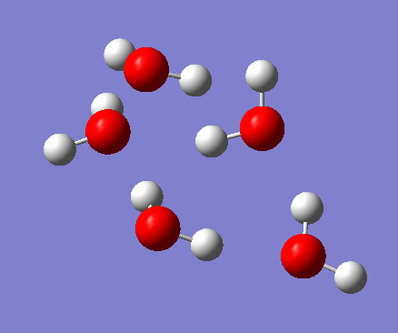

# 弱相互作用

这个文档主要是写一些弱相互作用的设置,计算偶极矩,极化率,超极化率等等.

由于弱相互作用主要描述的是分子间作用力,是长程作用力,所以传统的定域化的计算方法(基组和泛函)往往难以具有合适的精度,虽然可以通过加入弥散函数得到一定的改善,但是仍然存在一定的问题,DFT的色散校正方法结合弥散函数基组(比如一些月份基组)就可以得到较好的结果,现在最新的色散校正应该已经发展到`-D4`了,详细的泛函以及基组的推荐可以参见sob的博文:

乱谈DFT-D[http://sobereva.com/83] (这里的推荐好像是针对Gaussian的)

对于ORCA,由于其采用了强大的密度拟合技术,使得计算的难度降低,所以推荐也会不太一样:大体系弱相互作用计算的解决之道[http://sobereva.com/214]

最终还是要根据实际情况实践一下,选定最合适的基组和泛函.

通常弱相互作用会影响分子的热力学性质,光谱性质和部分化学性质,比较常见的弱相互作用计算有:相互作用能,偶极矩,极化率等等.

## 偶极矩

不需要加关键词,单点能计算会自动计算偶极矩

分子偶极矩主要描述的是分子的电荷分布情况,以水分子为例,我们考虑执行几何结构优化,其会自动输出偶极矩,关于泛函的选定,我们使用`b3lyp`,基组选用`cc-pvtz`(这里不涉及长程相互作用,所以不用加弥散函数).

输出信息为:

```
Total Dipole Moment    :      0.076185242       0.000000000      -0.751071590
                        -----------------------------------------
Magnitude (a.u.)       :      0.754925641
Magnitude (Debye)      :      1.918868486
```

计算值为1.91Debye,实验值为1.855Debye,相对误差为3.4%,尚且处在可以接受的范围.

后面在sob的文章看到偶极矩计算也推荐加弥散函数,加了之后再重新计算了一遍,计算结果为:

```
Total Dipole Moment    :      0.073621729       0.000000000      -0.725955300
                        -----------------------------------------
Magnitude (a.u.)       :      0.729678872
Magnitude (Debye)      :      1.854696298
```

与实验值异常吻合(还有一点就是几何结构优化最好不加弥散,所以推荐先优化完了再计算偶极矩)


## 分子极化率

分子极化率主要描述的是分子在外电场作用下,电荷分布的变化情况.

极化率计算任务需要指定,但是不能在关键字行指定,需要在块中指定:

```
%elprop
  Polar 1
end
```

当然,计算前也要先执行几何结构优化.泛函的选定也要不同,使用sob博文中推荐的`BHandHLYP`,但是平均极化率和实验差距较大,将基组提升到`cc-pv5z`的计算结果为:

```
Isotropic polarizability :   8.33657
```

换算一下(*0.1482)就是1.23,实验值大概在1.4多,相对误差在15%左右,还是有点大.

后来考虑了以下感觉极化率可能是一个长程相互作用参数,所以 **要加弥散函数** ,在ccpv5z基组下的极化率为1.372332,已经非常接近实验值了,加了弥散函数后,CCPVTZ和CCPV5Z的差别不太大,在之后的计算中可以考虑降级基组.

极化率输出为一个三阶张量:

```
STATIC POLARIZABILITY TENSOR (Dipole/Dipole)
---------------------------------------------------

Method             : SCF
Type of density    : Electron Density
Type of derivative : Electric Field (Direction=X)
Multiplicity       :   1
Irrep              :   0
Relativity type    : 
Basis              : AO

The raw cartesian tensor (atomic units):
       9.754489319         0.000003438         0.051762049  
       0.000003438         8.788219773         0.000000628  
       0.051762049         0.000000628         9.258703867  
diagonalized tensor: 
       8.788219773         9.253357352         9.759835834  

Orientation: 
       0.000003507         0.102743630         0.994707870  
      -1.000000000        -0.000000583         0.000003586  
       0.000000948        -0.994707870         0.102743630  

Isotropic polarizability :   9.26714
```

还有一点很遗憾的是,ORCA似乎不支持用CCSD或者CCSD(T)计算极化率,我们只能用DFT进行计算.

读取计算结果的极化率,只需要搜索关键词`POLARIZABILITY`即可.

```
grep -A 40 "POLARIZABILITY" H2O_polar.out
```

因为执行的是DFT计算,所以可以加`-D3,-D4`等色散校正,面对较大的分子必须要加,水的体系比较小,所以算出来还可以.

## 相互作用能

相互作用能描述的是分子间相互作用的大小,考虑将其中某个分子做微扰,相互作用能的变化就能描述分子间作用力.

相互作用能的计算以二分子为例:

$$
E_{interaction} = E_{2A} - E_{A} - E_{A}
$$

需要计算两个分子总体系的能量减去单个分子的能量,这部分能量大部分由库伦相互作用以及范德华相互作用提供,统称为分子间作用能,显然,要准确描述一个体系的分子间作用能,囊括的分子越多越好,但是相应的,结构优化的成本也会大大提升,下面尝试计算一个5水分子体系的相互作用能.

显然要加`D4`色散校正,如果使用已经自带色散校正的高级泛函,就不需要加色散校正了.基组加弥散函数.

==ps:文件名不要有(),orca竟然识别不了...==

计算结果为:

```
root@LAPTOP-DPOO7MIJ:~/ORCA_comp/H2O相互作用能# grep "FINAL SINGLE POINT ENERGY" H2O_4_interaction.out
FINAL SINGLE POINT ENERGY      -382.680156552026
FINAL SINGLE POINT ENERGY      -382.696344353361
FINAL SINGLE POINT ENERGY      -382.706117468571
FINAL SINGLE POINT ENERGY      -382.715635370210
FINAL SINGLE POINT ENERGY      -382.722326209217
FINAL SINGLE POINT ENERGY      -382.726609049683
FINAL SINGLE POINT ENERGY      -382.729697373101
FINAL SINGLE POINT ENERGY      -382.732135235858
FINAL SINGLE POINT ENERGY      -382.730700615970
FINAL SINGLE POINT ENERGY      -382.696370391430
FINAL SINGLE POINT ENERGY      -382.734386287255
FINAL SINGLE POINT ENERGY      -382.725786455955
FINAL SINGLE POINT ENERGY      -382.734626067182
FINAL SINGLE POINT ENERGY      -382.721809052974
FINAL SINGLE POINT ENERGY      -382.735989020227
FINAL SINGLE POINT ENERGY      -382.718408577835
FINAL SINGLE POINT ENERGY      -382.737191158440
FINAL SINGLE POINT ENERGY      -382.737776052927
FINAL SINGLE POINT ENERGY      -382.732881903219
FINAL SINGLE POINT ENERGY      -382.738680392350
FINAL SINGLE POINT ENERGY      -382.737890911677
FINAL SINGLE POINT ENERGY      -382.739821020992
FINAL SINGLE POINT ENERGY      -382.737792623517
FINAL SINGLE POINT ENERGY      -382.740522465528
FINAL SINGLE POINT ENERGY      -382.741356532420
FINAL SINGLE POINT ENERGY      -382.742515518610
FINAL SINGLE POINT ENERGY      -382.743602096676
FINAL SINGLE POINT ENERGY      -382.745038706265
FINAL SINGLE POINT ENERGY      -382.677486914641
FINAL SINGLE POINT ENERGY      -382.732640484630
FINAL SINGLE POINT ENERGY      -382.742561887532
FINAL SINGLE POINT ENERGY      -382.745886117462
FINAL SINGLE POINT ENERGY      -382.746948792030
FINAL SINGLE POINT ENERGY      -382.746786525616
FINAL SINGLE POINT ENERGY      -382.747609264676
FINAL SINGLE POINT ENERGY      -382.747962155872
FINAL SINGLE POINT ENERGY      -382.748324429664
FINAL SINGLE POINT ENERGY      -382.748910970957
FINAL SINGLE POINT ENERGY      -382.749175689207
FINAL SINGLE POINT ENERGY      -382.745472256400
FINAL SINGLE POINT ENERGY      -382.715794230827
FINAL SINGLE POINT ENERGY      -382.747531497781
FINAL SINGLE POINT ENERGY      -382.738468873558
FINAL SINGLE POINT ENERGY      -382.750068402573
FINAL SINGLE POINT ENERGY      -382.740837378206
FINAL SINGLE POINT ENERGY      -382.751531481587
FINAL SINGLE POINT ENERGY      -382.750666342760
FINAL SINGLE POINT ENERGY      -382.752392702017
FINAL SINGLE POINT ENERGY      -382.752153349818
FINAL SINGLE POINT ENERGY      -382.752667292019
```

迭代了相当多的步骤,输出了这么多的能量,应该是产生了大量的亚稳态,直接看最后一个能量就好了,5个水的总能减去5的水单独的能量算出来相互作用能为-0.601eV,文献值(使用汽化焓算氢键,然后一个水分子3.4个氢键)为-0.402eV,和无穷体系竟然只差这么点,这还是属实有点意外的,后面想要分析相互作用能就只算两分子了,太大的算不动,还有一个问题就是其很难收敛到全局最优,随着初始猜测的不同优化偶然性很大:



这张图就是优化结果,直觉告诉我,其一定不是全局最优(因为没有对称性)