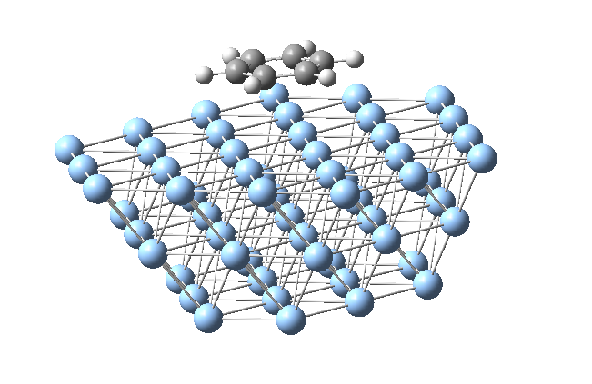
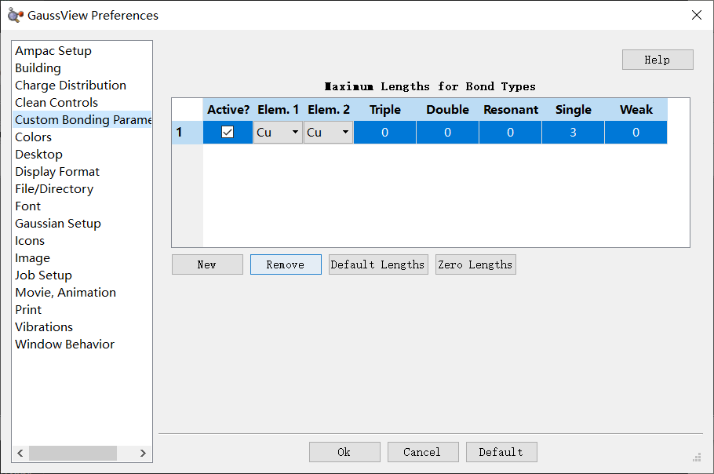
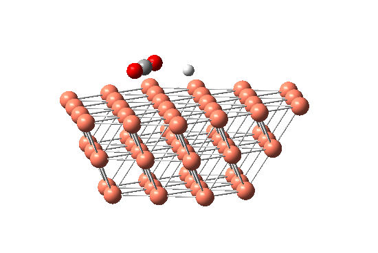
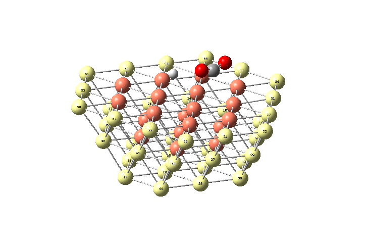

# 簇模型

参考卢经:[使用量子化学程序基于簇模型计算金属表面吸附问题](http://sobereva.com/540)

## 使用orca做催化,吸附计算

orca的RI近似和并行能力非常强大,所以可以用来算一些大体系,而且,虽然orca的迭代步数很多,但是往往最终可以收敛.本文的簇模型就是催化大体系,所以往往使用orca来执行计算.

通常来讲,金属吸附和金属催化显然要用第一性原理软件进行计算,量子化学软件显然是无法处理无穷体系的,但是我们可以做一个截断,取一个局部的金属簇,在这个簇上面进行一些相关的计算.好处是,支持的方法远远多于第一性原理计算程序,并且没有杂七杂八的设置,校正之类的,坏处是因为做了截断,所以一定有误差,怎么截断也是有一定技巧的.

例如,卢老师的金属簇长得就是一个三层的台阶状,在结构优化的时候冻结所有的边界原子,以模拟真实的体相环境:



## 如何构建簇

首先去ICSD数据库网站[https://icsd.fiz-karlsruhe.de/search/crystalChemistry.xhtml] 注册一个账号,然后直接开始搜索想要的晶体结构,下载对应的.cif文件,拖入到可视化软件VESTA中,选择Edit选项中的Edit data,然后选择Transfer选项,设置矩阵的对角元(代表三个方向的放大倍数),就可以得到延展后的晶胞,然后自己一点一点删掉原子,得到自己想要的形状的金属簇模型

然后导出的时候选择export data,选择xyz文件,orca就可以直接用了,但是为了方便分子建模和观看,把xyz文件拖入到Multiwfn中,将.xyz文件转化为Gaussian的输入文件,就可以在Gaussview中观看和建模了.

在Gaussview中能看的更清楚,值得注意的一点是,Gaussview中可能并不会判断Cu原子之间成键,这个可以自己手动设置,在File-preference-Custom-bonding-parameter中可以设置某两种元素之间的成键阈值:



修改一下簇,然后将想要研究的体系放在表面(比如我研究铜催化剂对氢原子进攻二氧化碳反应的催化作用),输入文件的坐标部分就构建好了.



## 冻结原子

Gaussian中冻结原子只需要在原子后面写个-1,别的写0就行,但是orca中不一样,它需要在geom模块中的constrains选项中设置被冻结的原子:

```
%geom
  Constraints
    {C 8 C}
    {C 9 C}
    {C 10 C}
    {C 11 C}
    {C 12 C}
    {C 13 C}
    {C 19 C}
    ...
```

warning:==orca中冻结原子,原子序号是从0开始的!但是坐标相关中的原子序号是从1开始的,这从输出文件中也能看出来,所以冻结原子的时候千万要注意,冻结的序号是Gaussview中的序号-1!!!==

我们把边界的未被其他铜原子约束的原子冻结,执行限制性优化,被冻结的原子如图所示:



## 计算

对这种大体系,采用orca执行计算,其自带的RIJCOSX方法可以显著加速大体系的收敛速度,同时,泛函采用杂化泛函PBE0(pbe对金属的描述也不错,但是杂化泛函的收敛比纯泛函要容易的多),基组采用def2系列的小基组def2-SV(P),去掉了一层极化函数,也是为了加速计算,同时减少orca文件的输出,避免又臭又长同时加速计算:

```
! PBE0 def2-SV(P) D3BJ Opt def2/J RIJCOSX  noautostart miniprint nopop
```

优化完成之后,理应在高级别下算一次单点,然后将任务改成OPTTS,寻找氢原子进攻二氧化碳的过渡态,然后再算一次单点,两个能量相减就得到了反应的活化能.

找过渡态在96核的超算下跑了2天,结构优化在96核超算下跑了一天,这个体系的计算确实相当耗时了.
