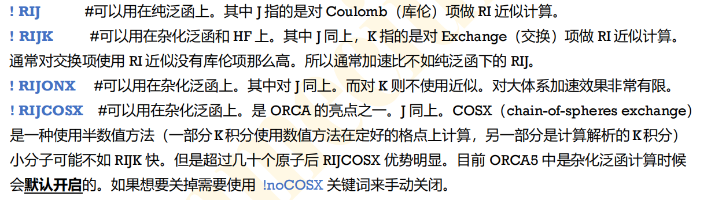

# 输入

## 架构
ORCA的输入文件有自己的体系,其主要包括了三个部分:

先来看一个简单的输入文件:

```
! HF def2-TZVP

%scf
   convergence tight
end

* xyz 0 1
C  0.0  0.0  0.0
O  0.0  0.0  1.13
*
```

可以注意到其中的三个part,第一行是关键字,用于指定计算方法,计算任务之类的,第二个part是模块,可以执行更加详细的设定,使用%开始,使用`end`结尾,最后一个部分是是系统的坐标以及通过一个 %coords 块提供的电荷和多重性,通常用*作为开始和结尾.

ORCA中的注释和py的语法一样,都是使用`#`开头.

详细的架构可以被总结为:

```python
#井号后的内容是注释，你可以想写什么写什么
! {Keywords} 			#控制了方法、基组、工作类型
! moread 		#备选项：让程序从已有的分子轨道开始计算需要%moinp关键词
%moinp “MyInp.gbw” 		#备选项：在此处输入已有的轨道信息
%maxcore 4096 			#备选项：以MB为单位，限制使用内存的大小,一般执行大型任务需要预分配较多的内存
# %base “MyBaseName” 		#备选项：规定临时文件的文件名  通常用不到
* xyz {Charge} {Mult} 		#输入坐标类型，电荷和自旋多重度
C 1.23 16.481 -9.87 		#笛卡尔坐标的默认单位是埃
* 				#坐标输入区结束
$new_job
#可以新建一个任务，以此类推
```

## 坐标输入

输入的坐标使用xyz格式和int格式,支持笛卡尔坐标输入和z-matrix输入(z-matrix在研究具体化学问题的时候可以更加方便的进行修改),其输入框架为:

```
* int {charge} {multiplicity}
AT NA NB NC R A D 
*

缩写	含义
AT	原子种类
NA	距离
NB	角度
NC	二面角
R	实际距离
A	角度制角度
D	角度制二面角 # 具体我不是很懂,等用到的时候再回来看
```

坐标输入的第一行首先指明文件输入的类型,其次再输入分子的电荷数和自旋多重度(注意这里是`2S+1`,而不是`2S`).

文档中介绍了另一种输入坐标的方式就是使用%coords块,等要用到的时候再看.

刚刚说的都是`.inp`文件,这是orca的输入文件,但是每次都在`.inp`文件里面输入全部的坐标未免有些麻烦,也可以直接从外部的`.xyz`文件中读取坐标,那么输入文件中的坐标设置就被简化为一行:

```
* xyzfile Charge Multiplicity Filename # 把这个filename换成你自己的文件名

* gzmtfile 1 2 mycoords.gzmt # 使用z-matrix的坐标文件是.gzmt,前面的指令也要同步修改.
```

使用`$new_job`指令可以创建一个新的任务,这个新任务可以继承上一个任务的坐标,所以坐标设置的时候只需要`* xyzfile {charge} {multiplicity}`就好了,当然这个任务算别的分子就另说.

通过执行H2O的结构优化计算(单点能计算不会产出xyz文件),orca会自动产生计算完毕的xyz文件,我们来看看这个文件的格式:

```
3
Coordinates from ORCA-job test E -76.321272220539
  H           0.00000000000000     -0.35931769820651     -0.03229300391205
  O           0.00000000000000      0.24315066097084      0.72399177266480
  H           0.00000000000000      1.11616703723567      0.30830123124724
```
坐标输入部分和预想的没有偏差,第一行需要指定原子的个数,第二行是注释,想写什么写什么.

==注意,orca在执行计算的时候会在当前目录(即orca inp > out inp所在的文件夹)下生成大量的缓存文件,一部分在计算完毕后会自动删除,没被删除的都会带有有用的信息,所以建议一个计算在一个文件夹内执行,便于不同任务之间的管理==

## key-words

第一行加!的就是关键字,可以用于指定计算方法和计算任务

例如我可以指定`! HF`执行scf计算,指定`! DFT`执行dft计算(事实上不需要指定!DFT,通常直接交换关联泛函,例如!B3LYP,这相当于会默认使用DFT计算),以及一些post-HF的计算方法,例如`! MP2 ,! CCSD(T)`之类的,大量的计算方法关键字可以在文档中找到,例如下面就是一个简单的CCSD(T)计算输入文件(因为是小分子一瞬间就算完了),并且作为一款成熟的量子化学软件,里面有大量的高精度计算方法,选择种类非常多.

```
! CCSD(T) DEF2-SVP 
* xyz 0 1
  C  0  0  0
  O  0  0  1.13
*
```

除了指定计算方法,还可以指定计算任务,例如`OPT`就是结构优化(orca的结构优化速度还是相当可以的),`MD`就是分子动力学模拟(orca原来还能做这个)...

我们考虑优化一个之前在pyscf里算不动的大分子-二氯联苯:
```
! B3LYP def2-SVP Opt # 需要指定泛函和基组,默认使用DFT进行结构优化
# 执行二氯联苯的结构优化任务
* xyz 0 1
C                 -1.15604739    1.14245343   -1.26496733
C                 -0.30298287    0.70867715   -0.24122858
C                 -0.16324325    1.47269691    0.92524842
C                 -0.87656694    2.67049374    1.06798602
C                 -1.72963254    3.10426930    0.04424786
C                 -1.86937291    2.34024905   -1.12222873
H                 -1.26274359    0.55910614   -2.15559737
H                  0.48808879    1.14149800    1.70689659
H                 -0.76987141    3.25384060    1.95861642
H                 -2.27427261    4.01881271    0.15323206
Cl                -2.94072689    2.88502212   -2.40792813
C                  1.83043457   -2.10174961   -1.75379769
C                  1.90754508   -3.00317186   -0.68355760
C                  1.27132883   -2.70679905    0.52941974
C                  0.55800039   -1.50900493    0.67215631
C                  0.48089030   -0.60758245   -0.39808362
C                  1.11710765   -0.90395465   -1.61106052
H                  2.31620031   -2.32803654   -2.67993260
H                  2.45218620   -3.91771478   -0.79254052
H                  1.33020318   -3.39505562    1.34657132
H                  0.07223587   -1.28271733    1.59829170
Cl                 1.02026594    0.22813001   -2.95516097
*
```
在我这台电脑上只需要20min,pyscf看不到算出来的希望.

还有一个和pyscf里面很像的就是,可以在关键字里面指定启用分子对称性(这个好像是比较新的orca才有的功能),只需要加入`UseSym`关键字即可.

同时我们执行计算计算的时候,也需要在关键字内指定泛函和基组(基组好像可以在基组模块中指定).这样,一个完整的关键字行就结束了,总结一下就是:

```
[计算方法] [计算任务] [泛函] [基组] [对称性等杂七杂八的操作...]
```

## Input Blocks

输入块就是我们执行更加精细设置的地方,在这里我们可以决定是否导入某些模块并且对模块进行设置和操作,其语法一般为`%开始 end结尾`

常用的block就是`basis`模块,可以对基组进行设定,

常见的基组有,比较小的基组系列:如`sto-3g`,`6-31g`(sto-3g我个人人为只能做一些定性的测定,这个基组太小了,计算结果不可信).

适用于重元素和过渡金属的`def2`系列基组:`def2-svp`,`def-tzvp`,`def2-tzvpp`等等,一般def2系列基组会自动使用赝势去加速计算,所以尤其适合重元素.

还有就是较为古典的大机组ccpv系列,常用于组态相关的post-HF方法:`ccpvdz`,`ccpvtz`,`ccpvqz`,`ccpv5z`等等,总结一些常用的基组就是:

```
BasisSet= 
    def2-SVP, def2-TZVP, def2-TZVPP, def2-QZVPP,
    ma-def2-SVP, ma-def2-TZVP, ma-def2-TZVPP, ma-def2-QZVPP,
    cc-pVnZ, aug-cc-pVnZ, cc-pCVnZ, aug-cc-pCVnZ (n= D,T,Q,5,6)
```

其中`ma-def2`和`aug-cc`分别是加入了扩展函数和弥散函数的的基组,可以更好的描述弱相互作用,这两套基组广泛适用于dft计算和精确波函数方法计算.

更多的基组参见ORCA的文档,其支持大量没见过的基组,到时候碰到具体问题再去查一下.

ORCA给的一个完整的基组设定为:

```
%basis

  Basis "Def2-TZVP"         # The orbital expansion basis set
  AuxJ  "Def2/J"            # RI-J auxiliary basis set
  AuxJK "Def2/JK"           # RI-JK auxiliary basis set
  AuxC  "Def2-TZVP/C"       # Auxiliary basis set for correlated 
                            # calcualtions, e.g. RI-MP2
  CABS  "cc-pVDZ-F12-OptRI" # complementary auxiliary basis set 
                            # for F12 calculations

  DecontractBas   false  # if chosen "true" the program will
                         # decontract the orbital basis set
  DecontractAuxJ  false  # if "true" - decontract the AuxJ basis set
  DecontractAuxJK false  # if "true" - decontract the AuxJK basis set
  DecontractAuxC  false  # if "true" - decontract the AuxC basis set
  DecontractCABS  true   # if "false" - do not decontract the CABS
  Decontract      false  # if "true" - decontract all basis sets
end
```

其中包括主要基组,辅助基组(用于开启RI加速),已经两者之间相关的设置选项.

也可以自己定制基组,基组需要从外部文件中读入,在模块中增加这么一句话:`%basis GTOName “MyGTOBasis.bas” end`

### 辅助基组(Auxbasis)

orca相较于其他软件很大的一个优势就是其使用了密度拟合技术(RI),通过添加辅助基组的方法把四中心的双电子积分<ij|kl>转化成为三中心或者二中心,大大加快计算速度的同时还能保持不错的精度,RI的开启通常是默认的,如果我们想要定制辅助基组,可以在basis模块中设定`AuxJ`参数

当然,直接在关键字行写出辅助基组也是被允许的,只不过这样比较难以阅读,结构不好,推荐还是在块中进行设定.

辅助基组通常会在普通基组的后面加上`/J,/JK,/C`之类的,例如`DEF2/J, cc-pVnZ/J`之类的,`/J`代表队库伦相互作用做密度拟合,`/JK`代表同时对库伦作用和交换作用做RI加速,`/C`这个好像在MP2中设置比较多.

一个完整的设定大概如:

```
! MP2 Def2-TZVP RI-MP2
%basis
  AuxC  "Def2-TZVP/C"
end
```

通常RI系列方法在orca 6中是默认开启的,一般不用去设置关键字.

数值计算方法的关键字设置为:



