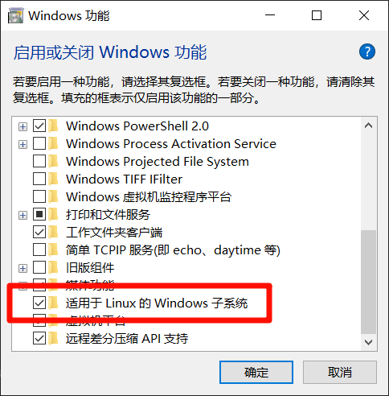
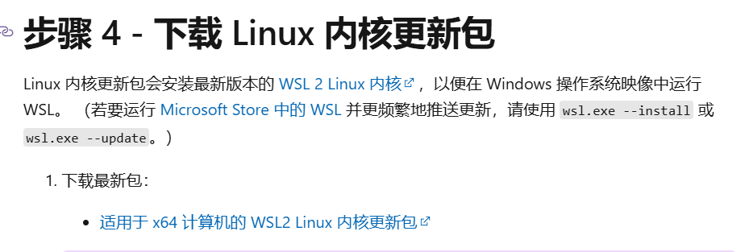
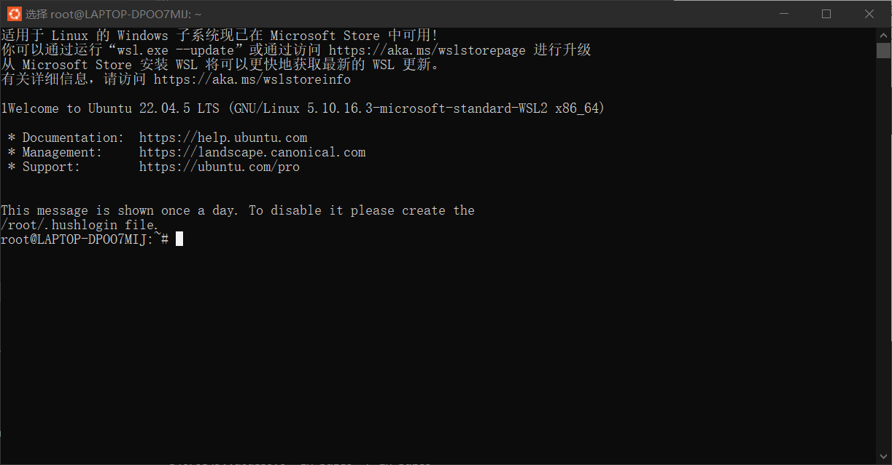

# 启用wsl

windows系统中有一个wsl选项,可以启用一个适用于Linux的windows子系统,下面为启用步骤:

首先,先在开始菜单直接搜索`启用或关闭windows功能`,



勾选这个功能然后重启计算机

## 下载linux发行版

要先将版本设置成wsl-2,但是使用这个版本需要启用一些虚拟机功能:

依次输入以下两条指令:

启用虚拟机平台功能

```
dism.exe /online /enable-feature /featurename:VirtualMachinePlatform /all /norestart
```

启用适用于linux的windows子系统功能

```
dism.exe /online /enable-feature /featurename:Microsoft-Windows-Subsystem-Linux /all /norestart
```

下载wsl-2的内核更新包:

访问微软的官方链接[https://learn.microsoft.com/zh-cn/windows/wsl/install-manual#step-2---check-requirements-for-running-wsl-2]



然后重启一下,就可以在cmd中设置版本为wsl-2了:

```
wsl --set-default-version 2
```

下一步就是安装Linux的发行版,我这里选择的是Ubuntu:

```
wsl --install -d Ubuntu
```

然后第一次安装会默认启动,会弹出一个终端的窗口,然后要求你创建用户名和密码,下次再启动的时候可以从开始菜单启动Linux终端,或者在cmd中输入简单指令:

```
wsl
```



这样Linux系统就装好了,可以在上面通过指令来操作文件.

## 迁移Linux系统

一般默认是装在C盘的,但是我C盘空间不够了,所以将其迁移到了E盘:

首先要在E盘创建一个文件夹用来存放迁移文件,然后执行命令将Linux发行版打包导出到指定文件夹:

```
wsl --export Ubuntu E:\WSL\ubuntu.tar
```

接着在C盘注销掉linux发行版:

```
wsl --unregister Ubuntu
```

然后在E盘上导入Linux发行版:

```
wsl --import UbuntuOnD E:\WSL\Ubuntu E:\WSL\ubuntu.tar --version 2
```

然后启动就好了:

```
wsl -d Ubuntu
```

这个时候发现不用设置用户和密码了,装在E盘的Linux系统默认你是根用户`root`,具有全部的权限.

在linux中运行指令`df -h`,就能查看系统装在哪里:

```
root@LAPTOP-DPOO7MIJ:~# df -h
Filesystem      Size  Used Avail Use% Mounted on
/dev/sdb        251G  2.6G  236G   2% /
tmpfs           2.3G     0  2.3G   0% /mnt/wsl
tools           100G   86G   15G  86% /init
none            2.3G  4.0K  2.3G   1% /run
none            2.3G     0  2.3G   0% /run/lock
none            2.3G     0  2.3G   0% /run/shm
none            2.3G     0  2.3G   0% /run/user
tmpfs           2.3G     0  2.3G   0% /sys/fs/cgroup
drivers         100G   86G   15G  86% /usr/lib/wsl/drivers
lib             100G   86G   15G  86% /usr/lib/wsl/lib
C:\             100G   86G   15G  86% /mnt/c
D:\             138G   60G   78G  44% /mnt/d
E:\             239G   88G  152G  37% /mnt/e
```
（根目录）挂载在 `/dev/sdb`（这是WSL 2的虚拟磁盘文件）。它的大小显示为 251G，当前使用 2.6G，和 `ext4.vhdx` 文件的大小应该基本匹配,去刚刚那个文件夹里找到这个文件,查看一下大小,验证确实装在E盘了.

## 使用vscode

直接使用终端管理文件比较麻烦,不如windows系统中图标点点来的舒服,所以可以安装vscode的wsl插件


安装完毕后按快捷键`Ctrl+Alt+O`,选择连接wsl,就会新开一个窗口,然后在里面就能畅快的使用vscode管理和编辑文件了,终端的指令依旧可以用.
