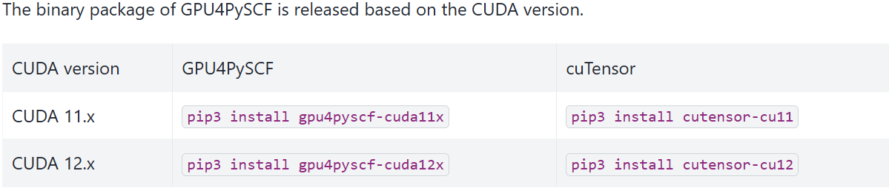
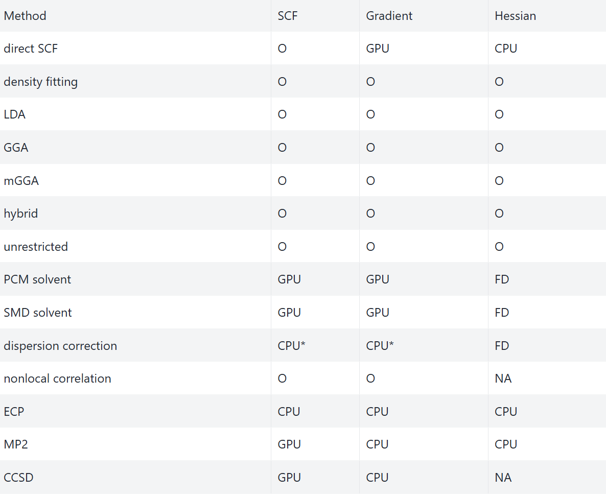

# 加速方法

主要记录两种加速方法,分别是密度拟合技术(RI近似)和调用GPU加速

## 密度拟合

DF(Density Fit)方法是一种近似计算双电子积分的方法,需要有一定的辅助基组,通过降低积分计算时间来显著加速计算

默认的SCF计算中是不会使用DF技术的,使用defsity_fit()方法可以进行调用:

```python
mf=scf.RHF(mol).density_fit().run()
```

在post-HF方法中也可以调用密度拟合,由于post-HF方法是基于一个完整的HF计算的,所以只要前面构建对象的时候使用了`density_fit()`,进行后HF计算的时候自动会调用DF

或者,根据文档的说法,有的人有特殊的需求,希望后HF计算的DF和HF计算的DF使用不同的辅助基组,那么可以在后HF计算的时候显式的使用`density_fit()`,例如:

```python
mol=...
mf=scf.RHF(mol).run() # 注意这里一定要写run,不要写kernel,前者返回的是对象,后者只吐出信息
mmp=mp.mp2(mf).density_fit(auxbasis="自己指定的辅助基组")
e_corr=mmp.kernel()[0]
```

一般来说,程序会自动指定和基组匹配的辅助基组,如果不存在对应的辅助基组,则会按照一定的规则去生成辅助基组(详见文档)

## GPU加速

现代GPU可以显著加速量子化学计算,pyscf的某些模块,使用插件包GPU4pyscf也可以调用gpu进行加速,同时,最好和密度拟合技术配合使用,这样可以显著降低计算的耗时.

需要的软件包的版本:



gpu4pyscf和pyscf有点像tensorflow和tensorflow_gpu之间的关系,但是gpu4oyscf可以和pyscf协同工作,两者的数据结构可以相互转换,使用to_gpu()和to_cpu()可以将两个模块的对象相互转换

有一些功能和模块仍然是cpu独有的,所以要灵活运用数据结构的转换.

例如,一个简单的闭壳层DFT计算,可以使用两种方式实现:

1.直接使用cpu的函数:

```
import pyscf
from gpu4pyscf import rks
mol=pyscf.M(...)
mf=rks.RKS(mol).densityfit().run()
```

2.在计算之前使用to_gpu

```
mf=dft.RKS(mol).density_fit().to_gpu().run()
```

支持方法一览:



O代表对GPU实现了优化,CPU代表只能用CPU模块实现,FD表明只能通过数值方法获得,NA表示不可用,GPU表示可以无缝衔接,直接替换.

非常值得提醒的是,目前pbc模块并不支持gpu加速,计算周期性体系还是要依赖于cpu,同时,pyscf是默认全核并行的.
