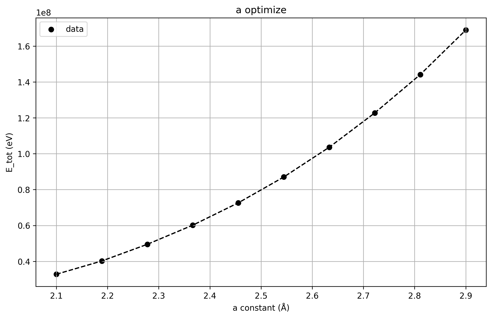
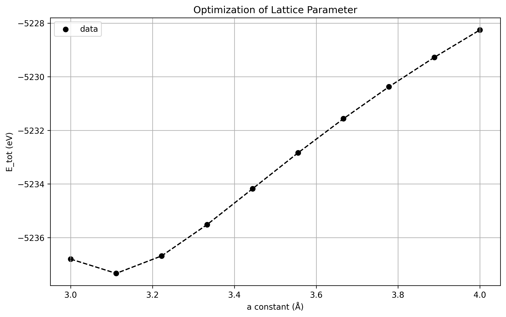

# 周期性体系

周期性体系一般指的就是晶体,由于其原子周期性重复的特征,输入文件和计算要求都和分子体系都有很大的不同,周期性体系以一个超晶胞为单位,我们需要指定原子坐标和晶格矢量.

## 输入文件

```python
from pyscf.pbc import gto
cell = gto.M(
  atom = '''H 0 0 0; H 1 1 1''',
  basis = 'gth-dzvp',
  pseudo = 'gth-lda',
  a = numpy.eye(3) * 2)
```

首先可以看到的是,这个gto模块不在是从pyscf中直接导入,而是从pyscf.pbc中导入,但是`gto.M`的用法和之前一致,依旧会自动完成`build`方法.

和分子模块中不同的是,基组不再是我们熟悉的`ccpvdz`等,而是`gth-dzvp`等,这些基组是专门为周期性体系设计的,并且还多了一个参数`pseudo`,这个参数被称作赝势.

与分子体系类似的是,我们可以指定晶胞的净自旋和净电荷,charge参数默认是0,但是在描述某些材料的局部缺陷的时候可以添加,具体的工作原理我还不是很懂.

还有一个我们要指定的参数就是晶格矢量`a`,默认是单位矩阵,有了晶格矢量,才能够重复描述整个周期性体系.

指定方式可以用矩阵形式代表三个向量(注意, **必须是要在右手坐标系下的坐标** ):

```python
cell.a = [[2,0,0],[0,2,0],[0,0,2]]
```

## 简单的晶体计算

主要是对David的Density Functional Theory这本书的图的复现,以检验我计算的正确性.我并没有进行优化,实际上只是计算了几个散点,优化的开销太大,我的电脑算不动.

### Cu的立方结构的晶格参数优化

虽然铜实际上是FCC结构,但是用立方结构也能计算,只不过总能量高一点,我们考虑对立方结构的晶格参数a进行优化.

由于优化任务需要进行大量的重复能量计算,所以我们可以使用并行化计算方法:

```python
from multiprocessing import Pool

# ... 在 if __name__ == '__main__': 块中
with Pool() as p:
    E = p.map(energy, x)
E = [e * 27.211386 for e in E]  # 转换为 eV
```

Pool是python的multiprocessing模块中的一个类,用于创建一个进程池执行并行计算任务,map方法用于将函数应用到可迭代对象的每个元素上,并返回一个结果列表.

铜的电子排布为`[Ar]3d104s1`,自旋数为1,所以要设定晶胞内`spin=1`,否则计算无法执行.

这里有一个非常值得注意的点,就是k点网格数的选取, ==**对于`spin=1`的体系,k点网格数必须是奇数**== ,否则会报错,这涉及到采样点电荷的分配问题,具体我也不是很懂,这个问题困扰了我好几个小时.这里我k点的设置为[3,3,3]

由于Cu是一个比较大的体系(电子数比较多),为了加速计算,所以我们可以选取小一点的基组进行计算,例如`sto-3g`,积分网格数目也相应减少,`mesh`参数设置为[10,10,10]

对周期性开壳层体系采用`dft.KUKS`方法进行计算,相较于分子体系的开壳层计算,前面多了一个K,表示使用Kohn-Sham方法.

最后全部代码如下:

```python
from pyscf.pbc import gto,dft
import numpy as np
import matplotlib.pyplot as plt


def energy(a0: float):
    cell = gto.M(
        atom=[['Cu', 0, 0, 0]],  # 立方结构
        basis='sto-3g',
        ecp='lanl2dz',
        a=np.eye(3) * a0,
        verbose=4,
        spin=1,
        mesh=[10,10,10]
    )


    # 创建 Monkhorst-Pack k 点网格
    kpts = cell.make_kpts([3,3,3])

    mf = dft.KUKS(cell,kpts=kpts)
    mf.xc = 'pbe'
    
    mf.kernel()

    return mf.e_tot


if __name__ == '__main__':
    x = np.linspace(2.1, 2.9, 10)  
    from multiprocessing import Pool

    # ... 在 if __name__ == '__main__': 块中
    with Pool() as p:
        E = p.map(energy, x)
    E = [e * 27.211386 for e in E]  # 转换为 eV

    # 绘图代码
    plt.figure(figsize=(10, 6))
    plt.scatter(x, E, color='black', label='data')
    plt.plot(x, E, '--', color='black')
    plt.xlabel('a constant (Å)')
    plt.ylabel('E_tot (eV)')
    plt.title('a optimize')
    plt.legend(loc='best')
    plt.grid(True)
    plt.savefig('铜晶格参数优化.png', dpi=300, bbox_inches='tight')
    plt.show()
```

计算结果为:



可以看出曲线是比较平滑的,计算在逻辑上应该是没问题的,但是没有出现最低点,应该是计算精度问题,基组太小,网格太系数,k点太少,等等都是问题.

### Cu的FCC结构的晶格参数优化

Cu的实际结构是FCC,其最优晶格参数对应的总能量要低于立方结构,下面尝试进行FCC结构的晶格参数优化.

FCC周期性体系的计算会更加耗时,为了进一步提升计算速度,可以提高dft的允许容差以及最大循环次数:

```python
mf.conv_tol = 1e-6
mf.max_cycle = 50
```

开启分子对称性`symmtery=True`

使用密度矩阵继承的方法,由于每次改变晶格参数,其密度矩阵都大差不差,所以不妨在上一次迭代的基础上继续迭代以减少计算量,那么函数就需要传入两个参数以及传出两个参数.(但是这样做了之后,下一次的计算需要依赖于上一次,无法进行并行化计算,但是我的CPU是单核的,其实无所谓)

代码为:

```python
from pyscf.pbc import gto, dft
import numpy as np
import matplotlib.pyplot as plt

def energy(a0, prev_mf=None):
    cell = gto.M(
        atom=[['Cu', 0, 0, 0]],
        a=np.array([[0.5, 0.5, 0], [0, 0.5, 0.5], [0.5, 0, 0.5]])* a0,
        basis='sto-3g',
        ecp='lanl2dz',
        verbose=4,        # Reduce verbosity
        symmetry=True,
        spin=1,
        mesh=[10,10,10]
    )

    # Create Monkhorst-Pack k-point mesh
    kpts = cell.make_kpts([3, 3, 3])

    mf = dft.KUKS(cell, kpts=kpts).density_fit()
    mf.xc = 'pbe'
    mf.conv_tol = 1e-6    # Adjust convergence tolerance
    mf.max_cycle = 50     # Limit maximum number of SCF cycles

    if prev_mf is not None:
        # Use previous converged density matrix as initial guess
        dm = prev_mf.make_rdm1()
        mf.kernel(dm0=dm)
    else:
        mf.kernel()

    return mf.e_tot, mf

if __name__ == '__main__':
    x = np.linspace(3, 4, 10)
    E = []
    prev_mf = None
    for a0 in x:
        e_tot, prev_mf = energy(a0, prev_mf)
        E.append(e_tot * 27.211386)  # Convert to eV

    # Plotting code
    plt.figure(figsize=(10, 6))
    plt.scatter(x, E, color='black', label='data')
    plt.plot(x, E, '--', color='black')
    plt.xlabel('a constant (Å)')
    plt.ylabel('E_tot (eV)')
    plt.title('Optimization of Lattice Parameter')
    plt.legend(loc='best')
    plt.grid(True)
    plt.savefig('铜晶格FCC参数优化.png', dpi=300, bbox_inches='tight')
    plt.show()

```

计算结果为:



最优晶格参数为3.12A左右,实验值为3.615A,计算结果偏小.但是有这个精度已经很感人了,误差大约为13%,还可以接受,如果想要进一步提升精度,则需要提高网格的密度,增加k点的数量,使用更高级的基组以及合适的赝势.


