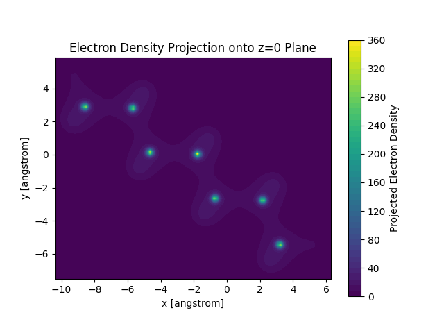

# 计算电子密度

使用pyscf写一遍计算电子密度的过程可以更好的理解量子化学理论,同时,可以和python的其他模块很好的协同化工作.

使用更成熟的量子化学计算软件可以更加方便的得到单个分子的电子密度图,获得方法是将输出文件拖入到Multiwfn中执行绘图的任务,可以节省很多时间,

## 使用scf计算电子密度

### 密度矩阵

电子密度信息在自洽场迭代中由密度矩阵和原子轨道共同决定:

首先,电子密度可以视作单电子波函数在空间中某一处出现概率的叠加:

$$
\rho(r)=\sum_i|\psi_i(r)|^2=\sum_i\sum_{\mu,\nu}c_{\mu i}c_{\nu i}\phi^*_\mu\phi_\nu=\sum_{\mu,\nu}D_{\mu\nu}\phi^*_\mu(r)\phi_\nu(r)
$$

于是空间中某一处的电子密度就转化为密度矩阵和原子轨道的乘积和.只要知道指定的基组和scf迭代的最终密度矩阵,就能求出任意一点的电子密度.

### 爱因斯坦求和约定

`numpy`中提供了一种高效的求张量积的计算方法`einsum`,其内部的运行机制采用了大量的底层优化,比我直接写for循环要高效很多.

以矩阵相乘为例:

$$
C_{ij}=\sum_kA_{ik}B_{kj}
$$

我们可以认为,是下标`ik,jk`坍缩到`ij`了,那么矩阵乘积就可以这么写:

```python
result=np.einsum('ij,jk->ik',A,B)
```

由比如说,两个i维向量的内积实际上就任意认为两个`i`坍缩到0维了:

```python
result=np.einsum('i,i->',A,B)
```

如果要求矩阵的迹,就可以认为是两个$ii$坍缩到0维了:

```python
result=np.einsum('ii->',A)
```

两个矩阵逐元素相乘得到一个新矩阵,可以认为其形状依旧是`ij`:

```python
result=np.einsum('ij,ij->ij',A,B)
```

同时,einsum还有一个优化选项`optimize`,可以自动选择最优的计算方式,比如:

```python
result=np.einsum('ij,jk->ik',A,B,optimize=True)
```

以上述求积为例,假设我输入一个三维坐标,用1行3列的矩阵来表示,那么所有原子轨道在这个点处的值可以用1行N列的矩阵表示,我希望遍历所有的列完成上述求和,体现在求和约定上就是:

```python
result=np.einsum('ij,pi,pi->p',dm, ao_values, ao_values)
```

让我们来解释一下上面的代码,首先`ao_values`代表的是所有原子轨道在所有坐标点处的值,其形状为`Np*Na`,其中`Np`是坐标点数,`Na`是原子轨道数. dm为密度矩阵,其形状为`Na*Na`,维数代表原子轨道的个数.

在我们的输入中,由于我们只输入了一个坐标点,所以p被认为是1,上面返回的也只是这一个点的电子密度.

## 绘图

由于我不是四维生物,我选择将电子云密度投影到z=0平面进行观察,其求电子云密度包括绘图部分代码如下:

```python
# 计算电子密度矩阵
dm = optmf.make_rdm1()

def ele_density(inp):
    # 计算原子轨道的值
    ao_values = optmol.eval_gto('GTOval', inp)
    result = np.einsum('ij,pi,pj->p', dm, ao_values, ao_values)
    return result
```
这一部分设置了计算电子密度的函数,其实`eval_gto`支持输入三维坐标系列返回一系列电子密度,但是为了方便对单个点的电子密度进行操作,所以还是写成这样

```python

# 获取优化后的原子坐标,这是一个N*3的矩阵
atom_coords = optmol.atom_coords()

# 计算坐标在 x, y, z 方向上的最小值和最大值,这样观察比较方便
x_min, y_min, z_min = np.min(atom_coords, axis=0)
x_max, y_max, z_max = np.max(atom_coords, axis=0)

# 定义 x, y, z 坐标范围
x = np.linspace(x_min-1, x_max+1, 100)
y = np.linspace(y_min-1, y_max+1, 100)
z = np.linspace(z_min-1, z_max+1, 100)
```
经过绘图实践,随便设定上下限画出来的图不好看,为了对任意分子绘图的方便性,采取上下限扩充的方法

```python

# 生成网格点 (x, y, z)
X, Y, Z = np.meshgrid(x, y, z)

# 展开网格，形成 Nx3 的坐标点矩阵，每一行是一个坐标 (x, y, z)
grid_points = np.vstack([X.ravel(), Y.ravel(), Z.ravel()]).T

# 计算每个网格点的电子密度
electron_density = ele_density(grid_points)

# 将结果恢复为三维矩阵
electron_density_3d = electron_density.reshape(X.shape)

# 沿 z 轴进行累加投影，将所有z轴的电子密度投影到z=0平面
electron_density_projected = np.sum(electron_density_3d, axis=2)

# 绘制电子密度投影图
plt.contourf(X[:, :, 0], Y[:, :, 0], electron_density_projected, levels=50, cmap='viridis')
plt.colorbar(label='Projected Electron Density')
plt.title("Electron Density Projection onto z=0 Plane")
plt.xlabel('x [angstrom]')
plt.ylabel('y [angstrom]')
plt.gca().set_aspect('equal', adjustable='box')  # 保持x和y轴比例一致

# 保存投影的电子密度分布图
plt.savefig('electron_density_projection.png')
```
这个是绘图部分,照着抄就行了

## 用DFT算电子密度

通过选取合适的交换关联泛函,DFT可以获得远高于HF的计算精度,并且,其迭代对象就是电子密度,所以,使用DFT计算电子密度是很自然的选择

相较于自洽场,DFT只是多了一个交换关联泛函,迭代的对象还是分子轨道波函数,而分子轨道波函数还是由原子轨道叠加而成,所以计算电子密度的方法和前面一样,依旧依赖于密度矩阵和原子轨道.

重点就是交换关联泛函的选取,看sob的文档选择`PBE0`作为我们的交换关联泛函,输入部分略作修改:

```python
# 初始化分子信息
mol = gto.M(
    verbose=0,
    charge=0,
    atom=open('庚烷.xyz').read(),
    basis='ccpvdz',
)

mf = dft.RKS(mol)
mf.xc = 'pbe0'

# 执行几何结构优化
optmol = geomopt.optimize(mf)
optmf=dft.RKS(optmol)
optmf.xc='pbe0'
optmf.kernel()
```

这次我们计算的对象是庚烷,z=0平面压缩出来的电子密度如图所示:



可以看到,DFT计算出来的电子密度更加弥散,这是因为DFT考虑了电子之间的交换关联,虽然运行时间有一定的提升,但是也还是能算出来的.

