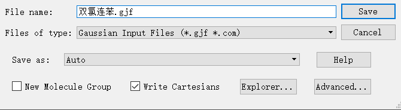

# 输入输出和结构优化

pyscf的输入只支持`.xyz`文件,这个文件就只需要单纯的原子和原子坐标就好了:

```
C                 -1.15604739    1.14245343   -1.26496733
C                 -0.30298287    0.70867715   -0.24122858
C                 -0.16324325    1.47269691    0.92524842
C                 -0.87656694    2.67049374    1.06798602
```

然后那个pyscf的文档好像写的有点问题,atom不能直接等于路径,不然他无法识别,还是需要使用python自带的open功能去读取这个文件:

```python
atom=open('双氯联苯.xyz').read()
```

这样程序就能跑了.

然后这个`.xyz`文件肯定不能手动输入,我是依靠`gaussview`产生输入文件,但是其产生的文件是`.gif`,我们需要把它手动变成`.xyz`,只需要打开然后截取其中的原子坐标部分就可以了



读入输入文件后,由于我画的分子肯定不是最好的构型,所以要执行 **几何结构优化** ,结构优化完毕之后再执行单点能计算.

输出文件可以设置`mol`对象中的`output`参数来实现,他会在当前文件目录下生成一个`.out`文件

```
output = 'name.out'
```

warning: 执行程序的时候不要直接点击run,要进入文件夹后使用`python3 name.py`,他才能正确找到文件,或者使用绝对路径来读入输入文件也可以.

## ==结构优化模块==

pyscf中的结构优化由结构优化模块`geomopt`来完成

```python
from pyscf import geomopt
```

使用方法定义完对象`mf`之后使用几何优化函数

```python
opt_mol = geomopt.optimize(mf)
```
warning:这个函数返回的是一个`Mole`对象,对这个对象我们还可以重新指定基组,指定方法,生成一个新的`optmf`对象,然后再执行单点能计算.

值得注意的是,上述模块的运行依赖于`geometric`库,所以执行几何结构优化之前要先下载这个库:

```
pip install geometric
```
几何优化是一个非常耗时的模块,不建议在自己的电脑上进行操作.值得注意的是,几何优化得到的是初始给定分子结构附近的能量极小值对应的结构,而不是能量最小值对应的结构,这是符合实际的,能量极小值往往就能对应一种稳定结构,而我们通常不希望进行全局优化从而严重偏离我们的初始结构.