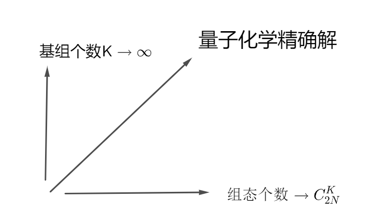

# Hartree-Fock 方法

## 量子化学精确解

要想描述一个多电子体系薛定谔方程的精确解,通常需要满足两个条件:

1. 完全组态相关
2. 无穷基组

无穷基组的要求很好理解,我们将波函数视作希尔伯特空间下的一个向量,这个向量空间的基底是无穷维度的,自然描述这个波函数的基向量越多,其就越精确.

完全组态相关要求我们表示波函数的时候用上所有的组态,这与化学中的常识似乎是相悖的,首先,要明晰组态的定义,组态和电子构型类似,都是描述电子状态的一个名词,只不过,电子构型只对电子的轨道排布做出要求($1s^22s^22p^1$),没有对电子的自旋做出描述,而电子组态对电子自旋也给予了描述,两者的定义类似.

首先,考虑一个电子的薛定谔方程,其波函数被称作分子轨道,我们知道,单独考虑单个原子的单个电子的时候,其波函数的解被称作原子轨道,其按照能量排布有无穷多个$s,p,d,f\cdots$,假设我们在所有原子的所有原子轨道中我们取K个作为分子轨道的基组(为什么取原子轨道,是因为其能更好表述分子轨道,用较少的迭代次数就能收敛,如果使用表象的本征函数,可能需要迭代很多次才能收敛,并且基组的个数需要很多.)

由于线性组合不会改变自由度个数,所以最后会组合出K个不同能级的分子轨道,又考虑到自旋方向有两个,所以就会有2K个分子轨道:

$$
\{ \phi_1,\phi_2, \ldots ,\phi_{2K} \}
$$

这个时候,假设我们有$N$个电子,那么这N个电子在2K个轨道上的一种占据就称为电子的一个组态,在该基组下,电子组态总共有$C_{2K}^N$个,最终的波函数一定要使用上所有组态的波函数进行线性表示,这就被称作完全组态相关(Full-CI).

$$
\psi=\lim_{K \to \infty}\sum_{i=1}^{C_{2K}^N}\sum_{j=1}^{N} c_{j}^i \phi_{m_j^i}
$$

满足两个条件就能得到量子化学精确解,由此可见,得到精确解往往是非常困难的,所以必须引入具有适当近似效果的计算方法简化我们的计算.

其中有限基近似是我们前面已经广泛使用的.

## H-F近似

H-F近似其实就是暗含了我们化学中常用的近似,用一个能量最低的组态作为主要组态来描述整个体系,例如,在分子轨道理论中,我们考虑电子总是优先成对占据能量较低的$\sigma$成键轨道,如果存在简并轨道,则根据洪特规则自旋平行的占据这些轨道,这样一种占据方法对应能量最低的状态.

量子化学理论告诉我们,精确解必须由完全组态相关描述,所以上述的说法只能是一种近似手段.

在确定好填充的分子轨道后,hartree-fock近似做了下一步处理,他认为,这N个分子轨道是不相关的,电子之间的相互作用被包含在求解分子轨道的过程中了,所以可以分离变量,把总波函数写成分子轨道的乘积:

$$
\Psi=\phi_1(x_1)\phi_2(x_2)\ldots\phi_N(x_N) 
$$

其中$x_i=(\vec{r_i},\vec{\omega_i})$,是电子空间坐标和自旋坐标的综合:

$$
\phi_i(x_i)=\psi(\vec{r_i})\alpha(\vec{\omega_i})
$$

然而,上述波函数不满足泡利规则----互换任意两个电子的标号,总波函数需要变号,所以上述波函数需要写成slater行列式的形式.

考虑两电子波函数,一个满足泡利规则又可以归一化的形式为:

$$
\Psi=\frac{1}{\sqrt{2}}(\phi_1(x_1)\phi_2(x_2)-\phi_1(x_2)\phi_2(x_1))=\frac{1}{\sqrt{2}}\begin{vmatrix}
    \phi_1(x_1),\phi_2(x_1)\\
    \phi_1(x_2),\phi_2(x_2)
\end{vmatrix}
$$

互换两个电子就是互换行列式的两行,行列式需要变号,将上述结果推广到N个电子就是所谓的slater行列式:

$$
\Psi=\frac{1}{\sqrt{N!}}\begin{vmatrix}
    \phi_1(x_1)&,\phi_2(x_1)&, \ldots &,\phi_N(x_1)\\
    \phi_1(x_2)&,\phi_2(x_2)&, \ldots &,\phi_N(x_2)\\
    \vdots&,\vdots&,\ddots&,\vdots\\
    \phi_1(x_N)&,\phi_2(x_N)&, \ldots &,\phi_N(x_N)
\end{vmatrix}
$$

显然,这就是hartree-fork近似的第二个近似处理手段,假设总分子轨道可以分离变量成为N个单电子轨道.

## H-F方程

如何得出N个单电子轨道方程,这就是hartree-fock方法的第三个近似,它假设电子之间的相互作用可以用一个平均势能来描述:

$$
\hat{f}=\hat{T}+\sum_{i,j}V_{Ne}+\widetilde{V}_{ee}(r)
$$

其中$\hat{f}$被我们称之为fock算符.

这样就避免了复杂的电子电子相互作用,降低了求解方程的难度,计算机求解所有本征态和能量的时候采取的是有限基近似,由于作为基组的原子轨道并不正交,所以最后就是要求解所谓的久期方程:

$$
FC=SCE
$$

S是重叠积分矩阵

## 总波函数的能量

以双电子为例,总哈密顿算符为:

$$
\hat{H}=-\frac{1}{2}\nabla_1^2-\frac{1}{2}\nabla_2^2-\sum_{A} \frac{Z_A}{|r_1-R_A|}-\sum_A \frac{Z_A}{|r_2-R_A|}+\frac{1}{|r_1-r_2|}
$$

我们将动能算符与核势能算符合并成为hartree算符:

$$
\hat{h}(r)=-\frac{1}{2}\nabla^2-\sum_A \frac{Z_A}{|r-R_A|}
$$

所以可以简写为:

$$
\hat{H}=\hat{h_1}+\hat{h_2}+\frac{1}{|r_1-r_2|}
$$

所以能量为:

$$
E=\langle \Psi|\hat{H}|\Psi\rangle =\langle\Psi|\hat{h_1}|\Psi\rangle+\langle\Psi|\hat{h_2}|\Psi\rangle+\langle\Psi|\frac{1}{|r_1-r_2|}|\Psi\rangle
$$

将slater行列式代入,将上述形式展开成为积分,最终得到结果:

$$
E=\int dx \phi_1^*(x)\hat{h}\phi_1(x)+\int dx \phi_2^*(x)\hat{h}\phi_2(x) +\int dx_1\int dx_2\phi_1^*(x_1)\phi_2^*(x_2)\frac{1}{|r_1-r_2|}\phi_1(x_1)\phi_2(x_2)-\int dx_1\int dx_2\phi_1^*(x_1)\phi_2^*(x_2)\frac{1}{|r_1-r_2|}\phi_1(x_2)\phi_2(x_1)
$$

这一坨太长了,所以物理学家发明了记号来化简上面的式子:

$$
\begin{aligned}
&\int dx \phi_i^*(x)\hat{h}\phi_j(x)=\langle i|h|j\rangle \\
&\int dx_1\int dx_2\phi_i^*(x_1)\phi_j^*(x_2)\frac{1}{|r_1-r_2|}\phi_k(x_1)\phi_l(x_2)=\langle ij|kl\rangle
\end{aligned}
$$

所以能量可以简记为:

$$
E=\langle 1|h|1\rangle+\langle2|h|2\rangle+\langle 12|12\rangle-\langle 12|21\rangle
$$

推广到N电子体系可以得到:

$$
E=\sum_{i=1}^N\langle i|h|i\rangle+\sum_{i<j}(\langle ij|ij\rangle-\langle ij|ji\rangle)
$$

这个还是比较长,有的书上会再引入记号:

$$
\langle ij||ij\rangle=\langle ij|ij\rangle-\langle ij|ji\rangle
$$

然后不管求和,重复计算了就除以2(这里其实用到了事实$\langle ii||ii\rangle=0$):

$$
E=\sum_{i=1}^N\langle i|h|i\rangle+\frac{1}{2}\sum_{i=1}^N\sum_{j=1}^N \langle ij||ij\rangle
$$

得到了体系的总能量后,我们来观察一下,很明显,能量组成的第一项是单电子贡献项,每个电子独立在势场中运动,那么后面剩下的一坨就是电子之间的相互作用项:

$$
\langle ij|ij\rangle=\int dx_1\int dx_2\phi_i^*(x_1)\phi_j^*(x_2)\frac{1}{|r_1-r_2|}\phi_i(x_1)\phi_j(x_2)\\
=\iint dx_1dx_2 \frac{\rho_e(1)\rho_e(2)}{|r_1-r_2|}
$$

从中可以看出这一项代表的就是库伦相互作用

第二项为$\langle ij|ji\rangle$被称作交换积分,来源于电子的反对称性(泡利规则),在经典理论中没有对应.我们来考察这个积分:

$$
\int dx_1\int dx_2\phi_1^*(x_1)\phi_2^*(x_2)\frac{1}{|r_1-r_2|}\phi_1(x_2)\phi_2(x_1)
$$

将波函数分离变量写成自旋波函数和轨道波函数的乘积:

$$
\int dr_1\int dr_2\psi_1^*(r_1)\psi_2^*(r_2)\frac{1}{|r_1-r_2|}\psi_1(r_2)\psi_2(r_1)(\iint d\omega_1d\omega_2 \alpha_1^*(\omega_1)\alpha_2^*(\omega_2)\alpha_1(\omega_2)\alpha_2(\omega_1))
$$

注意自旋轨道波函数的乘积:

$$
\iint d\omega_1d\omega_2 \alpha_1^*(\omega_1)\alpha_2^*(\omega_2)\alpha_1(\omega_2)\alpha_2(\omega_1)=\int d\omega_1\alpha_1^*(\omega_1)\alpha_2(\omega_1)\int d\omega_2 \alpha_2^*(\omega_2)\alpha_1(\omega_2)
$$

如果两个波函数自旋相反的话,根据正交性,上述积分一定为0,这样能量就平白损失了负的一部分,为了使得能量尽可能低,两个占据不同轨道的电子的自旋必须要平行,这就是洪特规则.

上述的推导过程我们似乎并没有约束简并轨道的条件,然而,HF近似要求我们取能量最低的组态,所以,电子自旋平行的排布在不同轨道只会在简并的情况出现,与洪特规则完全符合.

总结一下,一个hartree-fork近似状态下求解的总波函数的能量由三个部分组成:

1. 单电子贡献
2. 多电子库伦相互作用贡献
3. 交换能贡献

## 寻找最好的组态

对能量构成的拉格朗日函数采用变分求能量最低的组态.

注意到有约束条件:

$$
\langle i|j\rangle=\delta_{ij}
$$

所以构造拉格朗日函数:

$$
L=E-\sum_{i,j}\varepsilon_{ij}(\langle i|j\rangle-\delta_{ij})
$$

然后使用泛函变分求极值:

$$
{\delta L}=L(m+\delta m)-L(m)
$$

然后一项一项来:

$$
L(m+\delta m)=\sum_{i\neq m}\langle i|h|i\rangle+\langle m+\delta m|h|m+\delta m\rangle+\frac{1}{2}(\sum_{i,j\neq m}\langle ij||ij\rangle+\sum_{i\neq m}\langle i(m+\delta m)||i(m+\delta m)\rangle+\sum_{j\neq m}\langle (m+\delta m)j||(m+\delta m)j\rangle+\langle (m+\delta m)(m+\delta m)||(m+\delta m)(m+\delta m)\rangle)-\Delta
$$

这个$\Delta$是拉格朗日乘子哪一项,也和上面的类似:

$$
\Delta=\sum_{i,j}\varepsilon_{ij}(\langle i|j\rangle-\delta_{ij})+\sum_{i\neq m} \varepsilon_{im}\langle i|\delta m\rangle+\sum_{j\neq m} \varepsilon_{mj}\langle \delta m|j\rangle+\varepsilon_{mm}(\langle\delta m|m\rangle+\langle m|\delta m\rangle)
$$

把上面的展开,然后把二阶项丢掉,和原来的$L(m)$相减(太长了不想写了):

然后推导过程还需要用到反对称性:

$$
\langle ij||kl\rangle=\langle ji||lk\rangle
$$

合并一下就得到结果:

$$
\delta L=\langle m|h|\delta m\rangle+\langle \delta m|h|m\rangle +\sum_{i}(\langle i\delta m||im\rangle+\langle i m||i\delta m\rangle-\varepsilon_{im}\langle i|\delta m\rangle-\varepsilon_{mi}\langle\delta m|i \rangle)
$$

把上述表达式写成两个部分:

$$
\begin{aligned}
\delta L=\langle m|h|\delta m\rangle+\sum_{i}(\langle i\delta m||im\rangle-\varepsilon_{im}\langle i|\delta m\rangle)\\
+\langle \delta m|h|m\rangle+\sum_{i}(\langle i m||i\delta m\rangle-\varepsilon_{mi}\langle\delta m|i \rangle)
\end{aligned}
$$

注意到下面这个部分和上面这个部分满足:

$$
\begin{cases} A+B=0, &  \\ A=B^*, &  \end{cases}
$$

所以满足:

$$
Re(B)=0
$$

那不妨就让B=0:

$$
\langle \delta m|h|m\rangle+\sum_{i}(\langle i m||i\delta m\rangle-\varepsilon_{mi}\langle\delta m|i \rangle)=0
$$

然后将上述矢量的形式还原成为积分的形式,提取公共因子,分离积分变量,最后就得到:

$$
\begin{aligned}
\left[ \hat{h} + \sum_{i} \int dx_1 \, \phi_i^*(x_1) \frac{1}{r_{12}} \phi_i(x_1) \right] \phi_m(x_2) 
-\left[ \sum_{i} \int dx_1 \, \phi_i^*(x_1) \frac{1}{r_{12}} \phi_i(x_2) \right] \phi_m(x_1) 
= \sum_{i} \varepsilon_{mi} \phi_i(x_2)
\end{aligned}
$$

然后强行定义算符:

库伦算符:

$$
\hat{J}=\sum_{i} \int dx_1 \, \phi_i^*(x_1) \frac{1}{r_{12}} \phi_i(x_1)
$$

这个的意义很明确,就是代表库伦相互作用,两波函数乘积就是电荷密度

交换算符(这个不知道长什么样):

$$
\hat{K}\phi_m(x_2)=\left[ \sum_{i} \int dx_1 \, \phi_i^*(x_1) \frac{1}{r_{12}} \phi_i(x_2) \right] \phi_m(x_1)
$$

这一项更像是被强行定义的一项.

以及fock算符:

$$
\hat{f}=\hat{h}+\hat{J}-\hat{K}
$$

那么最好的分子轨道一定满足:

$$
\hat{f}|\phi_m(x)\rangle=\sum_i \varepsilon_{mi}|\phi_i(x)\rangle
$$

选一组分子轨道,满足$\phi_m(x)$可以被其他分子轨道线性表示,这样就能化简成为我们之前看到的本征值问题,也就是fock算符可以对角化.

这就证明了我们选取分子轨道是单独求解本征值问题的合理性.

## 求解Hartree-Fock方程

现在问题转化为求解一系列本征方程:

$$
\hat{f}|\psi_i\rangle=\varepsilon_i|\psi_i\rangle
$$

其中分子轨道我们认为可以被原子轨道线性表示:

$$
|\psi_i\rangle=\sum_\mu c_{\mu i}|\phi_\mu\rangle
$$

根据前面的知识,我们知道,这个问题就被抽象成为久期方程:

$$
FC=SCE
$$

其中:

S是重叠积分,只要选定了原子轨道基组就确定了

$$
F_{\mu\nu}=h_{\mu\nu}+J_{\mu\nu}-K_{\mu\nu}
$$

其中:

$$
h_{\mu\nu}=\langle\phi_\mu|\hat{h}|\phi_\nu\rangle=\int dx_1 \phi_\mu(x_1)(-\frac{1}{2}\nabla^2-\sum_A \frac{Z_A}{|r_1-R_A|})\phi_\nu(x_1)
$$

这个积分是好算的,所以我们认为上述积分是已知的.

$$
J_{\mu\nu}=\int\phi_\mu(x_2)\left[\sum_{i=1}^N \int dx_1 \frac{\psi_i^*(x_1)\psi_i(x_1)}{r_{12}} \right]\phi_\nu(x_2) dx_2
$$

对库伦积分,将分子轨道展开成为原子轨道:

$$
J_{\mu\nu}=\int\phi^*_\mu(x_2)\left[\sum_{i=1}^N \int dx_1 \frac{\sum_{\alpha}c_{\alpha i}^*\phi_\alpha^*(x_1)\sum_\beta c_{\beta i}\phi_\beta(x_1)}{r_{12}} \right]\phi_\nu(x_2) dx_2
$$

然后将与积分无关的部分提取出来:

$$
J_{\mu\nu}=\sum_{\alpha,\beta}\sum_i c^*_{\alpha i}c_{\beta i}\iint dx_1dx_2 \phi_\alpha^*(x_1)\phi_\mu^*(x_2)\frac{1}{r_{12}}\phi_\beta(x_1)\phi_\nu(x_2)
$$

定义密度矩阵:

$$
D_{\alpha\beta}=\sum_i c^*_\alpha c_\beta
$$

所以库伦积分提供的一项为:

$$
J_{\mu\nu}=\sum_{\alpha,\beta} D_{\alpha\beta}\langle \alpha\mu|\beta\nu\rangle
$$

还有一项由交换积分决定

交换算符的基本形式为:

$$
\hat{K}g(x)=\sum_i\int dx_1 \frac{\psi_i^*(x_1)g(x_1)}{r_{12}}\psi_i(x_2)
$$

所以:

$$
K_{\mu\nu}=\int dx_2 \phi_\mu^*(x_2)\sum_i\int dx_1 \frac{\psi_i^*(x_1)\phi_\nu(x_1)}{r_{12}}\psi_i(x_2)
$$

展开成为原子轨道:

$$
K_{\mu\nu}=\iint dx_1dx_2\sum_i \frac{1}{r_{12}}\phi_\mu^*(x_2)\phi_\nu(x_1)\sum_{\alpha}c_{\alpha i}^* \phi_\alpha^*(x_1)\sum_\beta c_{\beta i}\phi_\beta(x_2)
$$

然后把求和提取到外面:

$$
K_{\mu\nu}=\sum_{\alpha,\beta}D_{\alpha\beta}\langle\alpha\mu|\nu\beta\rangle
$$

所以求解Hartree-Fock方程实际上就是求解以下方程组:

$$
\begin{cases} F_{\mu\nu}=h_{\mu\nu}+\sum_{\alpha,\beta}D_{\alpha\beta}\langle\alpha\mu||\beta\nu\rangle, &  \\ D_{\alpha\beta}=\sum_i c^*_\alpha c_\beta, &  \\
FC=SCE
\end{cases}
$$

从中我们发现一个复合关系,要求解久期方程就要知道密度矩阵,要知道密度矩阵就要求解久期方程得到的系数,这是一个复杂的耦合关系,通常采用迭代的方式求解.

1. 先提前准备好积分$h_{\mu\nu},\langle\alpha\mu||\beta\nu\rangle$
2. 选定一组原子轨道基组
3. 初始猜测一个系数矩阵,求解密度矩阵
4. 代入久期方程,求解系数矩阵
5. 比较解与初始猜测的相似程度,若差距较大,将求解得到的矩阵作为猜测矩阵,代回到第三步.

迭代若干次,系数矩阵不再发生变化,算法收敛,轨道自洽,这就是所谓的自洽场理论(Self-consistent-filed即SCF)

求解这个广义本征值问题在数学上要先对重叠积分正交化,但是scipy中可以直接求解,我就不去费心思了解怎么操作了.

求解完毕后,我们通常需要解出总能量,直接把所有轨道的能量相加是不合理的,考虑之前我们得到的能量表达式,对它进行展开:

$$
\langle i|h|i\rangle=\int dx_1 \psi_i^*(x_1)\hat{h}\psi_i(x_1)=\int dx_1 \sum_\alpha c_{\alpha i}^* \phi_\alpha^*(x_1)\hat{h}\sum_\beta c_{\beta i}\phi_\beta(x_1)=\sum_{\alpha,\beta}D_{\alpha\beta}\langle\alpha|\hat{h}|\beta\rangle
$$

考虑双电子积分:

$$
\langle ij|ij\rangle=\int dx_1dx_2 \psi^*_i(x_1)\psi_j^*(x_2)\frac{1}{r_{12}}\psi_i(x_1)\psi_j(x_2)=D_{\alpha k}D_{\beta l}\langle\alpha\beta|k l\rangle=D_{\alpha k}D_{\beta l}[\alpha k|\beta l]
$$

$$
\langle ij|ji\rangle=\int dx_1dx_2 \psi^*_i(x_1)\psi_j^*(x_2)\frac{1}{r_{12}}\psi_j(x_1)\psi_i(x_2)=D_{\alpha k}D_{\beta l}\langle\alpha\beta|lk\rangle=D_{\alpha k}D_{\beta l}[\alpha l|\beta k]
$$

所以电子总能量为:

$$
E_{electron}=\sum_{\alpha,\beta}D_{\alpha\beta}\langle\alpha|\hat{h}|\beta\rangle+\frac{1}{2}\sum_{\alpha,\beta,k,l}D_{\alpha k}D_{\beta l}([\alpha k|\beta l]-[\alpha l|\beta k])
$$

还要加上一个核势能,就能得到总能量.

## 原子轨道基组

我们知道,氢原子的波函数可以由径向波函数和球谐函数相乘构成:

$$
\psi_{n,l,m_l}=P_n(r)e^{-\alpha r}Y_{l,m_l}(\theta,\phi)
$$

对于原子轨道的角度部分,我们知道它常常是一个复指数部分,复数的存在往往不利于我们的操作,所以,以p轨道为例,我们通常将其角度部分线性组合,变成三个实数轨道$p_x,p_y,p_z$,只用角度来进行表示,然后角度往往改成用坐标来进行表示,所以其实原子轨道的形式可以变成:

$$
\phi^{STO}=Nx^my^nz^lP_n(r)\exp(-\alpha r)
$$

这种较为贴近精确解的波函数被称作`Slater Type Orbital`,使用这种基显然可以更好的描述分子轨道,与之相对的,另一种具有更快指数衰减形式的基为:

$$
\phi^{GTO}=Nx^my^nz^lP_n(r)\exp(-\alpha r^2)
$$

即`Gaussian Type Orbital`,这种轨道的优势在计算电子积分的时候可以体现出来,但是,由于其不是原子轨道的精确解,所以效果肯定没有STO要来的好.

并且,可以发现,在一维计算的时候:$\exp(-\alpha|x|)$在$x=0$处是不可导的,相反$exp(-\alpha x^2)$是平滑连续的,种种迹象表明,GTO形式的基拥有比STO更好的计算性质,所以,人们往往就使用GTO去逼近STO,将STO写成GTO线性组合的形式:

$$
e^{-\alpha r}\approx\sum_i c_i\exp(-\alpha r^2)
$$

这其实就是某些基组的名称的由来,例如`6-31g`,表示内层轨道根据6个GTO来描述,而外层轨道由两组GTO描述,一组有3个GTO,另一组只有一个,这样可以更加精细的描述原子轨道.

还有比如STO-3G,被称之为最小基组即每个slater型轨道都用3个GTO来逼近.

另外更加复杂的还有`CCPVDZ`,`CCPVTZ`,`CCPVQZ`等等.

有的时候为了描述长程相互作用,还会在基组中添加`弥散函数`,通常形式像$e^{-0.003x^2}$,是一个展宽很大的高斯函数,代表电子在较远的地方也存在分布,在描述氢键,分子间相互作用,离子等等的时候被广泛应用.