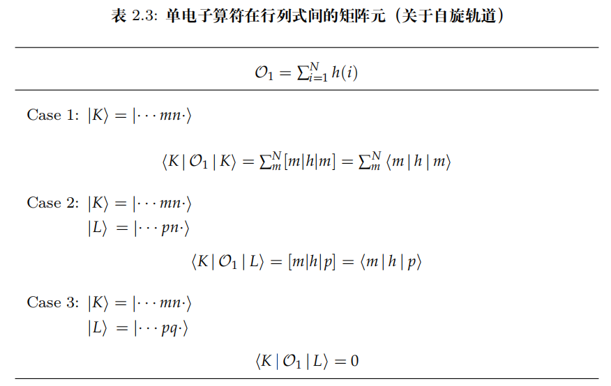
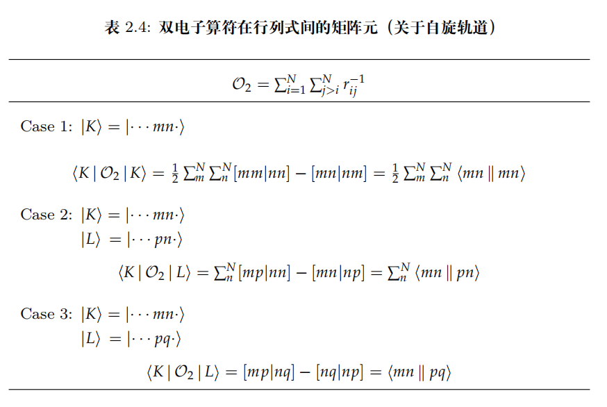

# 组态相关

## 电子的动态关联和静态关联

我们知道,电子关联是量子化学计算中不可或缺的一部分,我们把短程的,瞬时的电子相互作用称之为动态关联,把长程的,电子各个组态之间的相互作用称之为静态关联.

Hartree-Fock方法考虑了一部分电子的动态关联,但是没有考虑完整,只取了一个组态,所以完全没有考虑静态关联.

来回忆一下,我们是如何得到HF方法的分子轨道波函数的,首先,我们先得到总能量的表达式,然后考虑对能量进行变分,通过使得总能量取到极小值的变分法构建fork算符,通过求解fork算符的本征方程来近似得到分子轨道:

$$
\hat{f}|\psi\rangle=E|\psi\rangle
$$

而这个算符已经不是所谓的单电子分子轨道哈密顿算符了,也就是我们说的,将电子相互作用使用平均场近似了,难以捕捉到瞬时的电子相互作用,这里就忽略了电子的动态关联.

求解完分子轨道后,我们使用所谓的slater行列式来构建总波函数,考虑了一部分电子的动态关联(即自旋相同的电子不能占据同一个轨道).然而,构建slater行列式使用的是前N个能量最低的分子轨道波函数,也就是使用单一组态去近似描述总波函数,我们知道,这忽略了静态关联.

事实上,从构建总能量的表达式开始,我们就已经假设总波函数可以用slater行列式表示了.

一个很直观理解静态关联的想法是,考虑两个相隔很远的氢原子,电子在各个轨道之间的填充在这个时候变得不可区分,因为彼此之间的能级互相接近,这个时候还认为电子始终排布在HF基态显然是不合适的,通过这样一个例子,我们可以粗略理解一下为什么需要考虑多个组态,从数学上来说,算出来这么多分子轨道,没有全部用上,这也是没有道理的.

## 激发

我们将占据的自旋轨道称为占据轨道,未被占据的自旋轨道称之为虚轨道,有别于HF基态的组态就是电子被激发到虚轨道上,我们称之为激发态.

考虑单激发,一个占据轨道上的电子被称作i,未被占据轨道的电子记做a,一个单激发的电子总波函数就被记做

$$
\Psi_i^a=|\psi_1,\psi_2, \ldots, \psi_{i+1},\psi_N,\psi_a\rangle
$$

代表i被激发到a上了,其可以用新占据的轨道的slater行列式来表示.

如果是双激发,类比刚刚的记法,考虑占据i,j轨道的两个电子被激发到a,b上,那么双激发的波函数就可以记做

$$
\Psi_{ij}^{ab}=|\psi_1,\psi_2, \ldots, \psi_{i+1}, \ldots ,\psi_{j+1}, \ldots ,\psi_N,\psi_a,\psi_b\rangle
$$

那么full CI就可以表示为:

$$
\Psi_{full}=\Psi_0+\sum_{i,a}c_i^a\Psi_i^a+\sum_{i,j,a,b}c_{ij}^{ab}\Psi_{ij}^{ab}+ \cdots 
$$

直至考虑所有组态.

## 哈密顿矩阵

既然已经知道了full-CI的表达式,如何确定系数似乎还是一个问题,根据变分原理,我们的总波函数一定是能量最低的,使得能量最低的系数就是我们想要的系数,也就是求解本征方程的基态解:

$$
\hat{H}\Psi_{full}=E_0\Psi_{full}
$$

根据矩阵元规则可以构建哈密顿矩阵,但是这个矩阵非常大,比较难写,我们考虑写H2分子这个简单体系的哈密顿矩阵,由此可以直观的感受到这个矩阵的庞大,以及为什么我们需要使用大量的截断方法.

我们把H2分子的单激发称作S,双激发称作D,三记法称作T(但是H2只有两个电子).

在没有外部磁场的作用下,总自旋应该是守恒的,为0,所以单机发只需要考虑两种情况,双激发只需要考虑一种情况,故总哈密顿量可以写做:

$$
H=
\begin{pmatrix}
    \langle G|\hat{H}|G\rangle,\langle G|\hat{H}|S_1\rangle,\langle G|\hat{H}|S_2\rangle,\langle G|\hat{H}|D\rangle\\
    \langle S_1|\hat{H}|G\rangle,\langle S_1|\hat{H}|S_1\rangle,\langle S_1|\hat{H}|S_2\rangle,\langle S_1|\hat{H}|D\rangle\\
    \langle S_2|\hat{H}|G\rangle,\langle S_2|\hat{H}|S_1\rangle,\langle S_2|\hat{H}|S_2\rangle,\langle S_2|\hat{H}|D\rangle\\
    \langle D|\hat{H}|G\rangle,\langle D|\hat{H}|S_1\rangle,\langle D|\hat{H}|S_2\rangle,\langle D|\hat{H}|D\rangle\\
\end{pmatrix}
$$

这个就是CISD矩阵,是H2分子的full-CI矩阵,可以看到,这个矩阵已经非常大了,如果考虑更高阶的激发,矩阵会越来越大.
所以我们需要各种截断方法,考虑单激发的截断就被称作CIS,考虑双激发的截断就被称作CISD,考虑三激发的截断就被称作CISDT,以此类推.

## 缺点

经过上面的分析,我们似乎找到了一条通往full-CI的可靠途径,剩下的不过是计算资源的问题,然而,事实并非有我们想象的那么好.首先,使用激发截断的方法去逼近full-CI,其收敛是十分缓慢的,所以所需要的计算资源异常庞大让我们望而却步.

其次,截断有一个致命的缺点就是其不满足尺寸一致性.尺寸一致性指的是当一个化学体系 **被分解为两个或多个无相互作用的子系统时，整个系统的能量应该等于各个子系统能量之和。**

比如说我们考虑单激发,定义激发算符为:

$$
\sum_{i,a}c_i^a\Psi_i^a=\hat{T_1}\Psi_0 
$$

所以考虑了单激发的总波函数就可以写做:

$$
\Psi=(1+\hat{T}_1)\Psi_0
$$

以H2分子为例,考虑单激发,我们把两个核相隔无穷远,那么按理来说,两个氢原子的能量之和应该等于总能量,于是总波函数就可以写成Hartree积的形式,由于两个波函数都有一个单激发算符,乘起来就会有一项是双激发算符,这是不被允许的.

## 矩阵元规则

虽然CI矩阵很大,但是其往往是非常系数的,这可以从Szabo这本书上的矩阵元规则得知,这里不予以证明:

