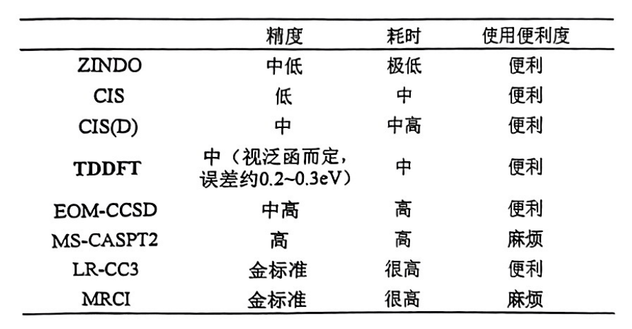
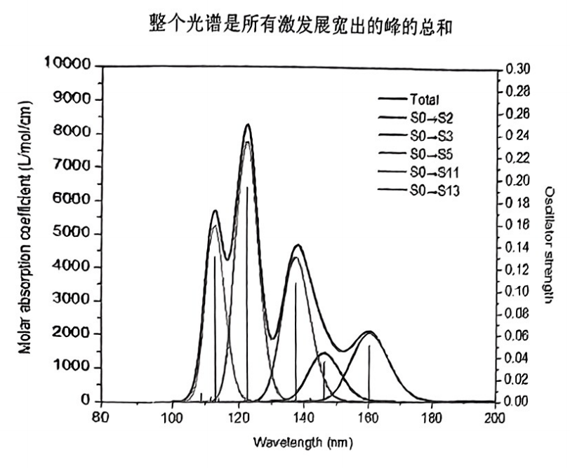
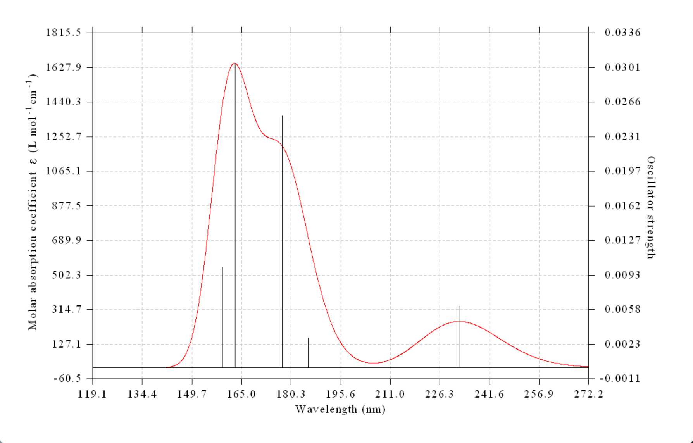
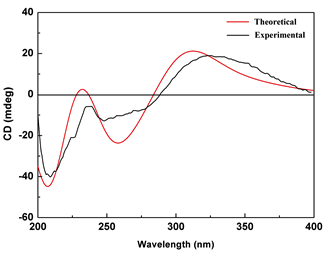
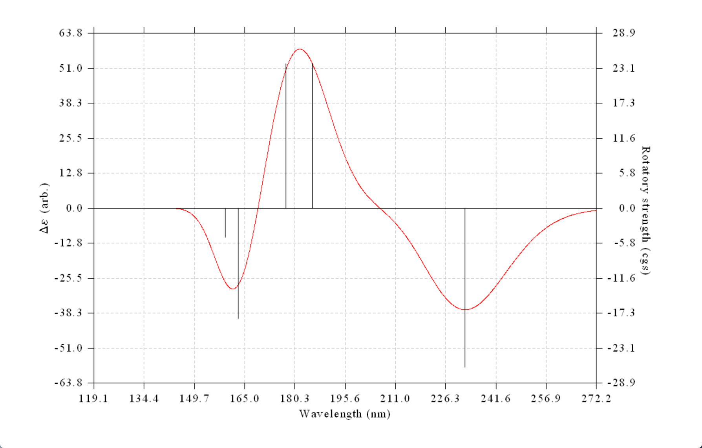
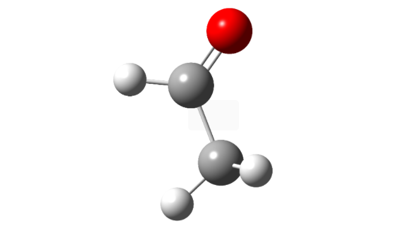

# 激发态计算与电子光谱

## 基组的选择

对于价层激发等激发能较小的情况,可以使用6-311G*, 更推荐def2-TZVP

对于里德堡激发,必须带弥散函数,否则不能描述较为弥散的里德堡轨道,aug-cc-pVDZ勉强可行,更好的选择是aug-cc-pvTZ,更高精度的基组为d-aug-pvTZ.

## 计算方法



## TDDFT(含时密度泛函理论)

对于一个给定的多电子体系，在任意初始波函数 $\Psi(t_0)$ 下演化，其含时电子密度 $n(\mathbf{r}, t)$ 与体系所受的含时外部势 $v_{ext}(\mathbf{r}, t)$ 之间存在唯一的对应关系（相差一个仅与时间有关的函数）。
    
这意味着，体系的含时波函数 $\Psi(t)$ 是含时密度 $n(\mathbf{r}, t)$ 的唯一泛函（在给定初始状态 $\Psi(t_0)$ 的情况下）。

体系波函数随时间演化过程遵循含时薛定谔方程:

$$
i\hbar\frac{\partial \Psi(t)}{\partial t} = H(t)\Psi(t)
$$

类比于基态KS方程的求解,在TDDFT中,也引入KS虚拟轨道,于是只需求解含时单电子轨道方程:

$$
i \frac{\partial }{\partial t}\phi_i(\mathbf r,t) = \left[-\frac{1}{2}\nabla^2+v_{\text{KS}}(\mathbf{r},t)\right]\phi_i(\mathbf r,t)
$$

求解TDKS方程主要有两种主流方法，它们适用于不同的物理问题,其一是 线性响应TDDFT (Linear-Response TDDFT, LR-TDDFT),这种方式可以得到分立的激发能和振子强度,其二是实时演化TDDFT (Real-Time TDDFT, rt-TDDFT),该方法可以模拟体系在任意强度的外场下的电子动力学过程，适用于研究非线性和强场现象。

## 泛函选用建议

对于单重态的价层激发,首选PBE0(HF成分25%),B3LYP(20%)次之

对于三重态价层激发,首选M06-2X(54%)

对于有机打钩则体系,适合使用HF成分比PBE0更高的泛函,PBE38(37.5%),BMK(42%),MN15(44%),CAM-B3LYP(19% - 65%)

里德堡激发,电荷转移激发需要使用高HF成分的泛函或者包含长程校正的泛函:M06-2X(54%),BHandHLYP(50%),$\omega$B97XD,CAM-B3LYP(这类长程校正泛函往往会高估大共轭体系的局域价层激发能)

## 在Gaussian中做激发态计算

做激发态的方法有很多,比如ZINDO,TDDFT,CIS,EOM-CCSD,CASSCF...

其中ZINDO只能算激发态结构信息,别的算不了.

所有的这些算激发态的方法都不会直接求解完整的本征方程,以单激发的CIS为例,共计有$N_{orb}\times N_{vir}$个组态,所以矩阵的大小为:$(N_{orb}\times N_{vir})\times(N_{orb}\times N_{vir})$,求解这个本征方程可以一次性解出你感兴趣的所有激发态,但耗时巨大,故实际求解过程中往往不是直接解全部的方程,而是通过一种迭代求解(Davidson diagonalization)的方式,这种方法可以求出本征值最小的几个本征向量而避免求解全部的本征方程,从而降低计算量.

这可以从Gaussian的输出文件中观察到这一点:

```
 Iteration     1 Dimension    20 NMult     0 NNew     20
 CISAX will form    20 AO SS matrices at one time.
 NMat=    20 NSing=    20 JSym2X= 0.
 Excitation Energies [eV] at current iteration:
 Root      1 :     5.461027141743715
 Root      2 :     6.751273976914919
 Root      3 :     7.046976368228027
 Root      4 :     7.679796707878720
 Root      5 :     7.843457608022729
 Root      6 :     8.295541699476749
 Root      7 :     8.635279722884777
 Root      8 :     8.953319037735108
 Root      9 :     8.984540464720832
 Root     10 :     9.240751019843598
 Root     11 :     9.270538107899473
 Root     12 :     9.387843043000094
 Root     13 :     9.451465585605362
 Root     14 :     9.481685452234055
 Root     15 :     9.720858125669874
 Root     16 :     9.897868832078581
 Root     17 :    10.028795240893460
 Root     18 :    10.281192315066030
 Root     19 :    10.294217178815470
 Root     20 :    11.341542894110940
 Iteration     2 Dimension    30 NMult    20 NNew     10
 CISAX will form    10 AO SS matrices at one time.
 NMat=    10 NSing=    10 JSym2X= 0.
 Root      1 not converged, maximum delta is    0.017453956837832
 Root      2 not converged, maximum delta is    0.041196972771569
 Root      3 not converged, maximum delta is    0.033931353962120
 Root      4 not converged, maximum delta is    0.022001044539891
 Root      5 not converged, maximum delta is    0.016743238089795
 Excitation Energies [eV] at current iteration:
 Root      1 :     5.345674883420529   Change is   -0.115352258323186
 Root      2 :     6.685375287154353   Change is   -0.065898689760566
 Root      3 :     6.984364673292572   Change is   -0.062611694935454
 Root      4 :     7.612245737817041   Change is   -0.067550970061679
 Root      5 :     7.797358351269026   Change is   -0.046099256753703
 Iteration     3 Dimension    40 NMult    30 NNew     10
 CISAX will form    10 AO SS matrices at one time.
 NMat=    10 NSing=    10 JSym2X= 0.
 Root      1 not converged, maximum delta is    0.004522079506638
 Root      2 not converged, maximum delta is    0.003230236236959
 Root      3 not converged, maximum delta is    0.003125558901500
 Root      4 not converged, maximum delta is    0.003771955035469
 Root      5 not converged, maximum delta is    0.003263991070883
 Excitation Energies [eV] at current iteration:
 Root      1 :     5.339709214691594   Change is   -0.005965668728935
 Root      2 :     6.680853760006474   Change is   -0.004521527147879
 Root      3 :     6.980790467107361   Change is   -0.003574206185212
 Root      4 :     7.607810117044136   Change is   -0.004435620772904
 Root      5 :     7.794725975565989   Change is   -0.002632375703036
 Iteration     4 Dimension    50 NMult    40 NNew     10
 CISAX will form    10 AO SS matrices at one time.
 NMat=    10 NSing=    10 JSym2X= 0.
 Root      1 not converged, maximum delta is    0.001052748701412
 Root      2 has converged.
 Root      3 not converged, maximum delta is    0.001211778980558
 Root      4 not converged, maximum delta is    0.001449700843216
 Root      5 not converged, maximum delta is    0.001084051039154
 Excitation Energies [eV] at current iteration:
 Root      1 :     5.339289619484175   Change is   -0.000419595207419
 Root      2 :     6.680583220902284   Change is   -0.000270539104189
 Root      3 :     6.980391303265043   Change is   -0.000399163842317
 Root      4 :     7.607437679822357   Change is   -0.000372437221780
 Root      5 :     7.794450963806761   Change is   -0.000275011759228
 Iteration     5 Dimension    58 NMult    50 NNew      8
 CISAX will form     8 AO SS matrices at one time.
 NMat=     8 NSing=     8 JSym2X= 0.
 Root      1 has converged.
 Root      2 has converged.
 Root      3 has converged.
 Root      4 has converged.
 Root      5 has converged.
 Excitation Energies [eV] at current iteration:
 Root      1 :     5.339260569950314   Change is   -0.000029049533861
 Root      2 :     6.680576755655352   Change is   -0.000006465246932
 Root      3 :     6.980367230192428   Change is   -0.000024073072615
 Root      4 :     7.607400952847915   Change is   -0.000036726974441
 Root      5 :     7.794425287939589   Change is   -0.000025675867172
 Convergence achieved on expansion vectors.
```

从迭代过程信息可以看到,软件首先选择了20个轨道能级差最小的激发态去构建初始猜测(最有可能的最低能级激发态), 然后Davidson算法会专注于我们指定的五个态进行迭代求解.

故在计算过程中会指定`nstates = 3`之类的关键词,求解的激发态越多耗时越大.

关键词:

```
#p B3LYP/6-311g** TD(nstates = 3 , root=1,singlet)
#p CIS(nstates = 3 , root=1,singlet)/6-311g**
#p CIS(D,nstates = 3 , root=1,singlet)/6-311g**
#p EOMCCSD(nstates = 3 , root=1,singlet)/cc-pvdz
#p ZINDO(nstates = 3 , root=1,singlet)/6-311g** 
```

`root`表示感兴趣的态的序号,该态会在文件末尾输出,`singlet`表示只求解单重态,`triplet`表示只求解三重态.也可以使得软件同时求解N个单重态和N个三重态,只需使用关键词`50-50`,代表求解50个单重态和50个三重态.

计算激发态是按照激发能排序的,即激发能最小的态排在最前面,故要计算第i个态,需要将前面的i-1个态都计算出来,保险起见,最好算到第i+2个态来确保收敛的可靠性.

默认情况下软件只给出基态的电子密度和波函数,如果要计算其他激发态的电子密度和波函数,需要在关键词中指定`density=all`,这会给出所有激发态的密度相关量以及波函数:

```
#p B3LYP/6-311g** TD(nstates = 3 , root=1,singlet) density=all
```
结束之后会输出跃迁电偶极矩等激发态电子结构特征:

```
 Ground to excited state transition electric dipole moments (Au):
       state          X           Y           Z        Dip. S.      Osc.
         1        -0.1494      0.1449     -0.0654      0.0476      0.0062
         2        -0.0829      0.0804      0.0707      0.0183      0.0030
         3         0.3706     -0.0971      0.0232      0.1473      0.0252
         4         0.3399      0.0539     -0.2128      0.1637      0.0305
         5        -0.0200     -0.0149     -0.2283      0.0527      0.0101
```

以及各个激发态的轨道跃迁组成,激发能, 振子强度:

```
 Excitation energies and oscillator strengths:
 
 Excited State   1:      Singlet-A      5.3393 eV  232.21 nm  f=0.0062  <S**2>=0.000
      23 -> 25        -0.20249
      24 -> 25         0.67156
 This state for optimization and/or second-order correction.
 Total Energy, E(TD-HF/TD-KS) =  -323.278949720    
 Copying the excited state density for this state as the 1-particle RhoCI density.
 
 Excited State   2:      Singlet-A      6.6806 eV  185.59 nm  f=0.0030  <S**2>=0.000
      23 -> 25         0.47726
      24 -> 25         0.18113
      24 -> 26         0.44412
      24 -> 27        -0.16152
 
 Excited State   3:      Singlet-A      6.9804 eV  177.62 nm  f=0.0252  <S**2>=0.000
      23 -> 25        -0.45292
      24 -> 25        -0.11063
      24 -> 26         0.51621
 
 Excited State   4:      Singlet-A      7.6074 eV  162.98 nm  f=0.0305  <S**2>=0.000
      22 -> 25         0.11358
      23 -> 26        -0.12997
      24 -> 26         0.14107
      24 -> 27         0.61752
      24 -> 28         0.22286
 
 Excited State   5:      Singlet-A      7.7944 eV  159.07 nm  f=0.0101  <S**2>=0.000
      24 -> 27        -0.22715
      24 -> 28         0.66004
```

`24 -> 27        -0.22715`是对应的组态以及组态系数,组态系数的平方代表这个组态对整个激发态的贡献,可以看到,其贡献之和并不为1,剩余的贡献过小但是数量众多的激发态组态被忽略了,从而没有打印出来.

## 电子光谱

计算电子光谱前需要先对基态进行结构优化,之后再做激发态计算

### 吸收光谱

使用激发态计算可以得到吸收波长和振子强度,然后辅以适当的展宽函数,就可以得到能和实验谱图对照的理论电子光谱.

展宽函数往往使用Gaussian函数:

$$
G(x) = \frac{1}{\sqrt{2\pi}\sigma}e^{-\frac{(x-\mu)^2}{2\sigma^2}}, \sigma = \frac{\text{FWHM}}{2\sqrt{2\ln2}}
$$



通过适当调节半高全宽$\text{FWHM}$,可以使得理论光谱尽可能逼近实际光谱.

将相应体系的激发态计算的.out文件导入Multiwfn,可以很方便的得到电子光谱:



### 荧光光谱

荧光发射是从激发态的最低振动能级发生的,故只需要将S0->S1的吸收峰展开为光谱即可,和吸收光谱的处理方式完全相同

### 电子圆二色谱(ECD)

物质因电子激发会对左旋偏振光和右旋偏振光的吸收不同从而产生了ECD谱,这种现象往往出现在手性分子中.故ECD谱可以用来判定体系中构象的分布,确定分子的绝对构型,确定手性物质的纯度等等.




Multiwfn绘制的ECD谱:



## 激发态结构优化问题

激发态平衡结构和基态平衡结构所属点群通常不同,如果基态平衡结构的对称性更高,则优化激发态过程中,可能一直会保持初始对称性从而导致最终结构出现虚频.

需要稍微改变初始结构来打破对称性.

在溶剂环境下优化乙醛的S1结构,采用S0的平衡结构作为初始结构会造成对称性问题:



```
                      1                      2                      3
                     A"                     A"                     A'
 Frequencies --   -460.3404               183.0762               368.4372
 Red. masses --      1.3659                 1.2777                 3.8693
 Frc consts  --      0.1705                 0.0252                 0.3095
 IR Inten    --     77.1525                 0.0229                 7.0549
  Atom  AN      X      Y      Z        X      Y      Z        X      Y      Z
     1   6     0.00   0.00   0.03     0.00   0.00   0.01     0.24   0.02   0.00
     2   1     0.00   0.00  -0.03     0.00   0.00   0.61     0.07  -0.37   0.00
     3   1    -0.01   0.08   0.10     0.43  -0.24  -0.21     0.52   0.05  -0.01
     4   1     0.01  -0.08   0.10    -0.43   0.24  -0.21     0.52   0.05   0.01
     5   6     0.00   0.00  -0.17     0.00   0.00  -0.12    -0.07   0.28   0.00
     6   8     0.00   0.00   0.04     0.00   0.00   0.08    -0.19  -0.22   0.00
     7   1     0.00   0.00   0.97     0.00   0.00  -0.20     0.00   0.27   0.00
                      4                      5                      6
```

可以看到,结构优化的频率分析结果中出现了虚频.
