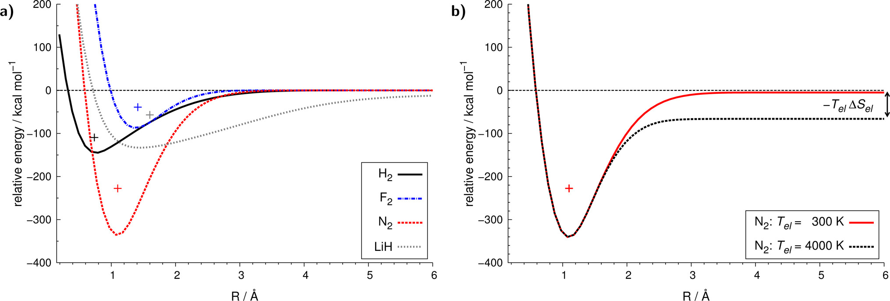
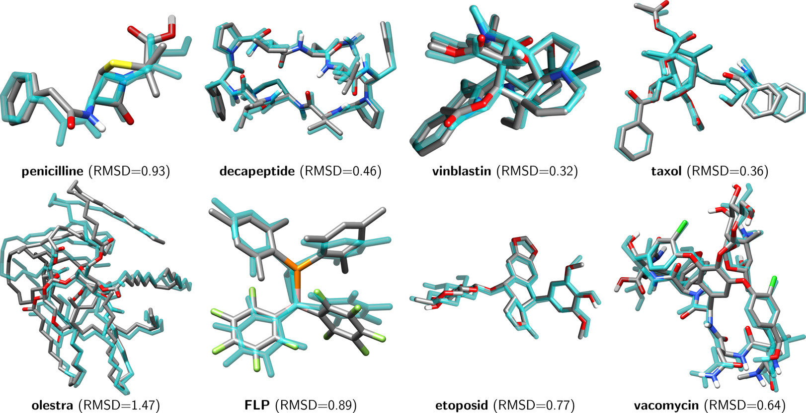
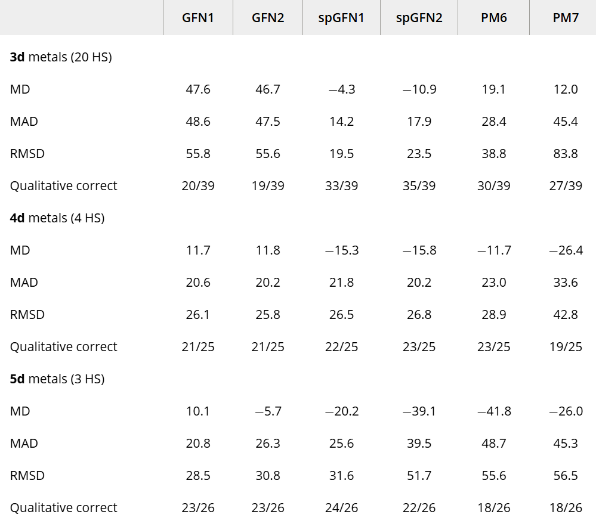
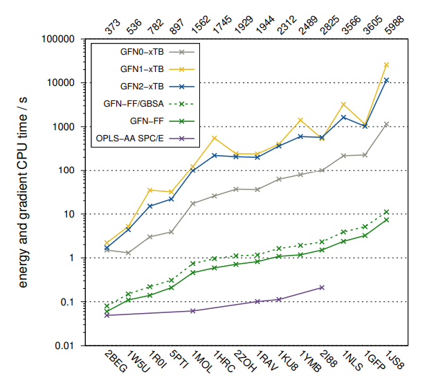
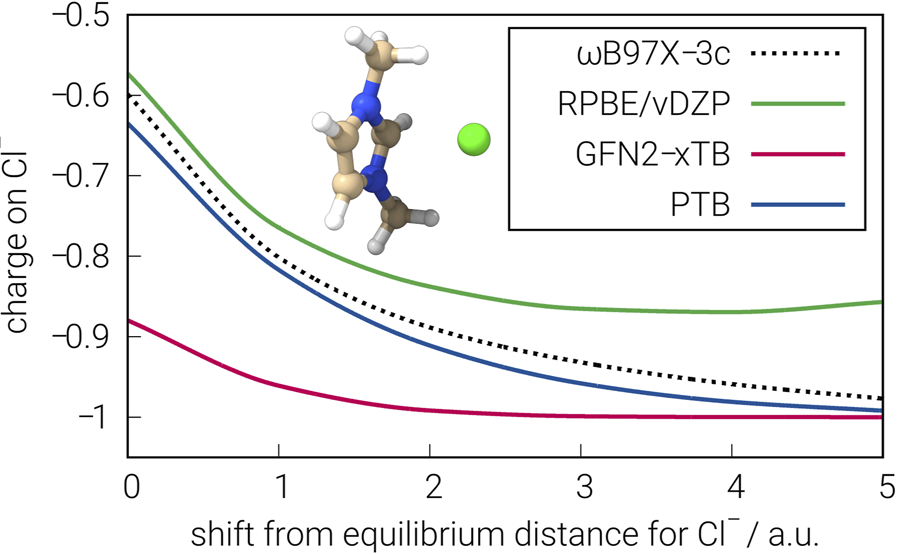

# GFN系列方法

GFN-xtb全称为Geometry,Frequency,Nonconvalent,eXtended TB,是Grimme等人从2017年开始发展起来的一系列方法.

## GFN1-xtb

2017年提出的GFN1-xtb是最早的GFN方法,耗时和DFTB3以及半经验方法在同一个档次,而整体精度却又略好于目前最好的半经验方法,其给出了1-86号元素的所诉要的所有参数,同时适用于几何优化振动分析,能量计算,因而具有强大的普适性.

在提出这个方法的原文中,作者使用GFN1-xtb做了解离曲线的计算,+代表高精度方法计算出来的势阱极小点的位置,GFN1方法在解离曲线的描述上基本正确,虽然深度并不对:

下图展示了PBE-3c方法和GFN1-xtb方法对多种体系结构优化的对比,PBE-3c方法为透明青色:

## GFN2-xtb

2019年提出的GFN2-xtb是物理上更加严格的方法,其形式更加复杂,耗时更高,而精度略有改进,但是存在SCF难收敛的问题.

## 自旋极化的GFN-xtb

以上两种方法均只考虑闭壳层,为了更好的描述自旋计划体系,Grimme等人在2023年提出的sp-GFN1-xtb和sp-GFN2-xtb方法,在能量表达式中加入了依赖原子轨道自旋布局的能量项,这样可以显式计算不同自旋态的能量.

在原文中构建的TM90S测试集中,sp-GFN1-xtb表现最好,对于90%的体系都成功预测了能量最低的自旋态,因此适合做过渡金属配合物的高通量筛选.

## GFN0-xtb

经验性最想的GFN-xtb版本,形式最简单,能量项不包含二,三阶项,因此不需要做SCF迭代来让电荷弛豫.

对于销体系,可以比GFN1-xtb方法快几倍,而大体系甚至可以快几十倍,故适合做大体系的快速计算,不存在SCF不收敛的问题,但是精度和可靠性难以保证.

## GFN-FF

2020年提出,是最便宜的GFN方法,属于可极化,非反应性的力场, 其形式比GAFF,OPLS-AA,MMFF94等经典力场更为复杂,计算也颇为昂贵,因此,不能用自定义参数的方法在lammps等程序中使用,也难以应用于几千原子的动力学模拟等场合.

其在不以π区域为主的体系中,标度可达$O(N^2)$,除此之外,所有GFN系列方法的标度都为$O(N^3)$.

该力场的精度远高于UFF,在某些场景下精度和GFN2-xtb相仿,但是存在局限性, 其所应用的初始结构必须接近平衡结构,否则无法指认拓扑参数,若初始结构未知,需要用其他GFN方法先优化至接近极小点.

计算耗时对比:

## PTB

2023年提出,ptb方法的目的是极快速的产生wb97x-v级别的单粒子密度矩阵,目前已经被xtb程序所支持,此方法基于2-zeta带计划的vDZP基组,其所计算的原子电荷,键级,偶极矩,极化率经过测试和wb97X-V很接近,并且表现较为稳健,但是,值得注意的是,其耗时是GFN2-xtb方法的几倍.

改图展示了不同方法计算的Cl-电荷随距离的变化值,可以看到PTB方法和wb97x-3c的结果最为接近.