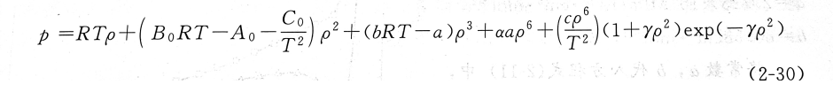
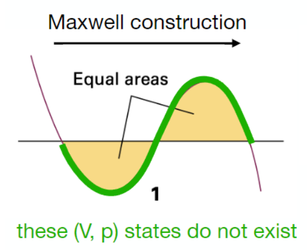

# 化工热力学
**写在前面,这门可可以算是本科化工最难的课程之一了,但是教研组似乎不太重视这门课,只给了半个学期的课时,考试考的也是相当简单,但是却忽略了其中大量的编程实践,我认为这门课必须和实践结合起来,不然的话学了其实就忘记了,不知道学了什么,里面大量的热力学理论让我头一次拥有了能对物质相态进行理论分析的能力,所以我还是蛮喜欢这门课的,毕竟马丁侯方程是浙大化工正统(笑)**
具体的框架我就打算跟着书上来,这门课我学的也不是很明白,希望制作这个笔记能让我对他有着更加深入的理解吧.

## 1.状态方程
一个均相的热力学系统根据相律$F=C-P+2$,只有两个自由度,也就是说,存在一个方程,方程中含有三个热力学参数,这个方程唯一确定了这个热力学系统,也就是状态方程,许多复杂的热力学系统最后都可以化简成为简单的均相封闭体系,所以,研究状态方程的必要性就在这里体现出来了
理想气体的状态方程广为人所熟知:
$$pV=nRT$$
对于这个状态方程的推导,我放到了物理化学基础当中去.
如果说,考虑分子的体积,或者说,考虑分子之间具有一定的斥力,我们就会得到修正后的范德瓦尔斯方程:
$$p=\frac{RT}{V-b}-\frac{a}{V^2}$$
注意,这里使用的V均为摩尔体积,这样是为了使得式子更加简洁.这个式子可以从统计热力学推导出来(但是我现在还不会)
流体的相界线存在着一个极大值点$(p_c,T_c,V_c)$,当压力和体积超过临界压力和临界体积的时候,流体就会变成超临界流体,这个时候,流体的气相和液相变得难以区分
当温度恰好为临界温度的时候,状态方程的等温线与相界线的极大值点相切,这个点成为了等温线的**拐点**(所以是二阶导数),所以,根据三个临界参数,我们就能够确定物体状态方程的若干参数:
$$
\begin{cases}
    (\displaystyle\frac{\partial p}{\partial V})_{T_c}=0\\
    \ \\
    (\displaystyle\frac{\partial ^2 p}{\partial V^2})_{T_c}=0
\end{cases}
$$
计算得到的vdw常数的表达式如下:
$$
a=\frac{27}{64}\frac{R^2T_c^2}{p_c}\\
\ \\
b=\frac{RT_c}{8p_c}
$$
这里可以开始编一个程序了,之后也用得到
在python中进行偏导数运算,你要先安装sympy库,然后可以使用里面的符号运算函数


``` python
import sympy as sp
T_c,V_c=map(float,input('请输入临界参数').split())
#定义符号变量,这里用的是状态参数p,V,T,有两个就行,再加上两个未知参数a,b
V,T,a,b=sp.symbols('V T a b')
R=8.3145
#可以直接用符号变量定义函数表达式
#例如这里的是范德华方程:
p=R*T/(V-b)-a/V**2

y1=sp.diff(p,V)
y2=sp.diff(p,V,2)

y1_v=y1.subs({T:T_c,V:V_c})#接受一个字典作为参数
y2_v=y2.subs({T:T_c,V:V_c})

#得到的是带参的表达式,下一步要解方程
s=sp.solve((y1_v, y2_v), (a, b))
print(s)
#返回的是以一个a和b的元组为元素的列表,得到的值还是一个符号表达式,需要使用sympy中的evalf方法转化成数值
# 计算 a 和 b
a_v=s[0][0].evalf()
b_v=s[0][1].evalf()

print(f'临界参数为a={a_v:.2f},b={b_v:.2f}')

```

RK方程
RK方程相较于vdw方程又做出来一些修正,主要体现在斥力项也会受温度影响,其表达式为:
$$
p=\frac{RT}{V-b}-\frac{\frac{a}{\sqrt{T}}}{V(V+b)}
$$
SRK方程
SRK方程主要是在系数a上对RK方程进行了改进,把原来的$\frac{a}{\sqrt{T}}$重新写成了a,a是一个函数,与炉体本身的属性和温度有关:
$$a=a_c\alpha(T_r,\omega)$$
下面对这几个参数一一解释:
第一个$a_c$即为RK方程中的$\frac{a}{\sqrt{T_c}}$,即临界温度时SRK和RK方程是一样的,后面那个$\alpha$函数在临界温度的时候等于1,$T_r$被称之为对比温度,即实际温度与临界温度的比值:$T_r=T/T_c$,$\omega$被称之为偏心因子,是一个和对比压力有关的参数,描述了简单流体和该流体之间的性质差异.
具体$\alpha$的经验公式可以用下列式子表示:
$$\alpha^{0.5}=1+(0.48+1.574\omega-0.176\omega^2)(1-T_r^{0.5})$$
相比于RK,计算相变的时候SRK会更好一点,但是在液相的时候还不够好,一般工程师用的是下面的PR方程也就是彭罗宾逊方程:
$$p=\frac{RT}{V-b}-\frac{a}{V(V+b)+b(V-b)}$$
根据上面的程序和两个偏导数关系,可以求得$a$的临界参数$a_c$以及b的值,因为a只是T的函数不是V的函数,对V求偏导不会产生新的项,但是此时的a只能是$a_c$

---
上面的状态方程都只有两个常数,采用曲线拟合的思想,参数越多得到的方程应该越精确,所以会有无穷阶的多常数状态方程,最常见的是维里方程:

**virial方程**
$$
Z=1+\frac{B}{V}+\frac{C}{V^2}+...\\
=1+B^{'}p+C^{'}p^2+...
$$
这两种形式是等价的,其中B,C之类的叫做维里系数,两种系数可以相互转换,注意到:
$$\frac{pV}{RT}=1+\frac{B}{V}+\frac{C}{V^2}+...\\
p=RT(\frac{1}{V}+\frac{B}{V^2}+\frac{C}{V^3}...)\\
$$
带入到维里方程的第二个表达式当中去得到:
$$
Z=1+B^{'}RT(\frac{1}{V}+\frac{B}{V^2}+\frac{C}{V^3}...)+C^{'}R^2T^2(\frac{1}{V}+\frac{B}{V^2}+\frac{C}{V^3}...)^2+...
$$
整理一下得到:
$$Z=1+\frac{B^{'}RT}{V}+\frac{B^{'}BRT+C^{'}R^2T^2}{V^2}+...$$
于是得到两种系数的对应关系:
$$
B^{'}=\frac{B}{RT},C^{'}=\frac{C-B^{2}}{R^2T^2}
$$
关于这个virial系数,还有一点值得注意的就是$V-\frac{RT}{p}$在p趋于0的时候并不总是趋于0的:
关注维里方程的第二种表达式,并且用我们刚刚得到的关系式进行代换,有:
$$B=\lim_{p \to 0}\ V-\frac{RT}{p}$$
两个大数相减结果并不一定是0,或者说,改写成$\frac{pV-RT}{p}$,分子分母同时趋向于0,并不能确定他们是等价无穷小或者谁比谁高阶,但是当$T=T_B$的时候,p是比$pV-RT$低阶的无穷小,整体趋向于0,这个温度被称之为**波义尔温度**,z在这个温度下会有:
$$\lim_{p \to 0}\ \frac{RT}{p}(Z-1)=0$$
也就是Z等于1,气体具有理想气体的性质.

BWR方程
感觉有点复杂,没什么鸟用,在特定工程场景可能会应用到,就在这里贴一下:


**马丁-侯方程**
浙大化工的门面,虽然有九个参数,但是只需要临界数据和一个蒸气压数据就能实现完全求取
找到了原论文但是看不懂,就把他在这里贴出来好了:
[https://deepblue.lib.umich.edu/bitstream/handle/2027.42/5231/bac3563.0001.001.pdf?sequence=5]

**混合法则**
分子之间存在相互作用,混合流体的表征参数受各个独立流体的参数影响,依赖于混合物的组成,不同的状态方程有不同的独立参数和混合法则
对维里方程有:
$$B=\sum_{i=1}^N\sum_{j=1}^Ny_iy_jB_{ij}$$
如果我们令相互作用参数$B_{ij}=\frac{B_i+B_j}{2}$
那么就会得到:
$$B=\sum_{i=1}^N\sum_{j=1}^Ny_iy_j\frac{B_i+B_j}{2}=\frac{1}{2}(\sum_{i=1}^Ny_i\sum_{j=1}^Ny_jB_j+\sum_{j=1}^Ny_j\sum_{i=1}^Ny_iB_i)=\sum_{i=1}^Ny_iB_i$$
这似乎是不同流体之间的线性叠加,那么能否认为他们之间的相互作用力是相等的,是理想溶液?
同样,如果令相互作用参数$B_{ij}=\sqrt{B_iB_j}$,会有:
$$B=\sum_{i=1}^Ny_i\sqrt{B_i}\sum_{j=1}^Ny_j\sqrt{B_j}=\left(\sum_{i=1}^Ny_i\sqrt{B_i}\right)^2$$
对于二参数方程,b是一个与分子半径有关的量,采用线性叠加的方式就行:
$$b=\sum_{i=1}^Ny_iB_i$$
但是a通常是对相互作用参数的度量,采用的混合法则在各个方程中略有不同:
RK方程:$a=(\sum_{i=1}^Ny_ia_i^{0.5})^2$
而对于SRK和PR方程来说,混合法则通常用下面的形式来表示:
$$a=\sum_{i=1}^N\sum_{j=1}^Ny_iy_ja_{ij}$$
$a_{ij}$被称之为交叉相互作用性质:
$$a_{ij}=\sqrt{a_ia_j}(1-k_{ij})$$
$k_{ij}$被称之为相互作用参数,一般通过查表来确定
BWR方程和马丁侯方程的混合法则比较复杂,这里不过多赘述.

**Maxwell等面积规则**
当我们观察实际得到的p-V等温线时,我们发现,相变的时候压力不会发生变化等于饱和蒸气压,只是气体在不断地冷凝然后变成了液体以提供体积的减小,相变区域的等温线是一条直线,而我们绘制出的状态方程通常不是这样,非常显而易见的是,相变是一个变化剧烈且泾渭分明的过程,但是状态方程式一个连续函数,必然追求平滑的描述每一个点,那么,在相变区域的状态方程曲线就失去了描述实际现象的能力,所以,必须要做一种修正,使得状态方程有能力去描述相变.


根据推导(使用相变开始和结束那个点上吉氏函数相等的条件进行推导),状态方程位于饱和蒸气压线上方的面积等于饱和蒸气压下方的面积(推导放到后面)
设从左到右三个体积根分别为$V_1,V_2,V_3$,那么麦克斯韦等面积规则等价于:
$$\int_{V_1}^{V_2}p^s-f(V)dV=\int_{V_2}^{V_3}f(V)-p^sdV$$
也就是:
$$
\int_{min\ V}^{max\ V}p^s-f(V)dV=0
$$
根据这个条件,我们就能找到相变的起始点和结束点,这样状态方程从相变的起始点到结束点的趋于变成一条等压线,我们就得到了成功描述全部区域的一条曲线.
对我们有意义的通常是饱和性质,例如液相饱和属性$(p^*,V^*_1)$和气相饱和性质$(p^*,V^*_2)$
其中,气相饱和体积和液相饱和体积分别对应饱和蒸气压下体积根的最大值和最小值,那么,如何确定$(p^*,V^*_1,V^*_2)$,我的初步想法是根据maxwell等面积规则去进行试差,如何对$p^*$进行更新迭代?
初步想法是根据所有体积根的算术平均对应到状态方程上得到一个新的p,这样会不会发散???
写了一个,没有成功求解,懂的朋友帮我看看:

``` python
#先做一个纯组分的饱和物性求解
import sympy as sp

p_c,T_c=map(float,input('请输入临界参数').split())
T_0,w=map(float,input('请输入温度和偏心因子').split())
p_s=float(input('请给出饱和蒸气压的初值'))
#计算相应的参数
R=8.31451
a_c=0.457235*(R*T_c)**2/p_c
b=0.077796*R*T_c/p_c
a_0=(1+(1-(T_0/T_c)**0.5)*(0.37646+1.54226*w-0.26992*w**2))**2
a=a_c*a_0
#定义符号变量和PR方程
V=sp.symbols('V')
f_v0=R*T_0/(V-b)-a/(V*(V+b)+b*(V-b))
while True:
    f_v=R*T_0/(V-b)-a/(V*(V+b)+b*(V-b))-p_s
    root=sp.solve(f_v,V)#注意这里返回的是根的列表
    root=[i for i in root if i.is_real and i>b]
    if not root:
        print('无解,初值设置不对')
        break
    V_1=min(root)
    V_2=max(root)
    #计算定积分
    x=sp.integrate(f_v,(V,V_1,V_2))
    if abs(x)<=1e-6:
        print(f'饱和蒸气压为{p_c:.4f}')
        print(f'气相饱和体积为{V_1:.4f}')
        print(f'液相饱和体积为{V_2:.4f}')
        break
    else:
        V_0=sum(root)/len(root)#感觉这个迭代条件不是很合适
        p_c=f_v0.subs({V:V_0})


```

如果是混合物的话,无非就是多一步求各自的a,b和多一步求总的a,b
放在这里,等上面的错误解决了再写:
``` python
```


## 2.均相封闭系统
所谓均相封闭,也就是不与外界有物质和能量交换的均相体系,体系由一些状态函数控制:

$$
H=U+pV\\
A=U-TS\\
G=H-TS
$$


## 3.均相敞开系统
## 4.非均相系统
## 5.流动系统
## 6.对应态原理和基团贡献法

