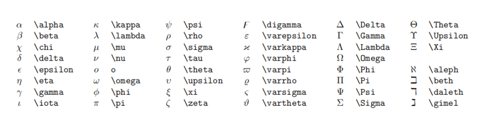

# Hello, World!
## 二级标题
### 三级标题
---

**加粗**
*斜体*
~~删除线~~

---
* 无序列表
  * 嵌套
* 哈哈哈哈

1. 有序列表
   1. 嵌套
   2. 
2. 有序
   1. 嵌套

在书写嵌套列表的时候往往要用到快捷缩进：ctrl+[ 向左缩进,ctrl+]是向右缩进.


> 引用文本

代码块
``` python
print("Hello, World!")
```
---

超链接
[https://zhuanlan.zhihu.com/p/366596107]

表格
自动表格对齐 shift alt+F
| 1    | 2    | 3    |
| ---- | ---- | ---- |
| 早饭 | 午饭 | 晚饭 |

---
注释：
<!--你看不见我-->
<!-- 快速注释反注释ctrl+/ -->

高亮
***==gaoliang==***
ctrl+B可以使得文本加粗
ctrl+I可以使得文本变为斜体

- [x] 已经完成的是
- [ ] 还没完
- [x] 完成了

----

图片相关操作(安装插件并且修改后)

好像直接粘贴就行???

数学公式相关支持
行内公式：$x^2+y^2=r^2$
公式块：
$$
\begin{cases}
    x=\rho\cos\theta\\
    y=\rho\sin\theta\\
\end{cases}
$$

$a^2+b^2=1$
$\frac{x+1}{x+2}$
$\displaystyle\frac{x+1}{x+2}$

开根号
$\sqrt{2}$
$\sqrt[n]{3}$

累加累乘
$\sum_{k=1}^{n}\frac{1}{k}$
$\prod_{k=1}{n}\frac{1}{k}$

积分
$\int_0^1{\rm d}x$
也可以简略一点：$\int_0^1x^2dx$
$\displaystyle\int_0^1{\rm d}x$

括号的修饰
圆括号：
$\displaystyle \left(\int_0^1e^{-x^2}dx \right)$
方括号
$\displaystyle \left[\int_0^1e^{-x^2}dx\right]$
花括号(大括号)
注意这里的\{必须是一个转义字符,因为原来的花括号另有用处
$\displaystyle \left\{\sum \frac{1}{k}\right\}$

书写多行算式使用begin{aligned}
居中对齐用\$\$相反,左对齐使用\$
使用\\\来进行换行
$$
\begin{aligned}
   y=(x+1)(x+2)\\=x^2+3x+2
\end{aligned}
$$

$
\begin{aligned}
   y=(x+1)(x+2)\\=x^2+3x+2
\end{aligned}
$

矩阵的书写方式:这个感觉有点麻烦
$$
\begin{pmatrix}
   1&1&\cdots&1\\
   1&1&\cdots&1\\
   \vdots & \vdots & \ddots & \vdots \\
   1&1&\cdots&1\\
\end{pmatrix}
$$

特殊字符集合


公式编号,后面加一个\\tag
$$
x^2+1=0 \tag{1.1}
$$
好像不能直接在行内公式里面加编号,不然会报错:

使用git和github进行云端储存
